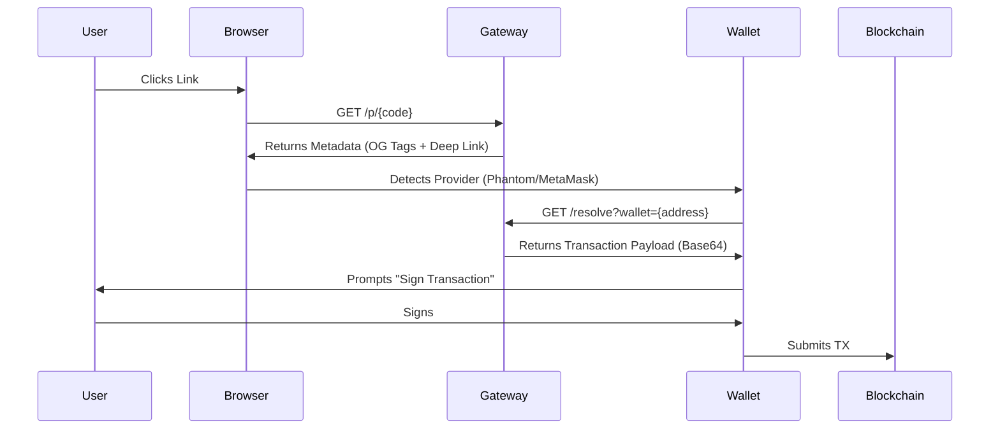

# The Interface

**Hyperlink** is the universal interface for the Streaming Economy. It is a standard for creating "PayLinks" that work anywhere on the web.

## URL Anatomy

A Hyperlink is a deterministic URL that resolves to a specific payment or engagement request.

`https://555.rendernet.work/p/{code}?ref={referrerId}`

*   **Domain**: The hosting gateway (can be self-hosted).
*   **Code**: A base58-encoded unique identifier for the Link Config.
*   **Ref**: (Optional) The wallet address or handle of the affiliate/referrer.

## Resolution Flow

When a user clicks a Hyperlink, the following sequence occurs:

## Social Attribution (The Viral Layer)

Hyperlink turns social media into a direct revenue channel. It bridges the gap between "Engagement" (Likes/RTs) and "Conversion" (On-Chain Action).

### The "Ref" Loop
1.  **Creator** posts a link on Twitter: `Play Sector 13 with me! 555.io/p/s13?ref=ninja`
2.  **Follower** clicks the link. The `ref=ninja` param is stored in the browser's local storage.
3.  **Action**: The follower plays the game, mints an NFT, or buys a skin.
4.  **Settlement**: The smart contract automatically routes a % of the transaction to `ninja.sol`.

**This works across platforms.** A link shared on Discord, Twitch, or X all resolves to the same on-chain attribution.

## Streamer Tools: Pay-to-Spawn

Hyperlink enables **Interactive Monetization** for live streamers. Viewers can pay to influence the game state in real-time.

### How it Works
1.  **The Trigger**: Streamer displays a QR code or Link: `555.io/p/spawn_boss`
2.  **The Payment**: Viewer pays $5.00 via the link.
3.  **The Event**:
    *   Payment is verified by AGG.
    *   VAP sends a `SPAWN_ENEMY` event to the Streamer's game client.
    *   A "Boss" spawns instantly on the stream.

This creates a **Feedback Loop** where the audience pays to create content for the streamer, increasing engagement and revenue simultaneously.

## Use Cases

### 1. Pay-Per-View (PPV)
*   **Link**: `.../p/stream_123`
*   **Action**: Pay 1 USDC.
*   **Result**: Receive a signed JWT to access the HLS stream.

### 2. Engagement (Quest)
*   **Link**: `.../p/quest_boss_fight`
*   **Action**: Play Sector 13 and score > 5000.
*   **Result**: VAP verifies the score and mints a Reward Token.

### 3. Commerce (NFT)
*   **Link**: `.../p/buy_skin_01`
*   **Action**: Pay 500 $555.
*   **Result**: Receive the cNFT asset.
