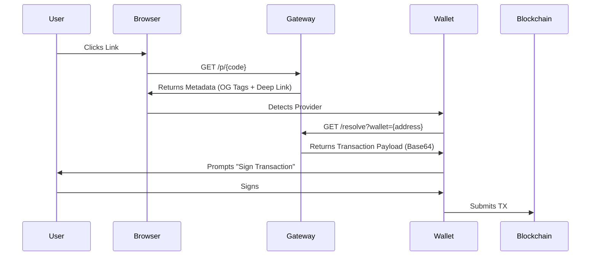

# The Interface

**Hyperlink** is the universal interface for the Streaming Economy. It is a standard for creating smart payment links that work anywhere on the web.

**Live at**: [555hyper.link](https://555hyper.link)

## URL Anatomy

A Hyperlink is a deterministic URL that resolves to a specific payment or engagement request.

`https://555hyper.link/p/{code}?ref={referrerId}`

*   **Domain**: The hosting gateway (can be self-hosted).
*   **Code**: A base58-encoded unique identifier for the Link Config.
*   **Ref**: (Optional) The wallet address or handle of the affiliate/referrer.

## Resolution Flow

When a user clicks a Hyperlink:

## Features

### Embedded Wallets
Hyperlinks support embedded wallets for users without a browser wallet extension. Frictionless onboarding — no Phantom or MetaMask required.

### Analytics
Built-in link analytics: click tracking, conversion rates, referral attribution, and geographic distribution.

### Multi-Chain
Links resolve across Solana, Base, and Polygon via AGG routing. Users pay with whatever they have; the protocol handles the rest.

## Social Attribution (The Viral Layer)

Hyperlink turns social media into a direct revenue channel, bridging engagement (Likes/RTs) and conversion (on-chain action).

### The "Ref" Loop
1.  **Creator** posts a link on Twitter: `Play Sector 13 with me! 555hyper.link/p/s13?ref=ninja`
2.  **Follower** clicks the link. The `ref=ninja` param is stored in browser local storage.
3.  **Action**: The follower plays the game, makes a purchase, or engages.
4.  **Settlement**: The smart contract automatically routes a % of the transaction to the referrer.

**This works across platforms.** A link shared on Discord, Twitch, or X all resolves to the same on-chain attribution.

## Streamer Tools: Pay-to-Spawn

Hyperlink enables **Interactive Monetization** for live streamers. Viewers can pay to influence the game state in real-time.

### How it Works
1.  **The Trigger**: Streamer displays a QR code or Link: `555hyper.link/p/spawn_boss`
2.  **The Payment**: Viewer pays via the link.
3.  **The Event**:
    *   Payment is verified by AGG.
    *   VAP sends a `SPAWN_ENEMY` event to the Streamer's game client.
    *   A "Boss" spawns instantly on the stream.

This creates a feedback loop where the audience pays to create content for the streamer, increasing engagement and revenue simultaneously.

## Use Cases

### 1. Pay-Per-View (PPV)
*   **Link**: `.../p/stream_123`
*   **Action**: Pay USDC.
*   **Result**: Receive a signed JWT to access the HLS stream.

### 2. Engagement (Quest)
*   **Link**: `.../p/quest_boss_fight`
*   **Action**: Play Sector 13 and score above threshold.
*   **Result**: VAP verifies the score and awards points.

### 3. Commerce
*   **Link**: `.../p/buy_skin_01`
*   **Action**: Pay $555 or USDC.
*   **Result**: Receive the digital asset.
