# 555 Ecosystem — Investigative Architecture Report

Date: 2026-01-15  
Scope: Repository workspace rooted at `./` (contains multiple nested repos: `backend/`, `555-mono/`, `555-bot/`, `555x402/`, `555-lottery/`, `555-rewards/`, plus legacy/aux directories).

## Executive Summary

This workspace implements a multi-component “555 Arcade” ecosystem:

- **Frontend**: a Next.js arcade UI (`555-mono/apps/web`) that proxies API calls to a Go backend and consumes real-time updates via SSE.
- **Backend**: a Go HTTP API server (`backend/cmd/555d`) that manages leaderboards, quests, payouts, chat ingestion, and lottery scheduling; it persists to **Postgres** (primary) and uses **BadgerDB** as optional/legacy/backup state store.
- **Bot**: an ElizaOS-based agent (“Alice”) (`555-bot`) that monitors Twitter/X, emits signed canonical social events to the backend, and listens to backend SSE for “social_summary” events to auto-post.
- **Payments / Hyperlink**: a 555x402 “API Gateway + Hyperlink link service + orchestrator” (`555x402/services/*`) used by backend/bot for wallet resolution and batch USDC payouts (multi-chain).
- **On-chain programs**: several Anchor/Solana programs exist in different subtrees (e.g., `555-lottery/`, `555-rewards/`, `555x402/programs/`, plus `./programs/referrals`), with overlapping concepts.

The architecture is **event-driven at the edges**:
1) UI uses **SSE** to subscribe to backend events (leaderboard/game/quest/payment).  
2) Bot pushes **signed canonical events** into backend via `/integrations/twitter/events`.  
3) Backend triggers **payment batches** via 555x402, then receives **webhook callbacks** to finalize payment statuses and broadcast them via SSE.

## Component Inventory

| Component | Path | Runtime | Primary Role | External Interfaces |
|---|---|---:|---|---|
| Arcade UI | `555-mono/apps/web` | Node/Next.js | Player UX, games, dashboards | HTTP to backend via Next rewrites; SSE via `/events` |
| Backend API | `backend` | Go | Leaderboards, quests, rewards, chat/lottery ops, payments integration | HTTP API + SSE (`/events`), Solana RPC, Postgres, (optional) BadgerDB, spawns `bun` chat tracker |
| Bot (Alice) | `555-bot` | Node/ElizaOS | Twitter monitoring, event emission, admin actions, autoposting | Twitter/X, HTTP to backend, SSE from backend, HTTP to 555x402 Hyperlink API |
| 555x402 API Gateway | `555x402/services/api-gateway` | Go | API-key auth, rate limiting, proxy façade | Public HTTP `/pub/v1/*` proxying to internal services |
| Hyperlink Link Service | `555x402/services/hyperlink-link-service` | Go | Store/resolve PayLinks (creatorId → wallet/chain) | HTTP `/links/*` + Postgres |
| CCTP Orchestrator | `555x402/services/cctp-orchestrator` | Node/Express | Batch payout orchestration + webhooks | HTTP `/api/payments/*` + Postgres + webhook to backend |
| Solana Programs (various) | `555x402/programs`, `555-lottery/programs`, `555-rewards/programs`, `./programs` | Rust/Anchor | On-chain state/transfers | Solana runtime + client scripts |

## High-Level Runtime Topology

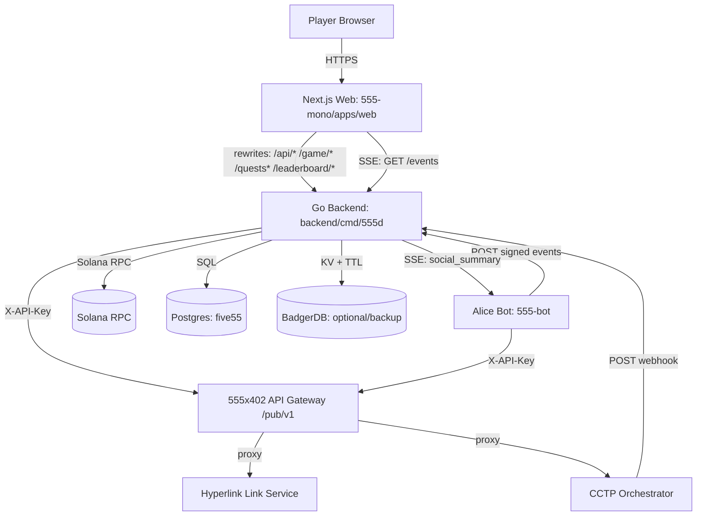
```mermaid
graph TD
  User[Player Browser] -->|HTTPS| Web[Next.js Web: 555-mono/apps/web]
  Web -->|rewrites: /api/* /game/* /quests* /leaderboard/*| Backend[Go Backend: backend/cmd/555d]
  Web -->|SSE: GET /events| Backend

  Bot[Alice Bot: 555-bot] -->|POST signed events| Backend
  Backend -->|SSE: social_summary| Bot

  Backend -->|Solana RPC| Solana[(Solana RPC)]
  Backend -->|SQL| PG[(Postgres: five55)]
  Backend -->|KV + TTL| Badger[(BadgerDB: optional/backup)]

  Backend -->|X-API-Key| Gateway[555x402 API Gateway /pub/v1]
  Bot -->|X-API-Key| Gateway
  Gateway -->|proxy| LinkSvc[Hyperlink Link Service]
  Gateway -->|proxy| Orchestrator[CCTP Orchestrator]
  Orchestrator -->|POST webhook| Backend
```

## Interface Catalog (Observed Cross-Component Interactions)

### Browser ↔ Backend (proxied via Next rewrites)
- **Auth**: `POST /auth/nonce`, `POST /auth/verify`, `POST /auth/logout`, `GET /me`
- **Core**: `GET /leaderboard/*`, `GET/POST /game/*`, `GET /config/*`, `GET /eligibility`, `GET /api/*`
- **Quests**: `GET /quests`, `GET /me/quests`, `GET /me/quest-multiplier`
- **Payments UI**: `GET /api/me/payments`
- **Realtime**: `GET /events` (SSE)

### Bot ↔ Backend
- **Canonical social events ingestion**: `POST /integrations/twitter/events` with HMAC + timestamp headers
- **Wallet resolution helper**: `POST /api/wallet/resolve` (optional `X-Bot-Key`)
- **Admin actions** (via bot plugins): `/admin/theme`, `/admin/cabinet/*`, `/quests` (admin token gated)
- **Realtime input to bot**: SSE event `social_summary` on `GET /events`

### Backend ↔ 555x402
- **Wallet resolution**: `GET /pub/v1/links/{code}`, `GET /pub/v1/links/by-creator/{creatorId}`
- **Batch payments**: `POST /pub/v1/payments/batch`, `GET /pub/v1/payments/status/{jobId}`
- **Webhook**: orchestrator → backend `POST /webhooks/payment-status` (HMAC-signed)

### Backend ↔ Solana
- Solana RPC calls for balances, token gating, lottery/VRF operations, etc.

## SSE Event Taxonomy (Backend-Originated)

Backend SSE payload format is always `data: {"type":"<event>","data":{...}}` (no SSE `event:` field), with an initial `type:"snapshot"` message on connect.

| Event Type | Producer | Primary Consumers | Meaning (Observed) |
|---|---|---|---|
| `snapshot` | Backend | UI (implicit) | Initial server snapshot: auto scheduler status + current round |
| `leaderboard_update` | Backend | `555-mono` | A game record changed points/leaderboards |
| `game_record` | Backend | `555-mono` | A raw game record was submitted |
| `game_stats_update` | Backend | `555-mono` | Game stats (plays/uniques) updated |
| `quests.updates` | Backend | `555-mono` | Quest progress/award changed |
| `quests.livestream.started` | Backend | `555-mono` | Livestream quest started (chat-driven) |
| `points.updates.social` | Backend | `555-mono` | Social points changed due to Twitter events |
| `points.updates.chat` | Backend | `555-mono` | Chat points changed due to chat activity |
| `social.events` | Backend | `555-mono` | Social event ingestion notifications |
| `payment.confirmed` | Backend | `555-mono` | USDC payment completed (tx hash available) |
| `payment.failed` | Backend | (none observed) | USDC payment failed |
| `quests.usdc_reward` | Backend | `555-mono` | USDC reward triggered (job created/pending) |
| `quests.usdc_ineligible` | Backend | (none observed) | Wallet ineligible for USDC rewards (token gate tier) |
| `rewards.daily_payout` | Backend | (none observed) | Daily payout batch triggered |
| `rewards.daily_payout_failed` | Backend | (none observed) | Daily payout failed to trigger |
| `round_started` | Backend | Bot/UI (indirect) | Auto round started |
| `round_finalized` | Backend | Bot/UI (indirect) | Auto round finalized with winning numbers |
| `social_summary` | Backend | `555-bot` | Summary of a finalized round, used for autoposting |
| `payouts_completed` | Backend | (none observed) | Payout record completed |
| `burn.event.daily` | Backend | (none observed) | Burn event daily burn executed |
| `new_entry` | Backend | (none observed) | New chat entry accepted |
| `chat_message` | Backend | (none observed) | New chat message surfaced |
| `auto_status` | Backend | (none observed) | Auto scheduler status update |
| `task_completed` | Backend | (none observed) | Daily task completion |
| `daily_task_update` | Backend | (none observed) | Daily task progress update |

## State Diagrams (Major Interactions)

All diagrams below are **logical** state machines for the most significant cross-component interactions discovered in code and docs.

### 1) SIWS Authentication (Browser ↔ Backend)

Relevant code:
- Backend: `backend/internal/api/auth.go`
- Frontend: `555-mono/apps/web/lib/auth.ts`

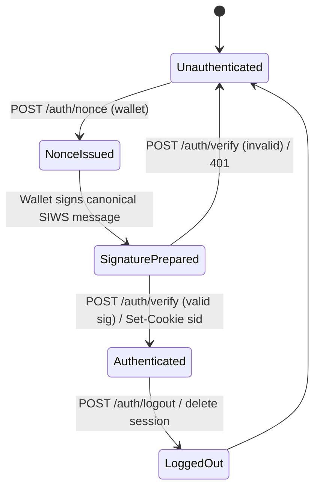
```mermaid
stateDiagram-v2
  [*] --> Unauthenticated

  Unauthenticated --> NonceIssued: POST /auth/nonce (wallet)
  NonceIssued --> SignaturePrepared: Wallet signs canonical SIWS message
  SignaturePrepared --> Authenticated: POST /auth/verify (valid sig) / Set-Cookie sid
  SignaturePrepared --> Unauthenticated: POST /auth/verify (invalid) / 401

  Authenticated --> LoggedOut: POST /auth/logout / delete session
  LoggedOut --> Unauthenticated
```

### 2) SSE Subscription Lifecycle (Browser ↔ Backend)

Relevant code:
- Backend: `backend/internal/api/sse.go`
- Frontend consumers:  
  - `555-mono/apps/web/components/LeaderboardDialog.tsx`  
  - `555-mono/apps/web/components/QuestsDialog.tsx`  
  - `555-mono/apps/web/components/PaymentHistory.tsx`

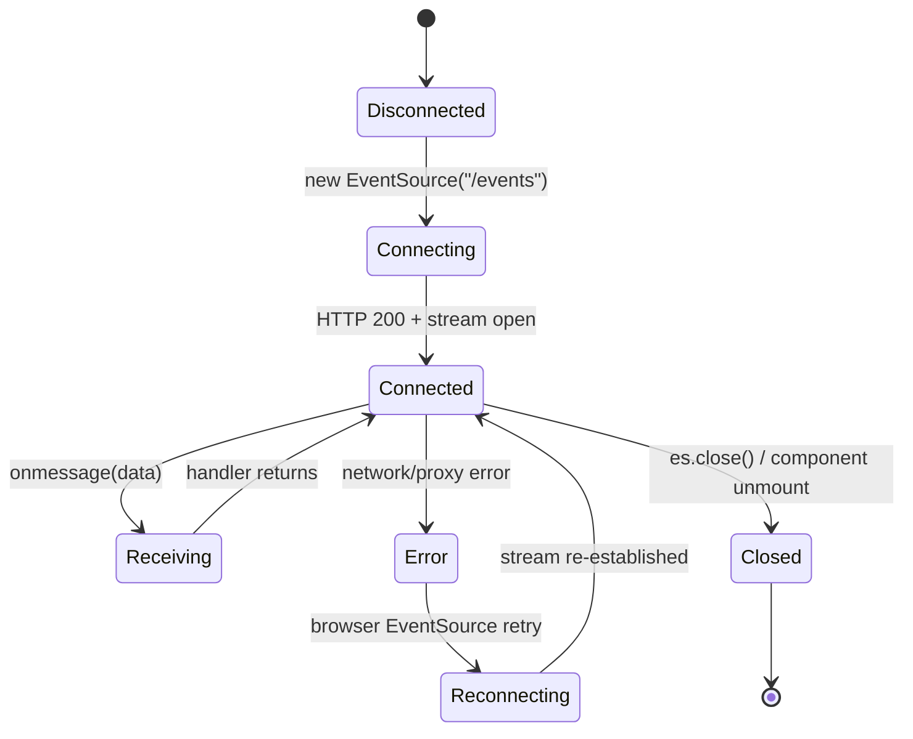
```mermaid
stateDiagram-v2
  [*] --> Disconnected
  Disconnected --> Connecting: new EventSource("/events")
  Connecting --> Connected: HTTP 200 + stream open

  Connected --> Receiving: onmessage(data)
  Receiving --> Connected: handler returns

  Connected --> Error: network/proxy error
  Error --> Reconnecting: browser EventSource retry
  Reconnecting --> Connected: stream re-established

  Connected --> Closed: es.close() / component unmount
  Closed --> [*]
```

### 3) Game Record Submission → Leaderboard Update (Browser ↔ Backend)

Relevant code:
- Backend: `backend/internal/api/game.go` (broadcasts `game_record` + `leaderboard_update`)
- Frontend: `555-mono/apps/web/components/LeaderboardDialog.tsx`

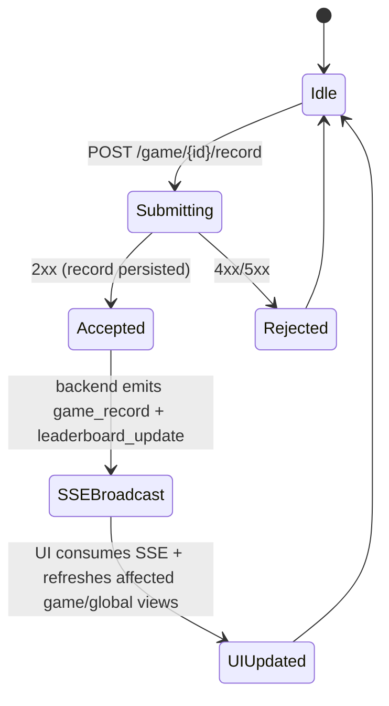
```mermaid
stateDiagram-v2
  [*] --> Idle
  Idle --> Submitting: POST /game/{id}/record
  Submitting --> Accepted: 2xx (record persisted)
  Submitting --> Rejected: 4xx/5xx

  Accepted --> SSEBroadcast: backend emits game_record + leaderboard_update
  SSEBroadcast --> UIUpdated: UI consumes SSE + refreshes affected game/global views
  UIUpdated --> Idle

  Rejected --> Idle
```

### 4) Canonical Twitter Event Ingestion (Bot ↔ Backend)

Relevant code:
- Bot: `555-bot/packages/client-twitter/src/integrations/webhook.ts`
- Backend: `backend/internal/api/integrations.go`

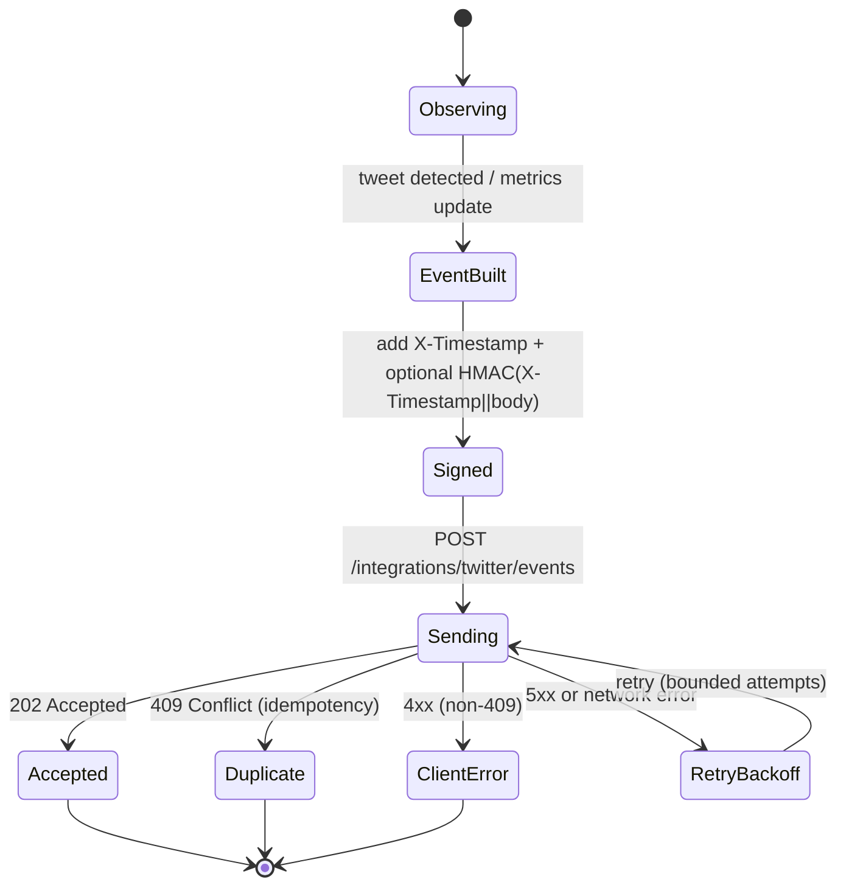
```mermaid
stateDiagram-v2
  [*] --> Observing
  Observing --> EventBuilt: tweet detected / metrics update
  EventBuilt --> Signed: add X-Timestamp + optional HMAC(X-Timestamp||body)
  Signed --> Sending: POST /integrations/twitter/events

  Sending --> Accepted: 202 Accepted
  Sending --> Duplicate: 409 Conflict (idempotency)
  Sending --> ClientError: 4xx (non-409)
  Sending --> RetryBackoff: 5xx or network error
  RetryBackoff --> Sending: retry (bounded attempts)

  Accepted --> [*]
  Duplicate --> [*]
  ClientError --> [*]
```

### 5) Backend Wallet Resolution Chain (Social Event → Wallet)

Relevant code:
- Backend: `backend/internal/api/integrations.go` (resolution chain)
- Backend helper endpoint: `backend/internal/api/wallet.go`
- 555x402: `555x402/services/api-gateway/main.go`, `555x402/services/hyperlink-link-service/main.go`

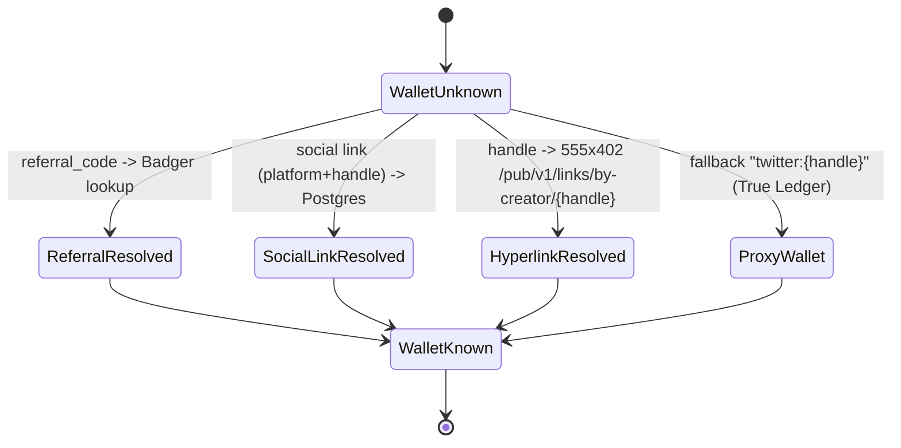
```mermaid
stateDiagram-v2
  [*] --> WalletUnknown

  WalletUnknown --> ReferralResolved: referral_code -> Badger lookup
  WalletUnknown --> SocialLinkResolved: social link (platform+handle) -> Postgres
  WalletUnknown --> HyperlinkResolved: handle -> 555x402 /pub/v1/links/by-creator/{handle}
  WalletUnknown --> ProxyWallet: fallback "twitter:{handle}" (True Ledger)

  ReferralResolved --> WalletKnown
  SocialLinkResolved --> WalletKnown
  HyperlinkResolved --> WalletKnown
  ProxyWallet --> WalletKnown
  WalletKnown --> [*]
```

### 6) Social Points + Quest Evaluation + Optional USDC Reward (Backend Internal Pipeline)

Relevant code:
- Backend ingestion: `backend/internal/api/integrations.go`
- USDC awards: `backend/internal/api/quest_payments.go`
- Payment webhook: `backend/internal/api/webhooks.go`
- SSE event hub: `backend/internal/api/sse.go`

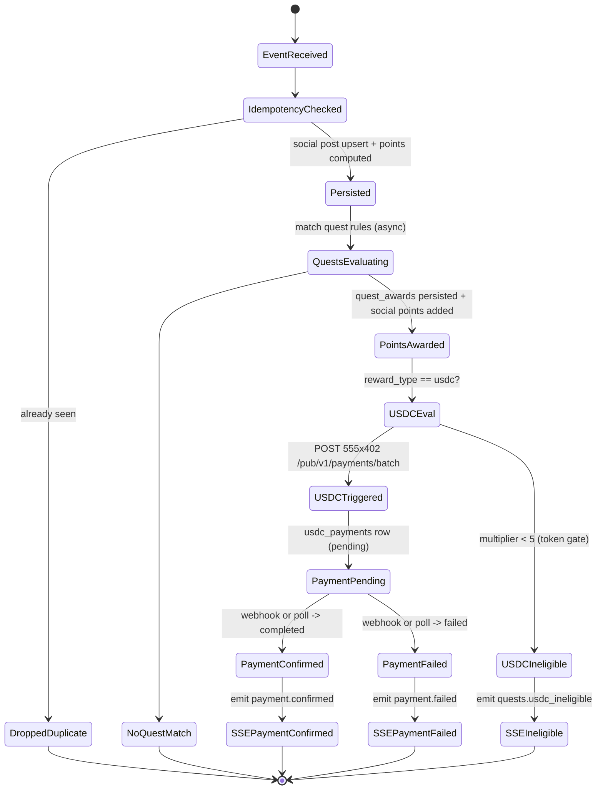
```mermaid
stateDiagram-v2
  [*] --> EventReceived
  EventReceived --> IdempotencyChecked
  IdempotencyChecked --> DroppedDuplicate: already seen
  IdempotencyChecked --> Persisted: social post upsert + points computed

  Persisted --> QuestsEvaluating: match quest rules (async)
  QuestsEvaluating --> PointsAwarded: quest_awards persisted + social points added
  QuestsEvaluating --> NoQuestMatch

  PointsAwarded --> USDCEval: reward_type == usdc?
  USDCEval --> USDCIneligible: multiplier < 5 (token gate)
  USDCEval --> USDCTriggered: POST 555x402 /pub/v1/payments/batch

  USDCTriggered --> PaymentPending: usdc_payments row (pending)
  PaymentPending --> PaymentConfirmed: webhook or poll -> completed
  PaymentPending --> PaymentFailed: webhook or poll -> failed

  PaymentConfirmed --> SSEPaymentConfirmed: emit payment.confirmed
  PaymentFailed --> SSEPaymentFailed: emit payment.failed
  USDCIneligible --> SSEIneligible: emit quests.usdc_ineligible

  DroppedDuplicate --> [*]
  NoQuestMatch --> [*]
  SSEPaymentConfirmed --> [*]
  SSEPaymentFailed --> [*]
  SSEIneligible --> [*]
```

### 7) Hyperlink Batch Payment Job (Backend ↔ 555x402 Gateway ↔ Orchestrator ↔ Backend)

Relevant code:
- Backend client: `backend/internal/hyperlink/client.go`
- Gateway routes: `555x402/services/api-gateway/main.go`
- Orchestrator: `555x402/services/cctp-orchestrator/src/index.ts`
- Backend webhook: `backend/internal/api/webhooks.go`

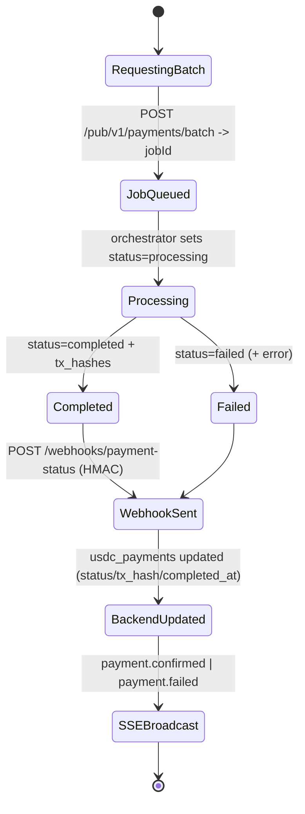
```mermaid
stateDiagram-v2
  [*] --> RequestingBatch
  RequestingBatch --> JobQueued: POST /pub/v1/payments/batch -> jobId

  JobQueued --> Processing: orchestrator sets status=processing
  Processing --> Completed: status=completed + tx_hashes
  Processing --> Failed: status=failed (+ error)

  Completed --> WebhookSent: POST /webhooks/payment-status (HMAC)
  Failed --> WebhookSent

  WebhookSent --> BackendUpdated: usdc_payments updated (status/tx_hash/completed_at)
  BackendUpdated --> SSEBroadcast: payment.confirmed | payment.failed
  SSEBroadcast --> [*]
```

### 8) 555x402 API Gateway Request Lifecycle (Client ↔ Gateway ↔ Upstream)

Relevant code:
- `555x402/services/api-gateway/main.go`

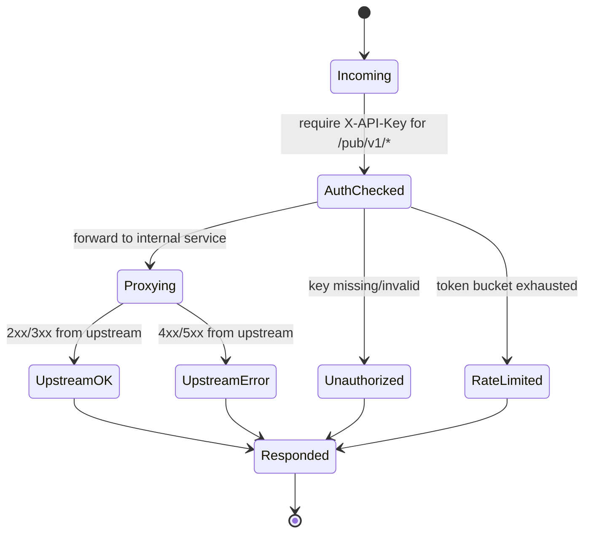
```mermaid
stateDiagram-v2
  [*] --> Incoming
  Incoming --> AuthChecked: require X-API-Key for /pub/v1/*
  AuthChecked --> Unauthorized: key missing/invalid
  AuthChecked --> RateLimited: token bucket exhausted
  AuthChecked --> Proxying: forward to internal service

  Proxying --> UpstreamOK: 2xx/3xx from upstream
  Proxying --> UpstreamError: 4xx/5xx from upstream

  UpstreamOK --> Responded
  UpstreamError --> Responded
  Unauthorized --> Responded
  RateLimited --> Responded
  Responded --> [*]
```

### 9) Daily Payout Scheduler (Backend → 555x402)

Relevant code:
- Backend: `backend/internal/scheduler/daily_payouts.go`

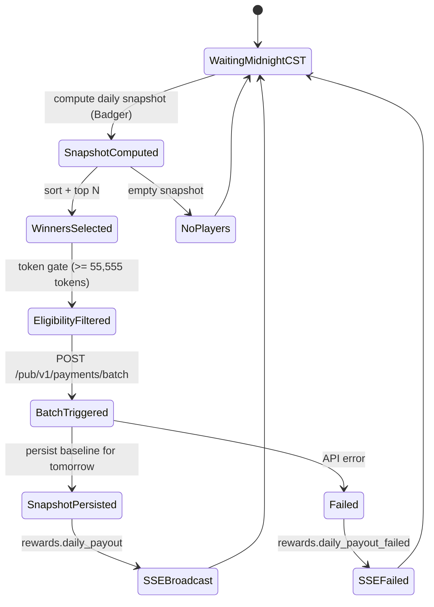
```mermaid
stateDiagram-v2
  [*] --> WaitingMidnightCST
  WaitingMidnightCST --> SnapshotComputed: compute daily snapshot (Badger)
  SnapshotComputed --> WinnersSelected: sort + top N
  WinnersSelected --> EligibilityFiltered: token gate (>= 55,555 tokens)
  EligibilityFiltered --> BatchTriggered: POST /pub/v1/payments/batch
  BatchTriggered --> SnapshotPersisted: persist baseline for tomorrow
  SnapshotPersisted --> SSEBroadcast: rewards.daily_payout
  SSEBroadcast --> WaitingMidnightCST

  SnapshotComputed --> NoPlayers: empty snapshot
  NoPlayers --> WaitingMidnightCST

  BatchTriggered --> Failed: API error
  Failed --> SSEFailed: rewards.daily_payout_failed
  SSEFailed --> WaitingMidnightCST
```

### 10) Auto Lottery Round Scheduler (Backend Internal State Machine)

Relevant code:
- Backend: `backend/internal/scheduler/auto.go`
- Trigger: `backend/internal/wallet/monitor.go`
- SSE coupling: `backend/internal/api/server.go` (SetScheduler callbacks)

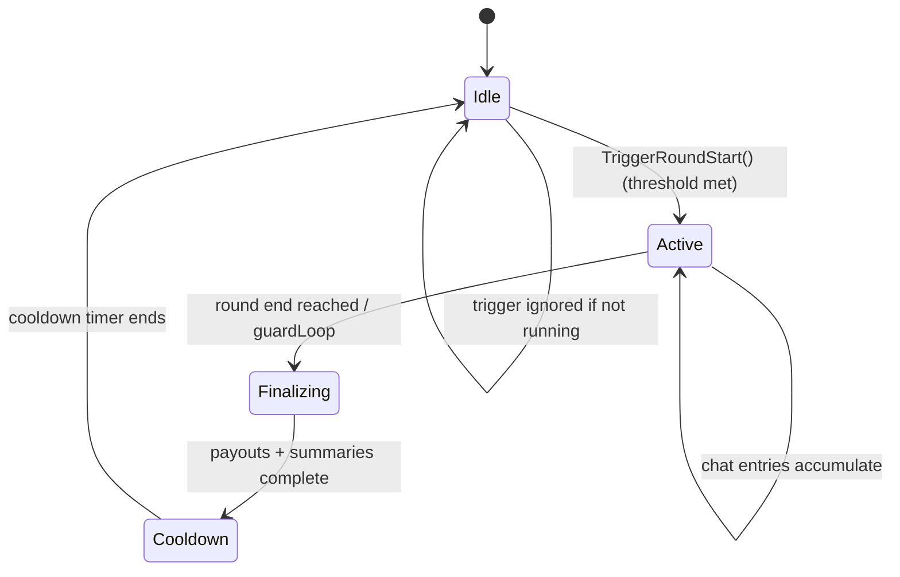
```mermaid
stateDiagram-v2
  [*] --> Idle
  Idle --> Active: TriggerRoundStart() (threshold met)
  Active --> Finalizing: round end reached / guardLoop
  Finalizing --> Cooldown: payouts + summaries complete
  Cooldown --> Idle: cooldown timer ends

  Active --> Active: chat entries accumulate
  Idle --> Idle: trigger ignored if not running
```

### 11) Rewards Wallet Balance Monitor (Backend ↔ Solana RPC)

Relevant code:
- `backend/internal/wallet/monitor.go`

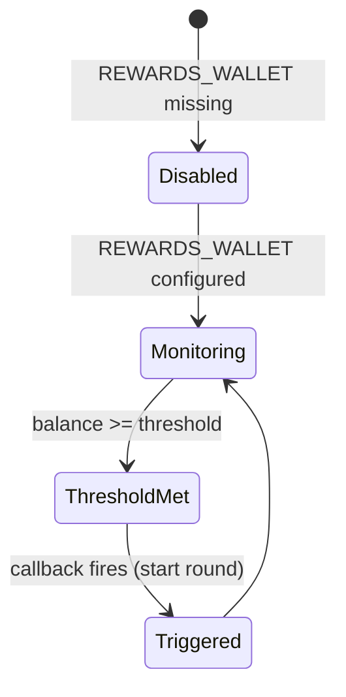
```mermaid
stateDiagram-v2
  [*] --> Disabled: REWARDS_WALLET missing
  Disabled --> Monitoring: REWARDS_WALLET configured
  Monitoring --> ThresholdMet: balance >= threshold
  ThresholdMet --> Triggered: callback fires (start round)
  Triggered --> Monitoring
```

### 12) Backend Chat Tracker Process (Backend ↔ bun/Node child process)

Relevant code:
- `backend/internal/chat/chat.go`
- Script invoked: `backend/chat/direct-tracker.js` (executed via `bun`)

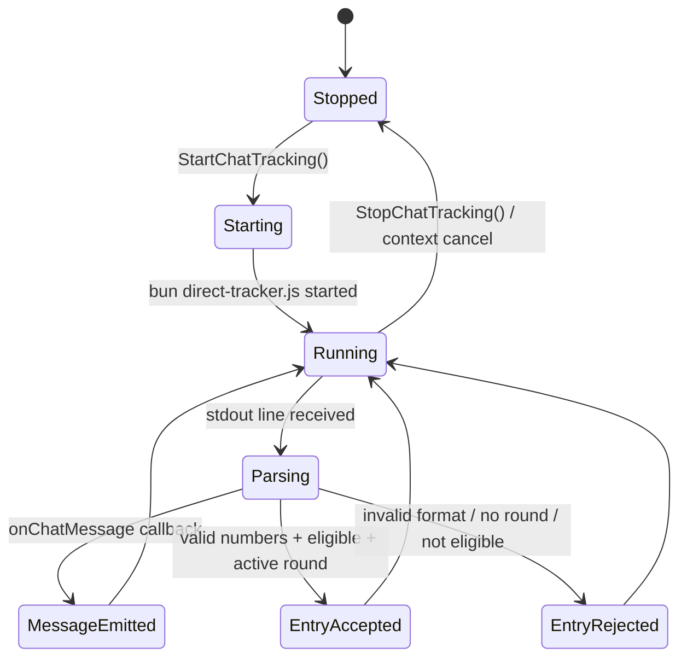
```mermaid
stateDiagram-v2
  [*] --> Stopped
  Stopped --> Starting: StartChatTracking()
  Starting --> Running: bun direct-tracker.js started
  Running --> Parsing: stdout line received
  Parsing --> MessageEmitted: onChatMessage callback
  Parsing --> EntryAccepted: valid numbers + eligible + active round
  Parsing --> EntryRejected: invalid format / no round / not eligible
  MessageEmitted --> Running
  EntryAccepted --> Running
  EntryRejected --> Running
  Running --> Stopped: StopChatTracking() / context cancel
```

### 13) Bot Social Summary Autopost (Bot SSE Consumer)

Relevant code:
- Bot: `555-bot/packages/client-twitter/src/post.ts` (startSocialEvents)
- Backend SSE emits: `social_summary` (`backend/internal/api/server.go`)

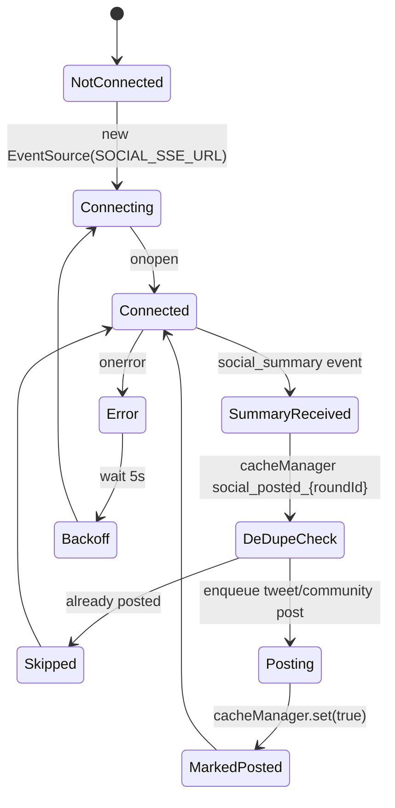
```mermaid
stateDiagram-v2
  [*] --> NotConnected
  NotConnected --> Connecting: new EventSource(SOCIAL_SSE_URL)
  Connecting --> Connected: onopen

  Connected --> SummaryReceived: social_summary event
  SummaryReceived --> DeDupeCheck: cacheManager social_posted_{roundId}
  DeDupeCheck --> Skipped: already posted
  DeDupeCheck --> Posting: enqueue tweet/community post
  Posting --> MarkedPosted: cacheManager.set(true)
  MarkedPosted --> Connected
  Skipped --> Connected

  Connected --> Error: onerror
  Error --> Backoff: wait 5s
  Backoff --> Connecting
```

### 14) Social Link Verification (Wallet ↔ Social Handle)

Relevant code:
- Backend: `backend/internal/api/social_auth.go`

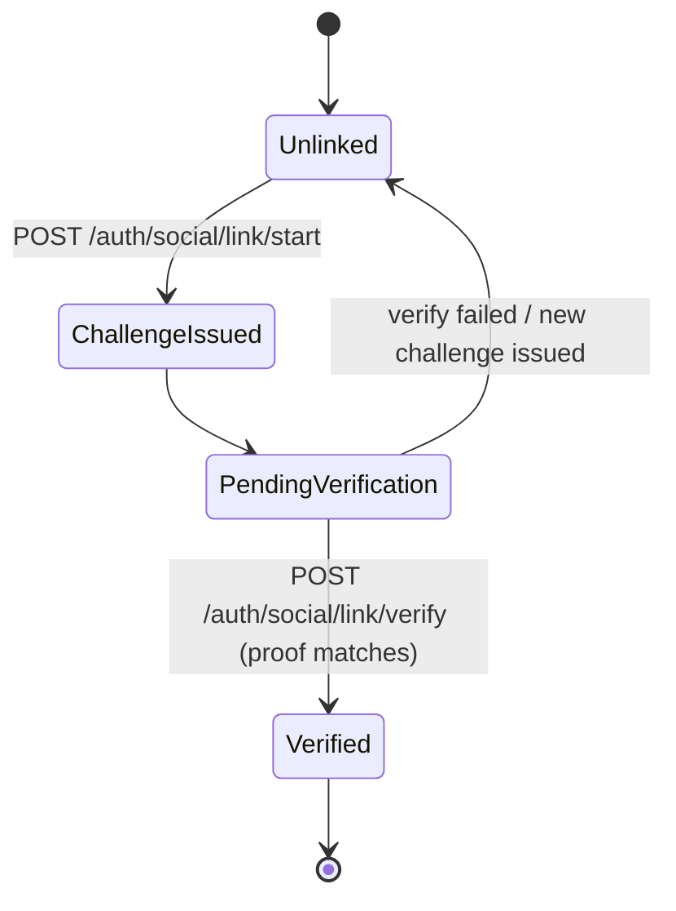
```mermaid
stateDiagram-v2
  [*] --> Unlinked
  Unlinked --> ChallengeIssued: POST /auth/social/link/start
  ChallengeIssued --> PendingVerification
  PendingVerification --> Verified: POST /auth/social/link/verify (proof matches)
  PendingVerification --> Unlinked: verify failed / new challenge issued
  Verified --> [*]
```

### 15) Arcade Theme + Timed Events (Admin/Bot ↔ Backend ↔ Frontend Polling)

Relevant code:
- Backend: `backend/internal/api/arcade.go` (admin endpoints), `backend/internal/store/sql/*` (state persistence)
- Frontend: `555-mono/apps/web/components/theme-manager.tsx` (polls `/arcade/state`)

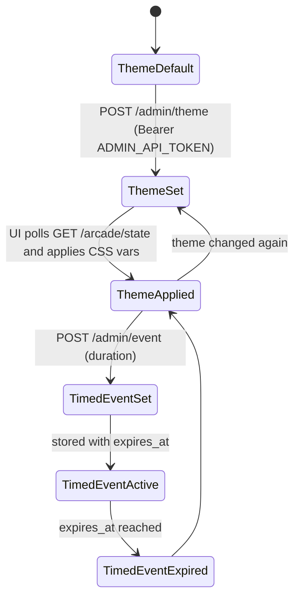
```mermaid
stateDiagram-v2
  [*] --> ThemeDefault
  ThemeDefault --> ThemeSet: POST /admin/theme (Bearer ADMIN_API_TOKEN)
  ThemeSet --> ThemeApplied: UI polls GET /arcade/state and applies CSS vars
  ThemeApplied --> ThemeSet: theme changed again

  ThemeApplied --> TimedEventSet: POST /admin/event (duration)
  TimedEventSet --> TimedEventActive: stored with expires_at
  TimedEventActive --> TimedEventExpired: expires_at reached
  TimedEventExpired --> ThemeApplied
```

### 16) Cabinet Possession + alice-sdk Message Passing (Bot/Admin ↔ Backend ↔ Frontend ↔ Game iframe)

Relevant code:
- Backend cabinet APIs: `backend/internal/api/server.go` (routes), `backend/internal/api/arcade.go` (handlers)
- Frontend iframe bridge: `555-mono/apps/web/components/GamePlayer.tsx`
- Game-side SDK: `555-mono/apps/web/public/alice-sdk.js`

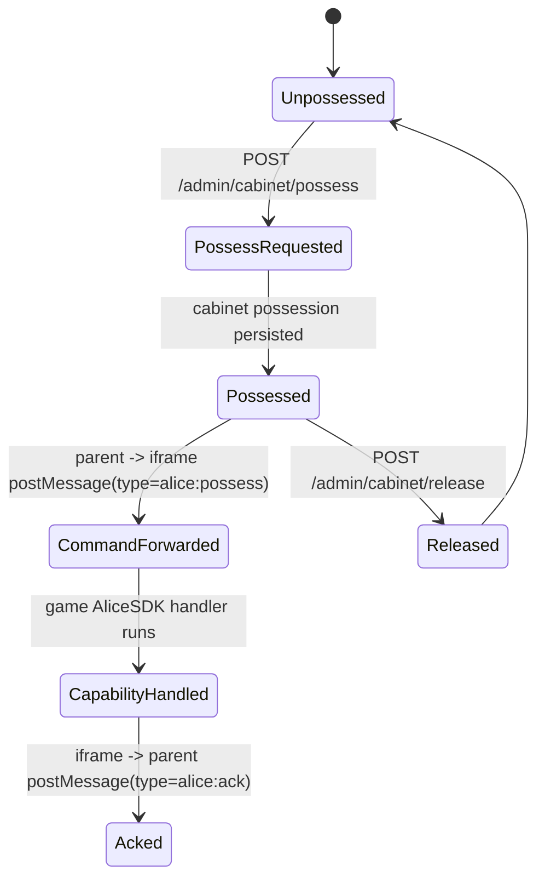
```mermaid
stateDiagram-v2
  [*] --> Unpossessed
  Unpossessed --> PossessRequested: POST /admin/cabinet/possess
  PossessRequested --> Possessed: cabinet possession persisted
  Possessed --> CommandForwarded: parent -> iframe postMessage(type=alice:possess)
  CommandForwarded --> CapabilityHandled: game AliceSDK handler runs
  CapabilityHandled --> Acked: iframe -> parent postMessage(type=alice:ack)
  Possessed --> Released: POST /admin/cabinet/release
  Released --> Unpossessed
```

### 17) Burn Event Daily Burn Loop (Backend Scheduler ↔ Solana Burn)

Relevant code:
- Backend: `backend/internal/scheduler/burn_event_scheduler.go`, `backend/internal/api/burn_events.go`

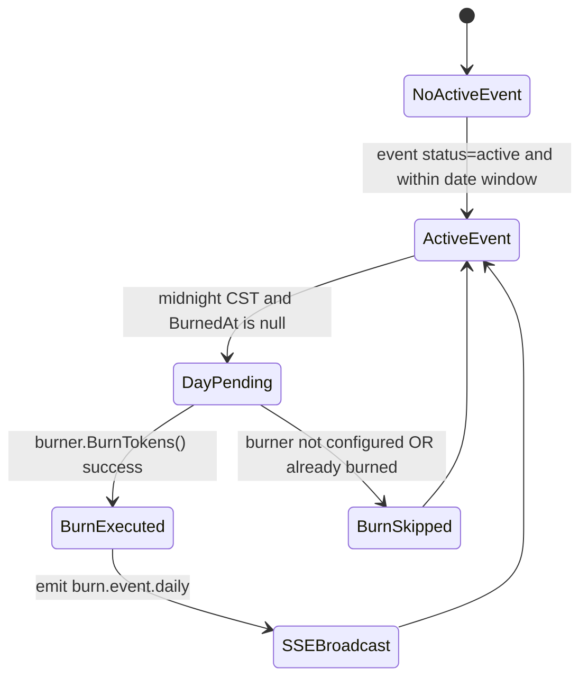
```mermaid
stateDiagram-v2
  [*] --> NoActiveEvent
  NoActiveEvent --> ActiveEvent: event status=active and within date window

  ActiveEvent --> DayPending: midnight CST and BurnedAt is null
  DayPending --> BurnExecuted: burner.BurnTokens() success
  DayPending --> BurnSkipped: burner not configured OR already burned

  BurnExecuted --> SSEBroadcast: emit burn.event.daily
  BurnSkipped --> ActiveEvent
  SSEBroadcast --> ActiveEvent
```

### 18) Rewards Claim (Frontend ↔ Backend ↔ Solana)

Relevant code:
- Frontend: `555-mono/apps/web/lib/rewards.ts`
- Backend: `backend/internal/api/server.go` (`handleGetClaimableEpochsFiltered`, `handleClaimReward`, `handleGetRewardProof`)
- On-chain: rewards_record program (built elsewhere; used by backend tx builder)

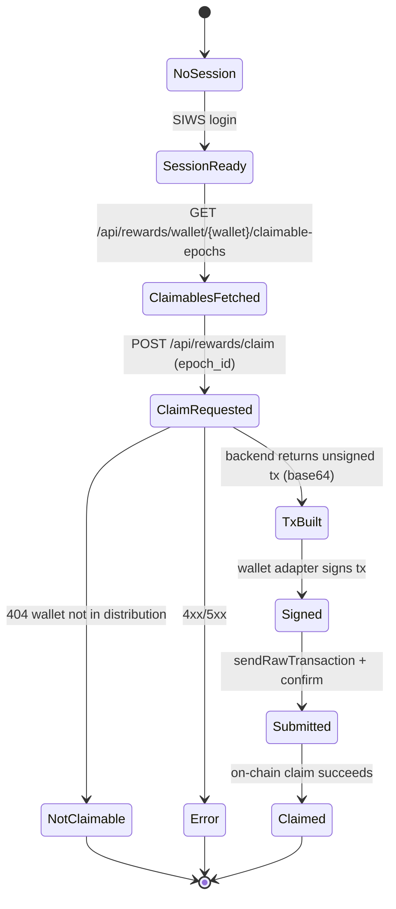
```mermaid
stateDiagram-v2
  [*] --> NoSession
  NoSession --> SessionReady: SIWS login

  SessionReady --> ClaimablesFetched: GET /api/rewards/wallet/{wallet}/claimable-epochs
  ClaimablesFetched --> ClaimRequested: POST /api/rewards/claim (epoch_id)
  ClaimRequested --> TxBuilt: backend returns unsigned tx (base64)
  TxBuilt --> Signed: wallet adapter signs tx
  Signed --> Submitted: sendRawTransaction + confirm
  Submitted --> Claimed: on-chain claim succeeds

  ClaimRequested --> NotClaimable: 404 wallet not in distribution
  ClaimRequested --> Error: 4xx/5xx
  NotClaimable --> [*]
  Error --> [*]
  Claimed --> [*]
```

### 19) Beta Mode Enforcement for Beta Games (Frontend ↔ Backend)

Relevant code:
- Frontend: `555-mono/apps/web/components/GamePlayer.tsx` (sends `X-Beta-Mode` based on localStorage)
- Backend: `backend/internal/api/game.go` (rejects beta game submissions when beta mode is off)

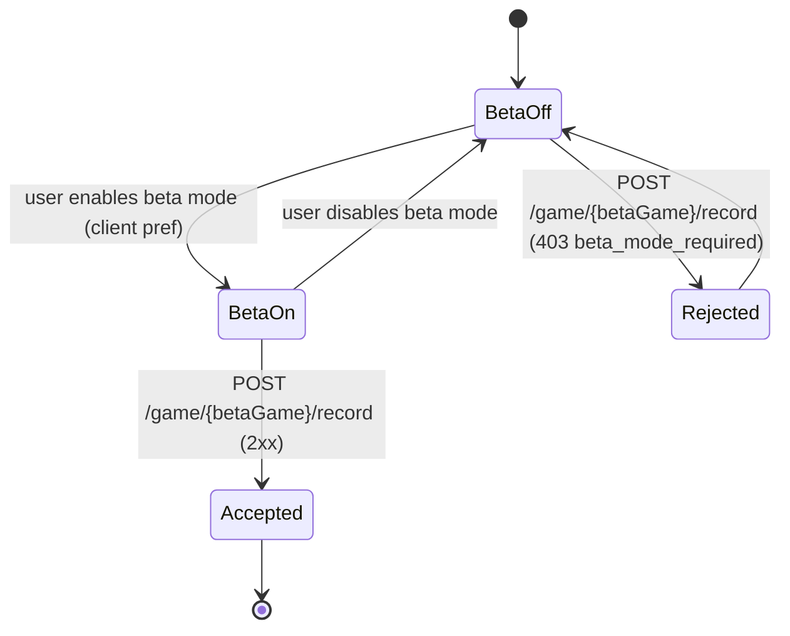
```mermaid
stateDiagram-v2
  [*] --> BetaOff
  BetaOff --> BetaOn: user enables beta mode (client pref)
  BetaOn --> BetaOff: user disables beta mode

  BetaOff --> Rejected: POST /game/{betaGame}/record (403 beta_mode_required)
  BetaOn --> Accepted: POST /game/{betaGame}/record (2xx)

  Rejected --> BetaOff
  Accepted --> [*]
```

### 20) Battle Lifecycle (Frontend ↔ Backend ↔ Bot/Admin)

Relevant code:
- Frontend polling: `555-mono/apps/web/components/BattleModal.tsx`
- Bot/admin create: `backend/internal/api/battle.go` (`/battle/create`), `555-bot/packages/plugin-arcade/src/actions/challenge.ts`
- Battle resolution: `backend/internal/api/arcade.go` (`handleSubmitScore` updates battle state)

```mermaid
stateDiagram-v2
  [*] --> NoBattle
  NoBattle --> Created: POST /battle/create
  Created --> Visible: UI polls GET /battle/active
  Visible --> Joined: POST /battle/{id}/join
  Joined --> Attempting: player submits scores
  Attempting --> WonByUser: best score beats AliceScore
  Attempting --> WonByAlice: max attempts reached
  WonByUser --> Completed
  WonByAlice --> Completed
  Completed --> NoBattle
```

### 21) Referral Binding + “First Five” On-Chain Payout (Backend ↔ Solana Referrals Program)

Relevant code:
- Backend referral processing: `backend/internal/api/game.go` (`processReferralForPlay`)
- Configuration: `backend/internal/config/config.go` (`REFERRALS_ENABLED`, `REFERRALS_PROGRAM_ID`, `REFERRALS_AUTHORITY_KEY_PATH`)

```mermaid
stateDiagram-v2
  [*] --> Unbound
  Unbound --> Bound: POST /api/referral/bind (referred binds to referrer)
  Bound --> PlaysTracked: referred submits game plays
  PlaysTracked --> PointsAwarded: referrer points incremented (Badger + leaderboards)
  PointsAwarded --> FirstFiveCheck: eligibility + paidCount < 5
  FirstFiveCheck --> OnChainReward: send tx to referrals program (RewardFirstFive)
  FirstFiveCheck --> Skipped: not eligible or already paid
  OnChainReward --> MarkPaid: write paidKey + stats
  MarkPaid --> PlaysTracked
  Skipped --> PlaysTracked
```

### 22) VRF Orchestration (Backend ↔ VRF Sidecar ↔ Switchboard/Solana)

Relevant code:
- Backend caller: `backend/internal/scheduler/auto.go`
- Sidecar: `backend/internal/vrf/orchestrator.go`
- Remote service (optional): `555-lottery/scripts/lottery/vrf-server.mjs`

```mermaid
stateDiagram-v2
  [*] --> NeedCommit

  NeedCommit --> CommitRequested: POST {VRF_ORCHESTRATOR_URL}/commit (Bearer ORCH_API_TOKEN)
  CommitRequested --> CommitOk: returns sig + seedSlot
  CommitRequested --> CommitRetry: error or non-200 (infinite retry w/ backoff)
  CommitRetry --> CommitRequested

  CommitOk --> RoundCreated: CreateRoundOnChain(drawPDA)
  RoundCreated --> NeedReveal

  NeedReveal --> RevealRequested: POST {VRF_ORCHESTRATOR_URL}/reveal-fulfill (draw)
  RevealRequested --> RevealOk: returns sig
  RevealRequested --> RevealRetry: error (infinite retry w/ backoff)
  RevealRetry --> RevealRequested

  RevealOk --> Finalized: backend reads result + broadcasts
  Finalized --> [*]
```

## Game Score Capture & Alice (555-bot) Parity Audit

Goal: verify that **Alice can authenticate, play, and land on per-game + global leaderboards** with **real identity + real score provenance**, without relying on static/hardcoded identities or fabricated scores.

### Score Capture Surfaces (Observed)

| Surface | Who calls it | AuthN | Identity source | What it records | Notes |
|---|---|---|---|---|---|
| `POST /game/{id}/record` | Browser (via `GamePlayer.tsx`) | SIWS session cookie | `currentWallet()` from session | `raw_score` (client), `norm_score` (server), meta | Enforces beta mode for beta games; emits SSE events. |
| `POST /game/{id}/record` (exit beacon) | Game iframe (`games-sdk.js`) | SIWS session cookie | `currentWallet()` from session | `raw_score` (adapter), `norm_score` (server), meta includes `origin:"sdk-exit"` | Uses `navigator.sendBeacon` / keepalive fetch on `pagehide`/`visibilitychange`/`beforeunload`. |
| `POST /game/{id}/play` | Browser fallback (exit/back) | SIWS session cookie | `currentWallet()` from session | Play counter only (no score) | Updates Badger play counters + emits `game_stats_update` SSE. |
| `POST /arcade/score` | Bot (`555-bot`) | `X-Bot-Key` | **Request body `wallet`** | `raw_score` + **trusted** `norm_score` + meta | No beta enforcement; no SSE broadcast; accepts arbitrary wallet if bot key is valid. |
| `POST /api/admin/upload-recording` | Game iframe (`games-sdk.js` in `?mode=alice`) | `alice_session` cookie OR `Authorization: Bearer ALICE_SECRET` | N/A | Video file + `{gameId, score, meta}` for AI analysis | Stores recording + queues post; does not itself affect leaderboards. Default `ALICE_SECRET` is hardcoded in code. |

### 23) Game-Side SDK Score Capture (Game iframe ↔ Parent ↔ Backend)

Relevant code:
- Game-side SDK: `555-mono/apps/web/public/games-sdk.js`
- Parent bridge: `555-mono/apps/web/components/GamePlayer.tsx`
- Backend: `backend/internal/api/game.go` (`handlePostGameRecord`)

```mermaid
stateDiagram-v2
  [*] --> Playing

  Playing --> GameOverDetected: heartbeatLoop() sees isGameOver()
  GameOverDetected --> PostToParent: postMessage(type=submitRecord, meta.run=runMarker)
  PostToParent --> ParentForwards: GamePlayer POST /game/{id}/record (cookie)
  ParentForwards --> Recorded: repo.SubmitGameRecord + SSE (leaderboard_update)
  Recorded --> Cooldown: lastSubmitTs updated (10s)
  Cooldown --> Playing: new runMarker generated

  Playing --> Exiting: pagehide/visibilitychange/beforeunload
  Exiting --> ExitBeacon: sendBeacon /game/{id}/record (meta.origin=sdk-exit)
  ExitBeacon --> [*]
```

Note: Sector-13 has additional redundancy in the parent UI (`GamePlayer.tsx`) that polls the iframe for `G.h`/`G.g.ja()` and submits a record if `postMessage` fails.

### 24) Bot Score Submission (555-bot ↔ Backend via `/arcade/score`)

Relevant code:
- Bot actions: `555-bot/packages/plugin-arcade/src/actions/possess.ts`, `555-bot/packages/plugin-arcade/src/actions/play_game.ts`
- Bot gameplay bridge: `555-bot/packages/plugin-arcade/src/services/GameBridgeService.ts`
- Backend handler: `backend/internal/api/arcade.go` (`handleSubmitScore`)

```mermaid
stateDiagram-v2
  [*] --> BotReady
  BotReady --> Playing: Playwright session + per-game adapter (AliceSocket/driveBot/G)
  Playing --> ScoreComputed: bot derives score from state
  ScoreComputed --> Submitting: POST /arcade/score (X-Bot-Key, wallet, raw_score, norm_score)
  Submitting --> Accepted: 200 + repo.SubmitGameRecord
  Submitting --> Rejected: 401 invalid bot key OR 4xx bad payload
  Accepted --> [*]
  Rejected --> [*]
```

### 25) “Alice Mode” Canvas Recording Upload (Game iframe ↔ Next.js API)

Relevant code:
- Game-side SDK: `555-mono/apps/web/public/games-sdk.js` (mode gate `?mode=alice`)
- Next API route: `555-mono/apps/web/app/api/admin/upload-recording/route.ts`

```mermaid
stateDiagram-v2
  [*] --> ModeAlice
  ModeAlice --> Recording: MediaRecorder(canvas.captureStream)
  Recording --> ScoreSubmitted: five55.submitRecord(score, meta)
  ScoreSubmitted --> NormalScorePath: originalSubmit() postMessage -> parent -> /game/{id}/record (if embedded)
  ScoreSubmitted --> Uploading: POST /api/admin/upload-recording (video + meta)
  Uploading --> Queued: posts.json entry written
  Queued --> [*]
```

### Per-Game SDK vs Bot Score Capture Matrix

Notes:
- `games-sdk.js` has explicit adapters only for: `knighthood`, `ninja-evilcorp`, `drive`, `555drive`, `clawstrike`, `flock`, `sector-13`. All other games fall back to `naiveGetScore()` + `naiveIsGameOver()` (often exit-only).
- `POSSESS_GAME` only computes score for: `clawstrike`, `555drive`, `ninja`, `knighthood`, `sector-13`. All other bot-played games currently submit `score=0` unless `play_game.ts` is used (which is simulated).

| Game ID | SDK score capture (games-sdk.js) | Bot adapter / score source (GameBridgeService + POSSESS_GAME) | Coverage + mismatch notes |
|---|---|---|---|
| `ninja-evilcorp` | Adapter: composite (level + time bonus) from `G.B._a` + `G.af`; game over via canvas text hooks | Detects `w.G.c_` as `game:"ninja-evilcorp"`; GameBridgeService computes composite score; POSSESS submits `detailedState.score` with `level/timeSec` meta | **OK** on raw score capture |
| `knighthood` | Adapter: `G.g.ja()`; game over `G.h == 2` | Detects `w.G._program`; uses `G.g.ja()`; POSSESS submits that score | **OK** on raw score capture |
| `drive` | Adapter: `window.score/points/best/time` or elapsed; game over via RAF stall | No GameBridgeService detection; not in POSSESS_GAME list | **Missing** bot coverage |
| `clawstrike` | Adapter: canvas score capture; game over via `__five55_claw_dead` / RAF stall | Detects `w.G.screens`; uses `runTime` score; POSSESS uses `detailedState.score` | **OK** on raw score capture |
| `sector-13` | Adapter: `G.g.ja()`; game over `G.h == 2`; extra exit beacons + direct send | Frame detection reads `G.g.ja()`; POSSESS uses `detailedState.score` | **OK** on raw score capture |
| `chesspursuit` | No adapter; naive score + `G.h` game over (likely exit-only if no `G.h`) | AliceSocket exposes `getState().score`; POSSESS uses `detailedState.score` | **OK** on raw score capture |
| `wolf-and-sheep` | No adapter; naive score + `G.h` game over | AliceSocket registered; `getState().score` uses `G.g.ja()` or moveCount; GameBridgeService detects via globals | **OK** on raw score capture |
| `leftandright` | No adapter; naive score + `G.h` game over | AliceSocket registered; `getState().score` uses `G.g.ja()` or `window.score` | **OK** on raw score capture |
| `playback` | No adapter; naive score + `G.h` game over | AliceSocket exposes `getState().score`; POSSESS uses `detailedState.score` | **OK** on raw score capture |
| `fighter-planes` | No adapter; naive `G.g.ja()` | GameBridgeService reads `G.g.ja()` via `myAirplane` path; POSSESS uses `detailedState.score` | **OK** on raw score capture |
| `pixel-copter` | Adapter: `game.counter * 0.1`; game over via end screen | GameBridgeService uses `driveBot.getState()`; AliceSocket also registered | **OK** on raw score capture |
| `floor13` | No adapter; naive score + `G.h` game over | Bot.js `getState()` returns score based on floors cleared; SDK now computes score on game over | **OK** on raw score capture |
| `godai-is-back` | No adapter; naive score + `G.h` game over | AliceSocket registered; score derived from enemy HP; GameBridgeService detects via hero/enemy life | **OK** on raw score capture |
| `peanball` | No adapter; naive score + `G.h` game over | AliceSocket `getState()` includes score via `G.g.ja()`; POSSESS uses `detailedState.score` | **OK** on raw score capture |
| `eat-my-dust` | No adapter; naive score + `G.h` game over | AliceSocket `getState()` now includes score during play; POSSESS uses `detailedState.score` | **OK** on raw score capture |
| `where-were-going-we-do-need-roads` | No adapter; naive score + `G.h` game over | AliceSocket registered; score from `distance`; GameBridgeService emits canonical ID | **OK** on raw score capture |
| `vedas-run` | No adapter; naive `G.g.ja()` | AliceSocket `getState()` includes score; POSSESS uses `detailedState.score` | **OK** on raw score capture |
| `555drive` (not in `GAMES_CONFIG`) | Adapter: `G.g.ja()`; game over `G.h == 2` | `driveBot` / AliceSocket exposes `score`; POSSESS reads `detailedState.score` | **OK** for bot capture (but game not in main catalog) |
| `flock` (not in `GAMES_CONFIG`) | Adapter: elapsed seconds; `isGameOver` always false (exit-only) | No bot adapter | **Missing** bot coverage |

### Alice Intelligence & Mastery Audit (Per-Game)

Scope: evaluate whether each catalog game has an autonomous bot, how it makes decisions, and whether it relies on static/hardcoded data (maps/paths/level tables) vs live game state.

Key findings:
- Several flagship bots are robust (`knighthood`, `sector-13`, `clawstrike`), but some rely on embedded level metadata or fixed paths.
- Two catalog game paths do not load bot scripts (`chesspursuit` src, `vedas-run` src), so Alice cannot autoplay without injection or alternate index paths.
- A few bots are low-agency or non-human (random move selection or direct state manipulation), which breaks "masterful" or fair-play expectations.
- LLM usage is sparse and strategic; real-time control is mostly deterministic heuristics.

| Game ID | Bot loaded in configured page | Autoplay approach | Static/hardcoded data | Mastery assessment |
|---|---|---|---|---|
| `555-lottery` | No | UI-only | N/A | Not applicable |
| `ninja-evilcorp` | Yes (`/games/ninja/bot.js`) | Embedded map + fixed pathing using game globals | **Yes** (full level matrices + paths) | High completion, but violates "no hardcoded data"; brittle if levels change |
| `knighthood` | Yes (`/games/knighthood/index.html` loads `knighthood_main/bot.js`) | Terrain scanner + hazard heuristics + state machine | No (reads runtime terrain buffers) | High, adaptive mastery |
| `drive` (redirects to `555drive`) | Conditional (`555drive` loads bot only when `?bot=true`) | Heuristic driving + hazard avoidance; optional LLM strategy | **Yes** (embedded level blueprints) | Medium-high; coupled to static level table |
| `clawstrike` | Yes (`/games/clawstrike/bot.js`) | A* navigation + combat heuristics + optional LLM | **Yes** (`LEVEL_INFO` metadata) | High, but tied to static level metadata |
| `sector-13` | Yes (iframe loads `sector-13-main` + `bot.js`) | Bullet-hell avoidance + powerup seeking | No | High, fully reactive |
| `chesspursuit` | **No** for configured path (`src/index.html` does not load bot) | Rule-based board analysis + safe-move search + optional LLM (bot in `bin-release`) | No (rules-only) | Medium-high if loaded; currently not active in catalog path |
| `wolf-and-sheep` | Yes (`/games/beta/wolf-and-sheep/bot.js`) | Random safe move selection | No | Low; non-strategic |
| `leftandright` | Yes (`/games/beta/leftandright/bot.js`) | Lane/obstacle heuristic | No | Medium; reactive only |
| `playback` | Yes (`/games/beta/playback/bot.js`) | Adapter only; no autonomous loop | N/A | None without external controller |
| `fighter-planes` | Yes (`/games/beta/Fighter-planes/bot.js`) | Targeting + rocket avoidance; LLM sets strategy | No | Medium-high |
| `pixel-copter` | Yes (`/games/beta/pixel-copter/bot.js`) | PD controller altitude hold; optional LLM | No | Low-medium |
| `floor13` | Yes (`/games/beta/floor13/bot.js`) | A* path to exit; no combat/loot logic | No | Medium (completion focus) |
| `godai-is-back` | Yes (`/games/beta/godai-is-back/bot.js`) | Approach + attack spam; includes teleport hack | No (but direct state manipulation) | Low; non-human behavior |
| `peanball` | Yes (`/games/beta/Peanball/bot.js`) | Rule-based element targeting + flipper timing; LLM strategy | **Yes** (static rule constants) | Medium-high |
| `eat-my-dust` | Yes (`/games/beta/eat-my-dust/bot.js`) | Reads phrase + types deterministically; LLM sets speed | No | High |
| `where-were-going-we-do-need-roads` | Yes (`/games/beta/where-were-going-we-do-need-roads/bot.js`) | Road-shaping heuristic with lookahead | No | Medium |
| `vedas-run` | **No** for configured path (`src/index.html` does not load bot.js) | Adapter only; no autonomous loop | N/A | None without injection |
| `555drive` (actual game) | Conditional (`?bot=true`) | Same as `drive` | **Yes** (embedded level blueprints) | Same as `drive` |

### Alice Autonomy & Control Map (Bot)

Scope: document what Alice (the bot) can read, decide, and control today, and where the code-paths diverge from intended capability.

#### Autonomy Loops & Decision Surfaces
- LLM scheduler loop: `555-bot/packages/client-twitter/src/scheduler.ts` (decides PLAY/POST/CREATE_QUEST/CHANGE_THEME/WAIT).
- Heuristic director loop: `555-bot/packages/plugin-arcade/src/services/director.ts` (self-play + challenges every 60s unless disabled).
- SSE autopost loop: `555-bot/packages/client-twitter/src/post.ts` (reacts to backend `social_summary`).

```mermaid
stateDiagram-v2
  [*] --> Idle
  Idle --> GatherIntel: PostScheduler tick / Director loop
  GatherIntel --> Decide: LLM or heuristics
  Decide --> PlayGame: POSSESS_GAME / PLAY_GAME
  Decide --> ChangeTheme: UPDATE_THEME / setTheme()
  Decide --> CreateQuest: createQuest()
  Decide --> CreateChallenge: CHALLENGE_USER
  Decide --> Post: generateNewTweet()
  PlayGame --> Record: GameBridgeService + bot.js
  Record --> SubmitScore: POST /arcade/score
  SubmitScore --> PostVideo: Twitter post
  ChangeTheme --> ThemeUpdated: POST /admin/theme -> /arcade/state
  CreateQuest --> QuestPosted: POST /quests (expected)
  CreateChallenge --> BattleCreated: POST /battle/create
  Post --> Idle
```

#### Capability Inventory (Observed)

Read/Observation:

| Area | Bot entry point | Backend endpoint | Status | Notes |
|---|---|---|---|---|
| Arcade state (theme/event) | `arcadeStateProvider` | `GET /arcade/state` | **Partial** | Provider reads `data.theme`, but backend stores `global_theme` (`backend/internal/api/arcade.go`); UI uses `global_theme` so bot context can drift. |
| Global leaderboard | `leaderboardProvider` | `GET /leaderboard/global` | **Partial** | Provider expects `items`, but API returns array (`backend/internal/api/game.go`); often renders "No scores yet". |
| Global leaderboard stats | `leaderboardProvider` | `GET /leaderboard/global/stats` | **OK** | Stats endpoint exists; used sparingly (20% chance). |
| Active battles | `arcadeStateProvider` | `GET /battle/active` | **OK** | Used in Alice context; also used by `BackendClient.getActiveBattles()`. |
| Economy (rewards/burn) | `economicsProvider` | `GET /api/rewards/pool/today`, `GET /events/burn/active` | **OK** | Read-only economic context. |
| Quest list (social quests) | `QuestSync` | `GET /quests` | **OK** | Used to update hashtag/mention monitoring. |
| Cabinet list | `cabinetProvider` | `GET /arcade/cabinets` | **OK** | Cabinet inventory is readable; no control action implemented. |

Write/Control:

| Area | Bot entry point | Backend endpoint | Status | Notes |
|---|---|---|---|---|
| Theme change | `updateThemeAction` | `POST /admin/theme` | **Partial** | Works only with `ADMIN_API_TOKEN` (Bearer). Scheduler uses `/theme/set` (missing). |
| Trigger event (double XP, etc) | `triggerEventAction` | `POST /admin/event` | **Broken** | Bot sends `X-API-Key`, but admin auth requires `Authorization: Bearer` (`backend/internal/api/server.go`). |
| Autoplay + score submit | `possessGameAction` | `POST /arcade/score` | **OK** | Real runs, but score parity + wallet proof issues documented in parity audit. |
| Simulated play | `playGameAction` | `POST /arcade/score` | **OK (non-real)** | Simulated scores; only allowed if `ALLOW_SIMULATED_SCORES=true`. |
| Create challenge/battle | `challengeUserAction` | `POST /battle/create` | **OK** | Uses `ALICE` sentinel; DirectorService feeds simulated score. |
| Create quest | `PostScheduler.executeQuest` | `POST /quest/create` | **Broken** | Backend expects `POST /quests` with admin token. |
| Check quest status | `PostScheduler.checkActiveQuests` | `GET /quest/active` | **Broken** | Backend exposes `GET /quests` and `/me/quests`. |
| Hyperlink onboarding | `createHyperlinkAction` | `POST /users`, `POST /links` | **Partial** | `/users` endpoint not present in link service/gateway; `/links` exists. |
| Cabinet possession | (none) | `POST /admin/cabinet/possess` | **Missing** | Docs mention `POSSESS_CABINET`, but no action exists. |
| In-game live modifiers | `alice-sdk.js` | `window.postMessage` (`alice:possess`) | **Missing** | Games expect AliceSDK class/init; actual SDK is a message listener; no bot path sends `alice:possess`. |

#### AliceSDK Possession Gaps (Games)
- `alice-sdk.js` is a simple `postMessage` listener (`555-mono/apps/web/public/alice-sdk.js`).
- `ninja`, `knighthood`, `flock` expect `new AliceSDK()` and `alice.init({callbacks})` which do not exist in the current SDK.
- No bot code sends `window.postMessage({type:"alice:possess"})`, so even Sector 13's handlers are unreachable from the bot.

#### Target Capability Checklist (What Alice Should Be Able To Do)
1) Control arcade theme and events via admin endpoints (and see those updates reflected in both UI and her own context).
2) Autoplay all 18 catalog games with real gameplay, submit scores as a real wallet, and appear on per-game + global leaderboards.
3) Possess cabinets in real time (send `alice:possess`), changing lives/weapons/difficulty/messages for live events.
4) Read and reference **global and per-game** leaderboards (plus quest/burn leaderboards) in her replies.
5) Create, update, and expire quests (social + game + livestream) with admin token; announce winners.
6) Create and manage battles/challenges with real Alice scores (non-simulated), enforce attempt limits.
7) Onboard new players by minting Hyperlinks and verifying wallet linkage.
8) Trigger short-term arcade events (double XP, free play) with correct admin auth.

### Game Link Audit (UI vs Bot)

Notes:
- The 404s you saw were due to missing top-level `index.html` files. Use the UI path from `GAMES_CONFIG` or the bot path below.
- Bot paths include `?bot=true` where required to auto-start or load bot scripts.

| Game ID | UI path (catalog) | Bot path (automation) | Notes |
|---|---|---|---|
| `555-lottery` | `/casino/555` | N/A | Not a game loop (UI only) |
| `ninja-evilcorp` | `/games/ninja/index.html` | `/games/ninja/index.html?bot=true` | Bot auto-starts with `?bot=true` |
| `knighthood` | `/games/knighthood/index.html` | `/games/knighthood/index.html?bot=true` | Bot script always loads |
| `drive` | `/games/drive/index.html?v=3` | `/games/555drive/index.html?bot=true` | `/games/drive` redirects and drops query params |
| `clawstrike` | `/games/clawstrike/index.html` | `/games/clawstrike/index.html?bot=true` | Bot auto-starts with `?bot=true` |
| `sector-13` | `/games/sector-13/index.html` | `/games/sector-13/index.html?bot=true` | Wrapper passes query to inner iframe |
| `chesspursuit` | `/games/beta/chesspursuit/src/index.html` | `/games/beta/chesspursuit/bin-release/index.html?bot=true` | Bot only in `bin-release` |
| `wolf-and-sheep` | `/games/beta/wolf-and-sheep/index.html` | `/games/beta/wolf-and-sheep/index.html?bot=true` | Bot script always loads |
| `leftandright` | `/games/beta/leftandright/index.html` | `/games/beta/leftandright/index.html?bot=true` | Bot script always loads |
| `playback` | `/games/beta/playback/index.html` | `/games/beta/playback/index.html?bot=true` | Bot script always loads |
| `fighter-planes` | `/games/beta/Fighter-planes/index.html` | `/games/beta/Fighter-planes/index.html?bot=true` | Bot script always loads |
| `pixel-copter` | `/games/beta/pixel-copter/src/index.html` | `/games/beta/pixel-copter/src/index.html?bot=true` | Root `/games/beta/pixel-copter/index.html` is 404 |
| `floor13` | `/games/beta/floor13/src/index.html` | `/games/beta/floor13/src/index.html?bot=true` | Root `/games/beta/floor13/index.html` is 404 |
| `godai-is-back` | `/games/beta/godai-is-back/index.html` | `/games/beta/godai-is-back/index.html?bot=true` | Bot script always loads |
| `peanball` | `/games/beta/Peanball/src/index.html` | `/games/beta/Peanball/src/index.html?bot=true` | Root `/games/beta/Peanball/index.html` is 404 |
| `eat-my-dust` | `/games/beta/eat-my-dust/public/index.html` | `/games/beta/eat-my-dust/public/index.html?bot=true` | Bot loads only when `?bot` is set |
| `where-were-going-we-do-need-roads` | `/games/beta/where-were-going-we-do-need-roads/index.html` | `/games/beta/where-were-going-we-do-need-roads/index.html?bot=true` | Bot script always loads |
| `vedas-run` | `/games/beta/vedas-run/src/index.html` | `/games/beta/vedas-run/dist/index.html?bot=true` | Root `/games/beta/vedas-run/index.html` is 404; bot only in `dist` |

### Bot Link Validation (Local Run)

Run: `npx ts-node --esm scripts/test_all_games.ts` (from `555-bot`, web at `localhost:3000`)

Summary:
- **13 OK**, **4 UNKNOWN** due to missing `status` fields in `GameBridgeService` for some detections.
- `fighter-planes` logged `page.waitForLoadState` timeout but still loaded; status mapping fix applied in bridge.
- Several **0-score** results are due to **no gameplay progression**, not missing score hooks (e.g., `playback` is adapter-only; `peanball`/`where-were-going` often need >500ms to start). `vedas-run` now sends `MOVE_FORWARD` to advance.
- `pixel-copter` SDK score capture now reads `game.counter`; bot path already OK via `driveBot`.

| Game | Result | Notes |
|---|---|---|
| `ninja-evilcorp` | PLAYING | OK |
| `knighthood` | UNKNOWN | Bridge returned score/phase without status (fixed) |
| `drive` | PLAYING | OK |
| `clawstrike` | UNKNOWN | Bridge returned score/level without status (fixed) |
| `sector-13` | UNKNOWN | Frame detection returned score without status (fixed) |
| `chesspursuit` | MENU | OK |
| `wolf-and-sheep` | PLAYING | OK |
| `leftandright` | PLAYING | OK |
| `playback` | MENU | OK |
| `fighter-planes` | UNKNOWN | Load-state timeout; bridge lacked status (fixed) |
| `pixel-copter` | PLAYING | OK |
| `floor13` | PLAYING | OK |
| `godai-is-back` | PLAYING | OK |
| `peanball` | MENU | OK |
| `eat-my-dust` | PLAYING | OK |
| `where-were-going` | MENU | OK |
| `vedas-run` | PLAYING | OK |

### Backend Normalization & Validation Matrix (Server)

Sources:
- `backend/internal/api/game.go` (`normalizeScore`, `maxScoresForValidation`, `timeGames`, beta enforcement list)
- `backend/internal/api/game.go` difficulty inference (tiers for `ninja-evilcorp`, `clawstrike`, `sector-13`)

Shared rules (apply to all server-submitted records via `/game/{id}/record`):
- **Normalized score**: `normalizeScore(raw)` (0–10000 scale) or time-based composite for `ninja-evilcorp`, then difficulty multiplier, then **divide by 5**.
- **Validation**: raw score is logged if it exceeds `maxScore * 2` for known IDs; it is not rejected.
- **Difficulty tiers (inferred)**: `ninja-evilcorp` + `clawstrike` = 3 tiers; `sector-13` = 2 tiers.
- **Beta gating**: beta game submissions rejected unless `X-Beta-Mode:true` or stored preference.

| Game ID | Normalization max (server) | Beta gated | Notes |
|---|---:|:---:|---|
| `ninja-evilcorp` | 20000 (validation); **time-based composite** for normalization | No | Uses meta `level`, `totalLevels`, `timeSec` (cap 600s); ignores `raw_score` for normalization |
| `knighthood` | 5000 | No | Direct `normalizeScore` path |
| `drive` | 50000 | No | Direct `normalizeScore` path |
| `clawstrike` | 100000 | No | Direct `normalizeScore` path; 3-tier difficulty inferred |
| `sector-13` | 200000 | No | Direct `normalizeScore` path; 2-tier difficulty inferred |
| `flock` | 5000 | No | Direct `normalizeScore` path |
| `fighter-planes` | 50000 | Yes | Beta list + normalizeScore |
| `chesspursuit` | 1000 | Yes | Beta list + normalizeScore |
| `wolf-and-sheep` | 10000 | Yes | Beta list + normalizeScore |
| `leftandright` | 1000 | Yes | Beta list + normalizeScore |
| `loud-maze` | 10000 | Yes | Beta list + normalizeScore; **not in `GAMES_CONFIG`** |
| `playback` | 10000 | Yes | Beta list + normalizeScore |
| `pixel-copter` | 1000 | Yes | Beta list + normalizeScore |
| `floor13` | 10000 | Yes | Beta list + normalizeScore |
| `godai-is-back` | 10000 | Yes | Beta list + normalizeScore |
| `peanball` | 50000 | Yes | Beta list + normalizeScore |
| `eat-my-dust` | 10000 | Yes | Beta list + normalizeScore |
| `where-were-going-we-do-need-roads` | 1000 | Yes | Beta list + normalizeScore |
| `vedas-run` | 10000 | Yes | Beta list + normalizeScore |
| `555drive` | 50000 | No | Aligned with `drive` distance max |

### Critical Parity Findings (User vs Alice)

1) **Hardcoded “ALICE” identity prevents “real wallet” leaderboard presence**
- Bot score submissions in `POSSESS_GAME` hardcode `wallet: "ALICE"` (`555-bot/packages/plugin-arcade/src/actions/possess.ts`).
- Backend battle logic also uses `"ALICE"` as a sentinel (`backend/internal/api/battle.go`, `backend/internal/api/arcade.go`, `backend/internal/models/battle.go`).
- Result: Alice cannot appear as a real wallet address unless the sentinel is replaced end-to-end.

2) **Bot-key submissions can impersonate any wallet**
- `/arcade/score` trusts the `wallet` field when `X-Bot-Key` is valid; there is no wallet proof or allowlist.
- This allows the bot (or anyone with the key) to post scores as arbitrary wallets, bypassing SIWS.

3) **Bot submissions bypass server normalization and can corrupt leaderboards**
- Human path: `POST /game/{id}/record` computes `norm_score` server-side (`backend/internal/api/game.go`) using:
  - game-specific normalization (`normalizeScore` + special time-based logic for ninja),
  - difficulty multipliers,
  - division by 5.
- Bot path: `POST /arcade/score` **trusts the caller’s `norm_score`** (`backend/internal/api/arcade.go`) and does not recompute it.
- Current bot code sets `norm_score = raw_score` in `POSSESS_GAME`, which is not comparable to human leaderboard scaling.

4) **Some bot score capture is simulated or incomplete**
- `PLAY_GAME` explicitly “simulates gameplay” and submits random-ish scores; it also omits `X-Bot-Key`, so it is likely rejected by backend (`555-bot/packages/plugin-arcade/src/actions/play_game.ts`).
- `BackendClient.submitScore()` sends only `{game_id, raw_score, wallet}` without `norm_score` / `run_id` (`555-bot/packages/client-twitter/src/backend.ts`), producing `norm_score=0` records and relying on “daily bonus” side-effects for points.

5) **Beta mode parity is currently broken for bot-played beta games**
- Human path: beta games reject score submissions unless `X-Beta-Mode:true` (`backend/internal/api/game.go` + `GamePlayer.tsx`).
- Bot path: `/arcade/score` does not enforce beta gating and the bot does not send `is_beta_mode` in `POSSESS_GAME`.
- Outcome: Alice can write “regular mode” leaderboard points for beta games even when humans cannot, which violates expected rules.

6) **Realtime UX parity: bot submissions do not broadcast SSE updates**
- Human submissions emit `game_record` + `leaderboard_update` (`backend/internal/api/game.go`).
- Bot submissions via `/arcade/score` do not broadcast these events (`backend/internal/api/arcade.go`), so the UI may not update until refresh/polling.

7) **Score provenance differs between user SDK and bot bridge**
- Human capture relies on `games-sdk.js` reading `window.G.g.ja()` and/or canvas text sampling, and emits a stable `meta.run` marker for dedupe.
- Bot capture uses `GameBridgeService.getDetailedState()` and then per-game heuristics in `POSSESS_GAME`; for some games the bot state does not include the real score (e.g., clawstrike state includes `level` but not `runTime`), so the submitted score can be structurally wrong.

8) **/arcade/score lacks input parity and dedupe guarantees**
- `/game/{id}/record` validates score sanity and always generates `run_id` if missing; `/arcade/score` does neither.
- Some bot submitters omit `run_id` or `norm_score`, allowing duplicate raw records and still granting the daily bonus (+100) with effectively zero score.

### Leaderboards & Point Accounting (How a Bot Run Actually “Shows Up”)

Relevant code:
- Leaderboards: `backend/internal/api/game.go` (`handleGetLeaderboard`, `handleGetGlobalLeaderboard`)
- Models: `backend/internal/models/game.go`
- Writes: `backend/internal/store/sql/repo.go` (`SubmitGameRecord`)

- **Per-game leaderboard (no period)**: `GET /leaderboard/{gameId}` reads `game_bests` and ranks by `norm_score` (DESC). If Alice submits a bad `norm_score`, she will appear but with an incomparable value.
- **Period leaderboards (day/week/month/year)**: use `leaderboard_points` and include `mode` (`regular` vs `beta`).
- **Global leaderboard**: `GET /leaderboard/global` reads `global_points` and ranks by `regular_points` (DESC). `beta_points` may be included in the response, but does not affect ordering in the “no period” endpoint.
- **Important implication**: if Alice plays primarily beta games and correctly marks them as beta, she may not rank on the default global leaderboard unless regular-mode points are also accumulated.

### What “Good” Looks Like (Concrete Requirements)

To satisfy the goal (“no static identity / no fabricated scores”), Alice needs all of:

- **Identity**: a real wallet address (e.g., `ALICE_WALLET`) used everywhere; remove `"ALICE"` sentinel behavior or gate it behind config.
- **Authentication**: either:
  - SIWS session (same as users) and submit via `POST /game/{id}/record`, or
  - `/arcade/score` upgraded to require wallet proof (signature) and/or restrict wallet to a configured Alice wallet.
- **Score provenance**: score sourced from the same mechanism as humans (ideally the game-side SDK), or at least computed on the server from `raw_score + meta` using the same code path as user submissions.
- **Mode parity**: beta games must be recorded as beta (and enforced) the same way for bot and human runs.

### Remediation Checklist (Actionable)

1) **Unify normalization**  
   Move normalization into shared backend logic; `handleSubmitScore` should compute `norm_score` the same as `handlePostGameRecord` and ignore client-supplied `norm_score`.

2) **Fix identity + wallet proof**  
   Replace `"ALICE"` sentinel with config (`ALICE_WALLET`) and enforce wallet signature or SIWS session. Update battle logic to treat Alice as a normal wallet.

3) **Enforce beta rules in bot path**  
   `POST /arcade/score` should validate `is_beta_mode` for beta games (or reject if missing), mirroring `/game/{id}/record`.

4) **Require `run_id` and validate inputs**  
   Bot submissions should include `run_id` (dedupe) and be rejected for invalid scores (negative/NaN/Inf). If omitted, backend should generate a run_id.

5) **Score provenance parity**  
   For Playwright bot runs, either:
   - embed the game in the actual web app so `games-sdk.js` + `GamePlayer.tsx` path is used, or
   - use `games-sdk.js` in the game frame and harvest `meta` + score from it for server-side normalization.

6) **Realtime parity**  
   Broadcast `game_record` + `leaderboard_update` for bot submissions (and optionally `game_stats_update`) so the UI reflects Alice’s scores live.

### Concrete Fix Plan (Per-Game + Component)

Cross-cutting fixes to unblock all games:
- **Bot score usage**: in `POSSESS_GAME`, always prefer `detailedState.score` when present; only fall back to game-specific heuristics if missing.
- **Bridge ID alignment**: update `GameBridgeService` to emit canonical IDs (`ninja-evilcorp`, `where-were-going-we-do-need-roads`) and fix the undefined `frames` reference in `waitForFunction`.
- **Expose score everywhere**: ensure each `bot.js`/`AliceSocket` returns a `score` value in `getState()` for the active gameplay loop.
- **Backend parity**: `/arcade/score` should recompute `norm_score` server-side, validate scores, enforce beta gating, and broadcast SSE.

Per-game fixes to close SDK vs bot mismatches:

| Game ID | Current gap | Fix (SDK/Bot/Bridge) | Backend note |
|---|---|---|---|
| `ninja-evilcorp` | Bot reports `game:"ninja"` and uses local timer; score formula diverges | Emit `game:"ninja-evilcorp"`; expose `timeSec` + `level` from `G.af`/`G.B._a` in AliceSocket or Bridge; compute same composite score as SDK | Normalize on server; ignore client `norm_score` |
| `knighthood` | OK | No change | None |
| `drive` | No AliceSocket; bot path missing | Add AliceSocket (score/time) or Bridge reads globals; include in `POSSESS_GAME` | Normalization already defined |
| `clawstrike` | Bot uses heuristic (level/deaths); ignores `runTime` | Bridge should use AliceSocket `getState()` (score = `G.runTime`); POSSESS uses `detailedState.score` | None |
| `sector-13` | OK | No change | None |
| `chesspursuit` | AliceSocket score exists; POSSESS ignores | Use `detailedState.score` for submission | None |
| `wolf-and-sheep` | No AliceSocket; Bridge expects one | Add AliceSocket `getState()` with `score=moveCount` | None |
| `leftandright` | No AliceSocket; Bridge expects one | Add AliceSocket `getState()` with `score=window.score` | None |
| `playback` | AliceSocket score exists; POSSESS ignores | Use `detailedState.score` | None |
| `fighter-planes` | AliceSocket score exists; POSSESS ignores | Use `detailedState.score` | None |
| `pixel-copter` | No AliceSocket or Bridge hook | Implement AliceSocket `getState()` (score = distance/`G.g.ja()` if available); add Bridge detection | None |
| `floor13` | No score in bot state | Implement AliceSocket `getState()` with score (level/time); Bridge should read it | None |
| `godai-is-back` | No AliceSocket | Add AliceSocket `getState()` (score from game globals) | None |
| `peanball` | AliceSocket exists but no score | Add `score` to `getState()` | None |
| `eat-my-dust` | `getState()` omits score during play | Add `score: state.D` in play state; use `detailedState.score` | None |
| `where-were-going-we-do-need-roads` | Uses `driveBot`, no score; Bridge uses truncated ID | Register AliceSocket with score; update Bridge ID to full string | None |
| `vedas-run` | AliceSocket score exists; POSSESS ignores | Use `detailedState.score` | None |
| `555drive` | Not in `GAMES_CONFIG`; backend uses default max | Add to catalog or alias to `drive`; add normalization max entry | Update `normalizeScore` map |
| `flock` | No bot coverage | Either add AliceSocket adapter or exclude from bot play | None |
| `loud-maze` | In backend beta list but missing assets/config | Add to `GAMES_CONFIG` + game assets before enabling | None |

### Implementation Worklist (By Component)

Backend (`backend/`):
- Create a shared normalization helper and use it in both `handlePostGameRecord` and `handleSubmitScore` so `/arcade/score` ignores client `norm_score`.
- Add score validation, `run_id` generation, and beta gating to `/arcade/score` to match `/game/{id}/record`.
- Emit `game_record` + `leaderboard_update` SSE events for `/arcade/score`.
- Replace hardcoded `"ALICE"` sentinel with `ALICE_WALLET` (config) in battle creation and battle resolution checks.
- Add `555drive` to normalization max scores, or alias `555drive` -> `drive` on input.
- Remove default `ALICE_SECRET` fallback in `upload-recording` route; require explicit env.

Bot (`555-bot/`):
- `GameBridgeService`: fix undefined `frames` reference in `waitForFunction`, normalize game IDs (`ninja-evilcorp`, `where-were-going-we-do-need-roads`), and prefer AliceSocket `getState()` if present.
- `POSSESS_GAME`: set `score` from `detailedState.score` when available; include `run_id`, `score_source`, and `is_beta_mode` for beta games.
- Remove hardcoded `wallet: "ALICE"` and derive from `ALICE_WALLET` env or Solana keypair.
- Either remove/disable `PLAY_GAME` simulated submission or ensure it uses `X-Bot-Key` and is clearly marked as simulated (and excluded from leaderboards).

Frontend / Game SDK (`555-mono/`):
- Add AliceSocket `getState()` with `score` for games missing it (`wolf-and-sheep`, `leftandright`, `godai-is-back`, `pixel-copter`, `floor13`, `where-were-going-we-do-need-roads`).
- Extend `games-sdk.js` adapters beyond the current 7 games or document that some games are "exit-only" capture.
- Align `GAMES_CONFIG` with backend normalization list (add `loud-maze` or remove backend reference; decide on `555drive`).

Security / Auth:
- Restrict `/arcade/score` to a configured allowlist wallet, or require wallet signature (SIWS-like) as proof of identity.
- Rotate and enforce bot keys; add audits for score submissions with missing/invalid wallet proof.

### Status Update (Fixes Applied)

- `/arcade/score` now recomputes normalized scores server-side, validates raw scores, enforces beta gating, generates `run_id` when missing, and emits `game_record` + `leaderboard_update` SSE.
- `ALICE` sentinel has been replaced with `ALICE_WALLET` configuration in bot submissions and battle comparisons (wallet proof still not enforced).
- Bot submissions now prefer `detailedState.score` with heuristic fallbacks only when no score is available.
- AliceSocket score surfaces added/expanded for `pixel-copter`, `floor13`, `godai-is-back`, `wolf-and-sheep`, `leftandright`, `peanball`, `eat-my-dust`, `where-were-going-we-do-need-roads`.
- GameBridgeService detection hardened for beta titles without reliable `<title>` metadata; `state.game` now resolves via globals.
- GameBridgeService now includes `status` for `knighthood`, `clawstrike`, `sector-13`, and `fighter-planes` to avoid `UNKNOWN` results in test runs.
- `ninja-evilcorp` composite score now computed in the bot bridge; `level/totalLevels/timeSec` forwarded as meta for server normalization.
- `floor13` SDK now computes a score on game over (floors cleared normalized to 0–10000).
- `pixel-copter` SDK adapter now reads `game.counter` (distance) to avoid 0-score submissions.
- `vedas-run` bot decisions now issue `MOVE_FORWARD` when stationary to ensure score progression; SDK adapter includes `gs.tz` fallback.
- Automated beta-game validation failed to launch Playwright Chromium due to Crashpad permission errors (environmental).
- WebKit fallback also failed in this environment (`Abort trap: 6`), so automated browser validation is currently blocked.
- Remaining parity gaps: wallet-proofing for `/arcade/score`.

### Verification Checklist (End-to-End)

Preflight:
- Confirm environment variables: `ARCADE_BOT_KEY`/`TWITTER_BOT_KEY`, `ALICE_WALLET`, `ALICE_SECRET`, and beta-mode preference flow.
- Confirm backend uses the unified normalization helper for both `/game/{id}/record` and `/arcade/score`.

Authentication + Identity:
- Submit `/arcade/score` with no `X-Bot-Key` -> expect `401`.
- Submit `/arcade/score` with valid bot key but mismatched wallet proof -> expect reject (if signature gating is added).
- Submit a bot score with `wallet=ALICE_WALLET` -> verify leaderboard shows the wallet (not `"ALICE"`).

Normalization + Dedupe:
- For a known game (e.g., `sector-13`), submit a fixed raw score via `/game/{id}/record` and `/arcade/score`; confirm identical `norm_score` result.
- Submit the same `run_id` twice with a lower raw score -> expect no change; then with a higher raw score -> expect update.
- For `ninja-evilcorp`, verify normalization uses `meta.level` + `meta.timeSec` (not the raw score).

Beta parity:
- Submit a beta game score without `is_beta_mode` -> expect `403 beta_mode_required`.
- Submit the same with beta mode enabled -> expect accept, and leaderboard points attributed to `beta` mode only.

Realtime parity:
- Open `/events` SSE and submit `/arcade/score`; confirm `game_record` + `leaderboard_update` are broadcast.
- Confirm UI updates without manual refresh.

Per-game sanity spot checks:
- `clawstrike`: bot score equals in-game `runTime` (not level-based heuristic).
- `chesspursuit`, `playback`, `eat-my-dust`, `vedas-run`: bot score is non-zero and matches AliceSocket `getState().score`.
- `where-were-going-we-do-need-roads`: bot score exists and game ID matches backend name.

## Intricate Integrations & Coupling Hotspots

- **Next.js rewrites as an API façade**: `555-mono/apps/web/next.config.mjs` proxies many backend routes, enabling relative `fetch("/...")` in the browser without exposing a separate API host at call sites.
- **Dual storage model in backend**: Postgres is required for core persistence, while Badger is still used for sessions/nonces and as backup for some counters/snapshots; some flows read/write both.
- **Multi-hop payment finality**: “Award USDC” spans backend → gateway → orchestrator → webhook → backend, with multiple failure modes; the system relies on webhook signatures and idempotency checks to avoid double pay.
- **Idempotency occurs in multiple layers**:
  - Bot event posts have idempotency keys; backend hashes and records social events to dedupe.
  - Payments have “quest_id+wallet” checks before creating new `usdc_payments`.
- **Time zone semantics**: “day/week/month/year” periods are computed in CST in several places; schedulers run at CST midnight.

## Orphans / Inconsistencies / Candidate Dead Ends (Initial Findings)

These are **candidates** based on static inspection; they should be verified against deployment reality.

- `./Cargo.toml` workspace references `programs/rewards-record`, but `./programs/rewards-record/` is absent (while similar programs exist under `555-rewards/` and `555-lottery/`).
- Multiple frontends exist (`home/frontend` vs `555-mono/apps/web`); master docs point to `555-mono`, while `home/frontend` looks like a default Next.js scaffold.
- `render.yaml` expects a `./frontend` static build producing `out/`, but this workspace’s active UI appears to be `555-mono/apps/web` (and `home/frontend` does not match the `out/` export assumption).
- Root docs appear to describe a different/older topology (e.g., `README.md` references `./frontend/` which is not present; `backend/README.md` references `cmd/server/main.go` which is not present).
- `home/slot` appears to be an unrelated AI Studio/Vite app (Gemini API key) and is not referenced by the core 555 deployment docs.
- Multiple Solana program trees exist with overlapping “referrals/rewards” concepts (`./programs`, `555-lottery/programs`, `555-rewards/programs`, `555x402/programs`).
- Configuration naming appears inconsistent across docs vs code for Hyperlink base URL env vars (backend code expects `HYPERLINK_API_BASE`; some docs reference `HYPERLINK_API_URL`).
- `backend/internal/api/rewards_direct_handlers.go` defines a `RewardsAPI` with handlers like `GET /api/airdrop/status` and `GET /api/rewards/history/{wallet}`, but it is not wired into the backend router (no `HandleFunc` registration found).
- `555-bot/packages/client-livestream/src/client.ts` listens for SSE `event: chat_message`, but backend SSE does not emit named events (it emits JSON with `type:"chat_message"`); this client likely won’t receive messages unless the SSE format changes.
- `555x402/services/cctp-orchestrator/src/index.ts` batch payment processing contains placeholder “TODO” logic and generates fake tx hashes (e.g., `solana_pending_*`), contradicting “production ready” expectations.
- `render.yaml` defines `TWITTER_WEBHOOK_SECRET`, but no code in this workspace references it (backend uses `TWITTER_BOT_HMAC_SECRET` / `TWITTER_BOT_KEY` instead).
- `backend/internal/api/game.go` contains unreachable legacy logic after `handlePostGameRecord` returns (older Badger dedupe/leaderboard path appears to be dead code).
- `backend/internal/api/arcade.go` `handleSubmitScore` trusts caller-provided `norm_score`, has no beta enforcement, and does not emit `leaderboard_update`/`game_record` SSE events (bot-written leaderboard changes may not appear live in the UI).
- `555-bot/packages/plugin-arcade/src/actions/play_game.ts` submits `/arcade/score` without `X-Bot-Key` and explicitly simulates scores; it likely fails auth and does not meet “real gameplay” requirements.
- `555-bot/packages/client-twitter/src/backend.ts` `submitScore()` omits `norm_score` and `run_id`, producing `norm_score=0` records (but still triggering daily-bonus point side effects).
- `555-bot/packages/plugin-arcade/src/services/GameBridgeService.ts` has a `waitForFunction` predicate that references an undefined `frames` variable, and uses inconsistent game IDs (`ninja` vs `ninja-evilcorp`, truncated `where-were-going` vs `where-were-going-we-do-need-roads`), which can break bot↔backend parity.
- `backend/internal/api/game.go` normalization config lacks an explicit `555drive` max score entry even though the frontend uses `game_id="555drive"`; default normalization will apply.
- `555-mono/apps/web/app/api/admin/upload-recording/route.ts` defaults `ALICE_SECRET` to `super_secret_alice_key` if unset, which is unsafe in any deployed environment.
- 555x402 “Hyperlink” routing appears internally inconsistent:
  - API gateway defines `GET /pub/v1/links/{code}/qr`, but link service implements `POST /links/{code}/qr`.
  - Bot scripts expect `GET /pub/v1/links` (list links), but gateway/link service do not implement a list endpoint.
  - `555-bot/packages/plugin-hyperlink/src/actions/createHyperlink.ts` calls `POST {HYPERLINK_API_BASE}/users` (user registration), but no `/users` endpoint exists in the link service or gateway routes shown in this workspace.
- Some directories contain committed build artifacts (`node_modules/`, `.next/`, `target/`, compiled binaries), which obscures what is “source-of-truth” vs “generated”.
  - Nested repos are present (`./.git`, plus `.git` inside `backend/`, `555-mono/`, `555-bot/`, `555x402/`, etc.), which can hide divergent histories/config and complicate global analysis.
  - “Deep possession” appears partially wired: `GamePlayer.tsx` listens for a window event `alice:possess` but this repo contains no emitter for that custom event (only a forwarder to the iframe).
  - `555-mono/apps/web/public/alice-sdk.js` sends `alice:ack` messages, but no parent/host listener is present in this repo.

## Appendix: Key Entrypoints & Files

- Backend entrypoint: `backend/cmd/555d/main.go`
- Backend router: `backend/internal/api/server.go`
- Backend SSE hub: `backend/internal/api/sse.go`
- Backend bot ingestion: `backend/internal/api/integrations.go`
- Backend wallet resolution API: `backend/internal/api/wallet.go`
- Backend auth: `backend/internal/api/auth.go`, `backend/internal/api/social_auth.go`
- Backend USDC payments: `backend/internal/api/quest_payments.go`, `backend/internal/api/webhooks.go`, `backend/internal/api/payments_api.go`
- Backend auto scheduler: `backend/internal/scheduler/auto.go`, `backend/internal/wallet/monitor.go`
- Frontend rewrites: `555-mono/apps/web/next.config.mjs`
- Frontend auth client: `555-mono/apps/web/lib/auth.ts`
- Bot canonical events: `555-bot/packages/client-twitter/src/integrations/webhook.ts`
- Bot SSE autopost: `555-bot/packages/client-twitter/src/post.ts`
- 555x402 gateway: `555x402/services/api-gateway/main.go`
- 555x402 link service: `555x402/services/hyperlink-link-service/main.go`
- 555x402 orchestrator batch payouts: `555x402/services/cctp-orchestrator/src/index.ts`
