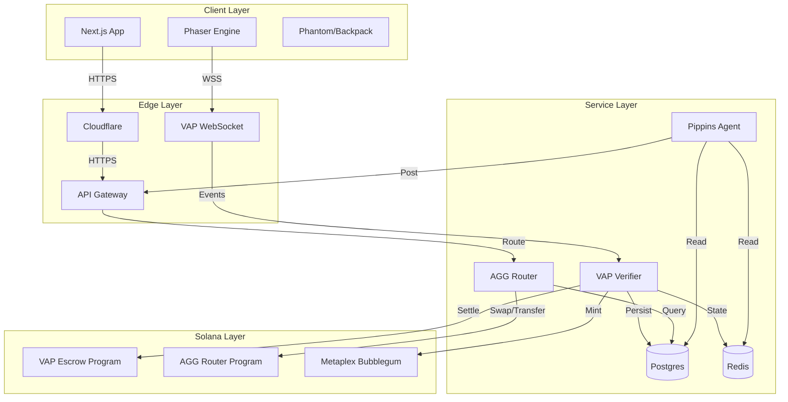

# Architecture Overview

The 555 Ecosystem is a complex interplay of an-chain and off-chain components.

## The Full Stack

## Data Flow: The "Kill Enemy" Event

Trace a single user action through the system:

1.  **Client**: User kills an enemy in Sector 13.
2.  **Game Engine**: Emits `{ type: "ENEMY_KILL", id: "mob_01", score: 100 }`.
3.  **VAP SDK**: Hashes this event into the current `InputBlock`.
4.  **VAP SDK**: Signs the block with the Session Key.
5.  **WebSocket**: Sends `PULSE` packet to VAP Verifier.
6.  **Verifier**:
    *   Verifies Signature.
    *   Checks Nonce sequence.
    *   Updates `SessionState` in Redis (`score += 100`).
7.  **Persistence**: Every 60 seconds, Redis state is flushed to Postgres.
8.  **Settlement**: When the session ends, Verifier submits `settle_session` to Solana.
9.  **Blockchain**:
    *   `vap_escrow` transfers 100 $555 to User.
    *   `bubblegum` mints "Session Log" cNFT to Creator.
