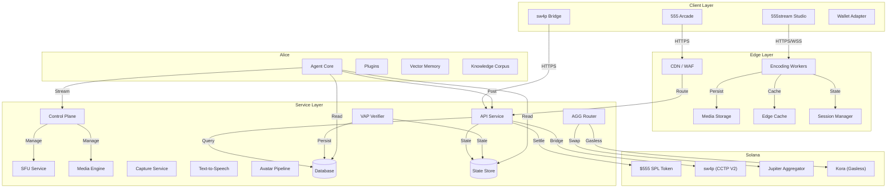

<Info>**Status: Live** — This feature is operational.</Info>

# Architecture Overview

RNDRNTWRK is a multi-layer system spanning client applications, edge services, backend infrastructure, AI agents, and on-chain programs.

## System Diagram

## Layer Overview

### Client Layer
User-facing applications that connect to the protocol:
*   **555 Arcade** — Browser-based game platform with wallet authentication (SIWS). Games run in sandboxed iframes with the VAP SDK for verified engagement.
*   **555stream Studio** — Browser-based streaming studio with everywhere all at once, scene composition, and guest management via WebRTC.
*   **sw4p Bridge** — Cross-chain bridge interface for USDC transfers across Solana, Base, and Polygon.

### Edge Layer
Globally distributed infrastructure handling encoding, caching, and real-time sessions:
*   **Encoding Workers** — Video encoding and distribution at the edge, offloading compute from creator devices.
*   **Media Storage** — Persistent storage for stream recordings, clips, and media assets.
*   **Edge Cache** — Low-latency caching for frequently accessed data.
*   **Session Manager** — Stateful session handling for real-time interactions.
*   **CDN / WAF** — Content delivery and web application firewall.

### Service Layer
Backend services handling API routing, verification, media composition, and settlement:
*   **API Service** — Central API handling authentication, game state, leaderboards, rewards, referrals, and settlement.
*   **VAP Verifier** — Validates cryptographic heartbeats from client sessions, maintains engagement proofs.
*   **AGG Router** — Payment aggregation with optimal swap routing and gasless transaction sponsorship.
*   **Control Plane** — Manages scene composition, source routing, and guest connections for 555stream.
*   **SFU Service** — Selective Forwarding Unit for multi-party WebRTC.
*   **Media Engine** — Video composition and transcoding pipeline.
*   **Capture Service** — Browser-based capture for recording and clip generation.
*   **Text-to-Speech + Avatar** — Alice's voice and visual presence pipeline.

### Agent Layer (Alice)
Autonomous AI operator with persistent memory and multi-platform capabilities:
*   **Agent Core** — Autonomous decision engine with 12+ custom plugins.
*   **Vector Memory** — Local-first RAG retrieval for contextual intelligence.
*   **Knowledge Corpus** — 80+ documents covering the full protocol specification.
*   See [Alice: The Operator](/alice/persona) for details.

### Blockchain Layer (Solana)
On-chain programs and integrations:
*   **$555 SPL Token** — Protocol token for staking, burns, and participation.
*   **sw4p (CCTP V2)** — USDC bridge across Solana, Base, and Polygon.
*   **Jupiter Aggregator** — Optimal swap routing across Solana DEXs.
*   **Kora** — Gasless transaction sponsorship for frictionless user experience.

## Data Flow: Play Session

Trace a user action through the system:

1.  **Client**: User plays a game in the Arcade.
2.  **Game Engine**: Emits events (`SCORE_UPDATE`, `ENEMY_KILL`, etc.).
3.  **VAP SDK**: Hashes events into the current InputBlock and signs with session key.
4.  **WebSocket**: Sends `PULSE` packet to VAP Verifier.
5.  **Verifier**: Validates signature, checks nonce sequence, updates session state.
6.  **Persistence**: State periodically flushed to the database.
7.  **Points**: Session score converted to points based on game normalization rules.
8.  **Settlement**: Weekly engine converts credits to USDC payouts.

## Data Flow: Live Stream

1.  **555stream**: Creator starts broadcast from browser.
2.  **Edge Encoding**: Handles video encoding and distribution.
3.  **Distribution**: Custom RTMP output to any destination — everywhere all at once.
4.  **Alice**: Monitors engagement signals, triggers L-Bar ads at optimal moments.
5.  **Control Plane**: Manages scene composition, guest WebRTC, overlays.
6.  **Settlement**: Ad revenue flows through 10% ARP → 50/50 split cascade.
