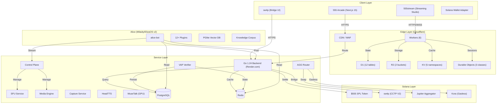

# Architecture Overview

The 555 Ecosystem is a multi-stack system spanning client applications, edge workers, backend services, AI agents, and on-chain programs.

## The Full Stack

## Infrastructure

### Hetzner K3s Cluster
Primary compute infrastructure at `<server-ip>`:
*   **MetalLB** load balancer, **nginx-ingress**, **cert-manager**
*   **15+ services** including alice-bot, control-plane, SFU, media-engine, capture-service, HeadTTS, MuseTalk
*   **Storage**: 170Gi total PVCs (alice-milaidy-state 50Gi, alice-eliza-state 120Gi)

### Cloudflare Edge
*   **6 Workers** handling routing, encoding, and edge logic
*   **D1**: 12 tables for edge-local data
*   **R2**: 2 buckets for media storage
*   **KV**: 5 namespaces for caching
*   **Durable Objects**: 3 classes for stateful edge sessions

### Render.com
*   **Go 1.24 backend** deployed in Oregon region
*   Handles API routing, payment processing, settlement

### Solana
*   **$555 SPL token** (contract: `CQwwRomsuWsUCPYomZmRnwMns4ZCTASc31ExMvSysAF2`)
*   **sw4p**: CCTP V2 bridge across Solana, Base, Polygon
*   **Jupiter**: Optimal swap routing
*   **Kora**: Gasless transaction sponsorship

## Data Flow: Play Session

Trace a user action through the system:

1.  **Client**: User plays a game in the Arcade.
2.  **Game Engine**: Emits events (`SCORE_UPDATE`, `ENEMY_KILL`, etc.).
3.  **VAP SDK**: Hashes events into the current InputBlock and signs with session key.
4.  **WebSocket**: Sends `PULSE` packet to VAP Verifier.
5.  **Verifier**:
    *   Verifies signature and nonce sequence.
    *   Updates `SessionState` in Redis.
6.  **Persistence**: Redis state periodically flushed to PostgreSQL.
7.  **Points**: Session score converted to points based on game normalization rules.
8.  **Settlement**: Weekly engine converts credits to USDC payouts.

## Data Flow: Live Stream

1.  **555stream**: Creator starts broadcast from browser.
2.  **Cloudflare Workers**: Handle encoding and distribution.
3.  **Simulcast**: Output to 7 platforms simultaneously.
4.  **Alice**: Monitors engagement signals, triggers L-Bar ads at optimal moments.
5.  **Control Plane**: Manages scene composition, guest WebRTC, overlays.
6.  **Settlement**: Ad revenue flows through 10% ARP → 50/50 split cascade.
