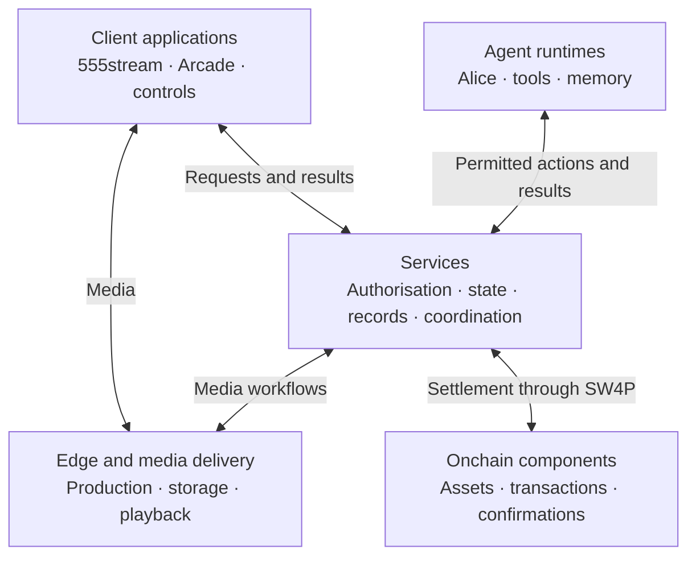

This map follows the implementation responsibilities behind RNDRNTWRK’s products. Read the [System Overview](/architecture/overview) for the five capability jobs they support.

The map describes how the parts relate. Component documentation explains the individual systems and workflows.

## Responsibility Map

```mermaid
flowchart TD
    C["Client applications<br/>555stream · Arcade · controls"]
    M["Edge and media delivery<br/>Production · storage · playback"]
    S["Services<br/>Authorisation · state · records · coordination"]
    A["Agent runtimes<br/>Alice · tools · memory"]
    O["Onchain components<br/>Assets · transactions · confirmations"]

    C <-->|Media| M
    C <-->|Requests and results| S
    S <-->|Media workflows| M
    A <-->|Permitted actions and results| S
    S <-->|Settlement through SW4P| O
```

An overview of responsibilities within the architecture RNDRNTWRK is developing. Identity, permissions, budgets, and ownership connect these parts. Individual integrations determine the components and connections used.

| Responsibility | What it handles | Where it connects |
| --- | --- | --- |
| **Client applications** | User interactions, stream controls, game presentation, and payment instructions. | Services that manage the relevant activity, identity, state, or settlement operation. |
| **Edge and media delivery** | Encoding, media storage, caching, session handling, content delivery, and request filtering. | Media production, stream outputs, recordings, and playback. |
| **Services** | Application requests, authorisation, state, participation records, event delivery, and workflow coordination. | Clients, media systems, agent tools, data stores, and settlement components. |
| **Agent runtimes** | Models, tools, context, memory, task execution, and recovery within granted authority. | Defined product and service actions; records of the work and resources used. |
| **Onchain components** | Asset and transaction records, signatures, and supported settlement operations. | Payment instructions, confirmations, and accounting for the result. |

Identity, permissions, budgets, and ownership connect these responsibilities. They determine which actor can use a resource or perform an action and how that action is recorded.

## Components Within the Map

### Clients and media

555stream concerns production, publishing, and interaction. CTRL Panel concerns stream controls, layouts, overlays, and scheduling. Arcade concerns games and interactive environments.

The media design includes encoding, storage, caching, scene and session state, guest connections, recording, and clips. A selective forwarding unit (SFU) handles forwarding media between participants in a multi-party WebRTC arrangement; composition and transcoding are separate media-engine responsibilities.

Capture components support recording and clip generation. Text-to-speech and avatar components concern the agent’s voice and visual presentation.

### Services and participation records

Application services handle requests, authentication, state changes, and event delivery. Databases and state stores serve different persistence and coordination needs within those workflows.

VAP describes participation records and session-integrity checks. AGG describes payment-routing coordination; Hyperlink describes payment requests with the context needed to resolve and follow them.

### Agents and authority

Alice is the reference agent used to develop and test research, planning, coding, and media operations. Its runtime work covers tools, models, memory, knowledge retrieval, budgets, and recovery.

555ID and the surrounding permission and policy work connect actors to their roles and resources. An agent’s permitted observations and actions depend on the authority granted for its task.

### Settlement and economic programmes

SW4P coordinates the settlement lifecycle, including route selection, fees, authorisation, execution, confirmation, recovery, and accounting.

An integration can involve asset exchange, execution-cost handling, or other route-specific services. Supported networks, assets, providers, and costs belong to the particular integration’s documentation.

$555 is the coordination asset of RNDRNTWRK. Token holdings, points, and settlement assets have different roles.

SW4P Earn extends SW4P’s economic model into source-aware allocation, claims, rewards, payout schedules, reserves, and reconciliation.

**Current status: SW4P Earn is not yet publicly available. No staking, liquidity, reward, or claim programme is currently open.**

## Illustrative Data Flow: A Play Session

1. A player or agent takes part in a game under its session and access rules.
2. Game logic produces actions, score changes, or other relevant events.
3. The session-record design associates those events with the participant and the permitted context.
4. Service logic checks the record and updates session state.
5. The interface receives the resulting state or ranking, and records are retained as needed.
6. The experience’s rules explain any points or credits and how they are used.

A future economic programme would connect its funding and terms to allocations and claims through SW4P Earn. A recorded score is not a payment instruction.

The [VAP reference](/protocol/vap) explains the documented session-record design. [Games Library](/arcade/games) describes game-specific mechanics.

## Illustrative Data Flow: A Stream

1. A creator prepares the stream’s sources, destinations, layouts, and guests.
2. Media components handle the production and delivery work required by that configuration.
3. Controls and session state coordinate scenes, overlays, and guest interactions.
4. Permitted operator or agent tasks support defined parts of the workflow.
5. Participation and programme records describe the activity and any commercial deliverables.
6. Payment records connect the programme’s funding, costs, recipients, and settlement results.

Each programme’s agreements determine allocations. [Fee Distribution](/tokenomics/fee-distribution) explains the separate planning policies and their bases.

## Go Deeper

- [System Overview](/architecture/overview) — Understand the five capability jobs.
- [API Reference](/api-reference) — Read the documented interface families.
- [555stream](/555stream) — Explore the media workflow.
- [Alice](/alice/persona) — Read about the reference agent.
- [SW4P](/sw4p) — Follow a settlement operation.
- [SW4P Earn](/products/earn) — Read the allocation model and current status.
