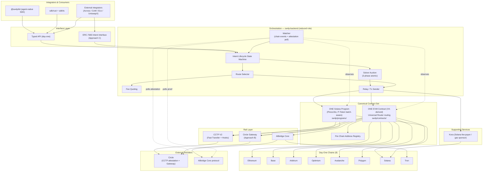
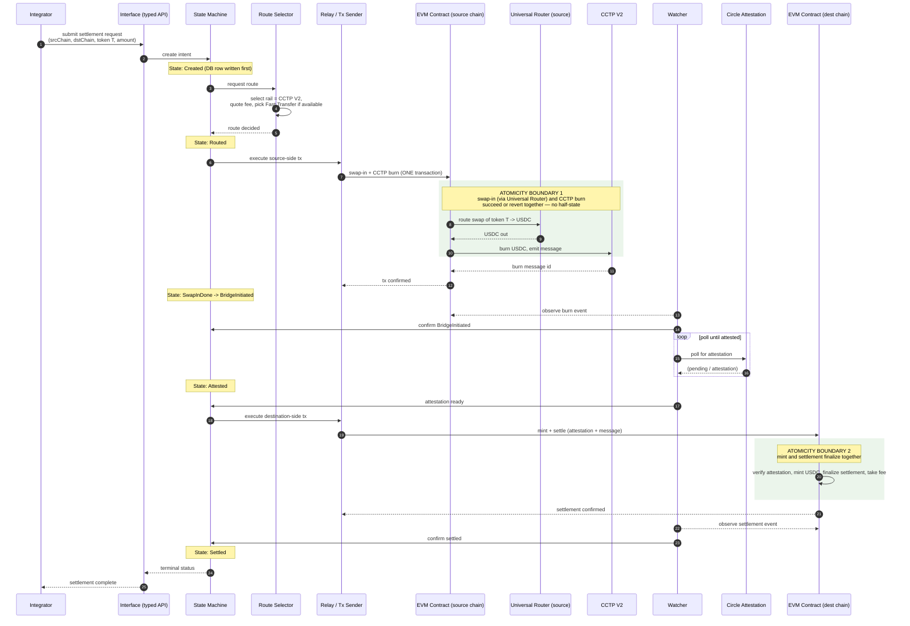
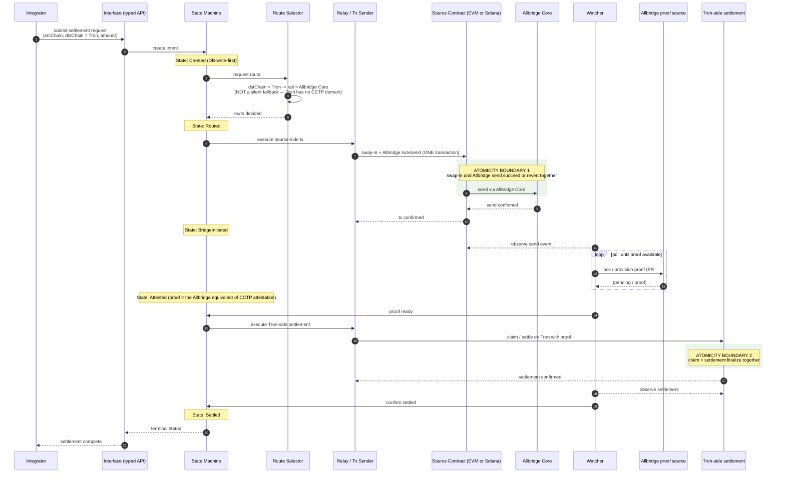
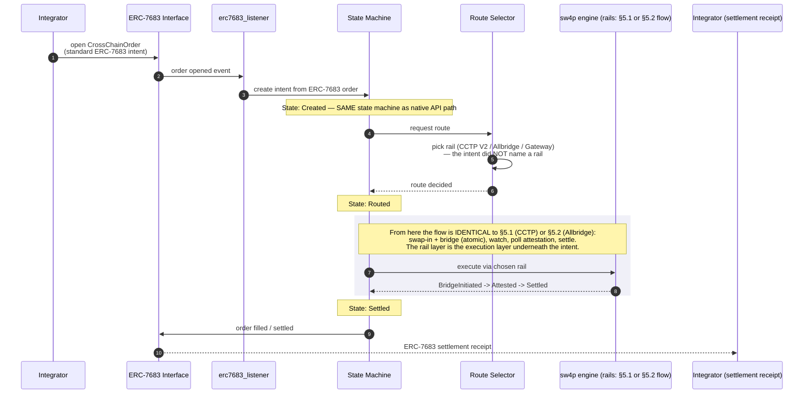
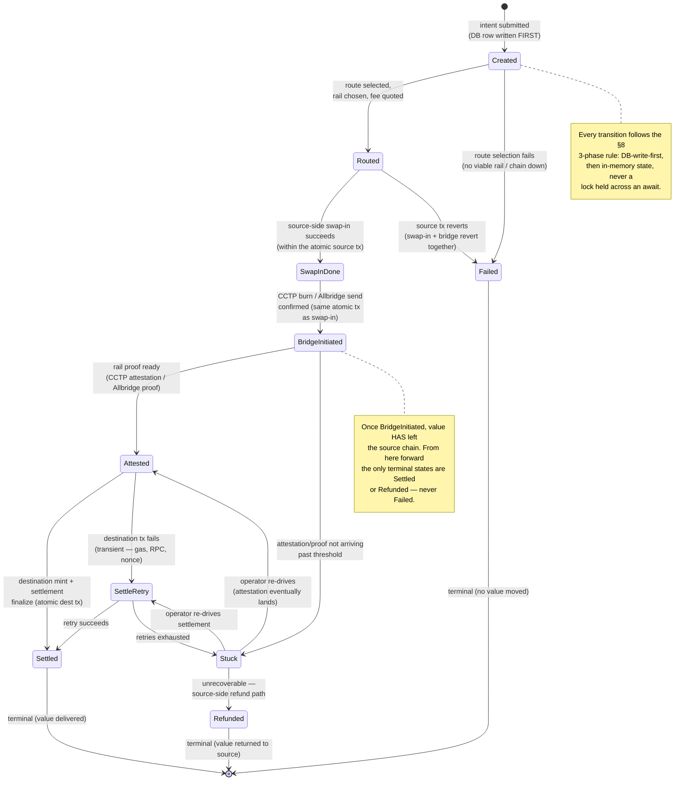
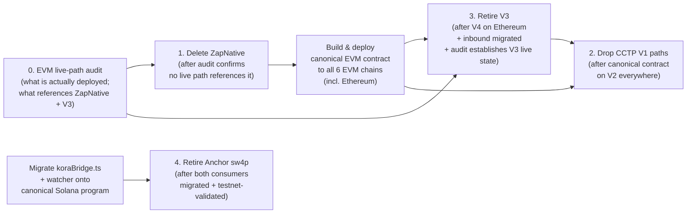
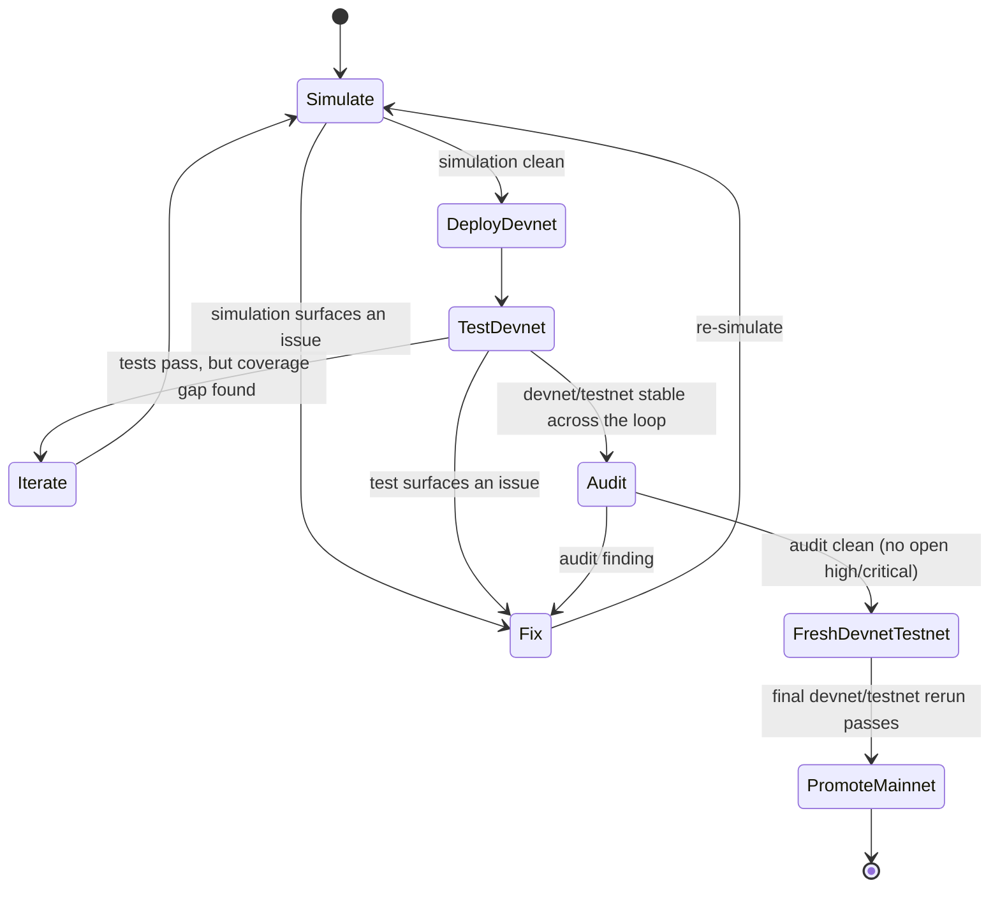

# sw4p Frontier Engine — Design Spec

**Status:** DESIGN — for review.
**Date:** 2026-05-14.
**Author:** design agent under user direction ("use superpowers"), synthesizing four prior research passes.
**Spec format:** superpowers `brainstorming` skill terminal artifact. The companion SOW and TRD already exist alongside this spec (the user directed they be written before the plan). The `writing-plans` output now exists at `docs/superpowers/plans/2026-05-15-sw4p-frontier-engine-approach-a.md`; it derives from all three documents and is scoped to Approach A.

---

## Summary in one paragraph

`sw4p` is RNDRNTWRK's cross-chain settlement engine — it moves value (USDC primarily) across chains. Today it is a *version-ladder*: two Solana programs (one Anchor prototype, one hardened native program) both wired into different consumers, three generations of EVM contract (`ZapAndBridgeV4` ⊃ `ZapAndBridge` "V3" ⊃ `ZapNative`), CCTP V1 paths now officially "Legacy," and a large Rust backend (`sw4p-backend`) carrying route selection, fee logic, a solver auction, watchers and relays — much of which is off-chain logic that the user wants on-chain where possible. This spec defines the **frontier engine**: ONE canonical contract set (one Pinocchio-based Solana program, one V4-derived EVM contract deployed to all 6 EVM chains), atomicity-first discipline generalized engine-wide, and a sequenced rail strategy. The day-one scope (**Approach A**) is consolidation onto **7 CCTP chains + Tron** — Ethereum, Base, Arbitrum, Optimism, Avalanche, Polygon over CCTP V2, plus Tron over Allbridge Core — two rails, no more. **Approach B** (fast-follow) adds Circle Gateway for unified cross-chain USDC liquidity. **Approach C** (full frontier) exposes ERC-7683 as the canonical external intent interface, with the rails demoted to an execution layer underneath. This document specifies the A+B+C end-state and is explicit about what is in A versus deferred to B and C.

## Scope check (per writing-plans pre-flight, captured here for the next phase)

This is a **design document**. It contains no code and no implementation. It specifies architecture, interfaces, contracts-as-boundaries, state machines, and the priority sequencing. It covers ONE coherent program of work: the frontier-engine rebuild across the `sw4p` engine repo (`Render-Network-OS/sw4p-pro`).

This spec does NOT cover:

- **`sw4p-earn`** (the separate staking/rewards product, `Render-Network-OS/sw4p-earn`). It is referenced only as a *downstream consumer* of settlement-fee revenue. Its launch readiness, stages, and economics are owned by its own corpus.
- **The `@sw4p/kit` SDK slim-down + npm publish** — owned by `Render-Network-OS/sw4p-kit`. This spec references the kit as a consumer of the canonical interface, nothing more.
- **The parent 555 monorepo canonical-corpus alignment** — separate docs work.
- **The implementation plan itself** — the `writing-plans` output derives task-level steps from this spec, the SOW, and the TRD; it is a separate artifact at `docs/superpowers/plans/2026-05-15-sw4p-frontier-engine-approach-a.md`.
- **The SOW/TRD** — already written (the user directed they precede the plan); they are separate artifacts from this spec.

The implementation surface for the *eventual* plan is large (it touches contracts, programs, and the backend across two languages and eight chains), but it is a single coherent program of work with one architectural thesis, which is what makes it appropriate for one spec.

---

## 1. Context & motivation

### 1.1 Why the rebuild

Four research passes (current contract reality; cross-chain tooling verdict; ahead-of-the-curve primitives; the atomicity bleed) converge on one finding: **sw4p works, but it has accreted into a version-ladder, and the ground under it has shifted.** The rebuild is not a rewrite for its own sake — it is a consolidation forced by four independent pressures arriving at once.

**Pressure 1 — version-ladder tech debt.** The engine carries multiple generations of the same component, all still partially wired in:

| Surface | Generations present | Live reality |
|---|---|---|
| Solana program | `programs/sw4p-native` (native non-Anchor Rust — signature-gated fees, pause, 24h timelock, daily limits, Squads-multisig admin, fuzz tests, audit-fix lineage; program ID `555nber4ezpjLqiAiY5GnjkGEbWWcgShUcFLtUPf39PG`) **and** `programs/sw4p` (older Anchor prototype, a strict subset; program ID `555FYVu5wEbRmKPg6g8zhPUhMXZCc9y2Z2hbQkz5wMj3`) | **Both wired in.** The frontend `koraBridge.ts` service and the backend `watcher` reference the *Anchor* program; only `update_native_config.ts` uses the native one. Consolidating to one Solana program is therefore a real **migration**, not a deletion. |
| EVM contract | `ZapAndBridgeV4.sol` (Permit2 + Universal Router + CCTP **V2**) ⊃ `ZapAndBridge.sol` "V3" (CCTP **V1** decode) ⊃ `ZapNative.sol` (outbound-only legacy contract, with deployment/consumer status to audit) | V4 is the keeper. `ZapNative` looked like dead code, but repo references prove its live-path status must be audited. V3 is the **legacy Ethereum path** — local audit notes have it "dormant by default" (used only on explicit opt-in), not confirmed-live; its actual live state is one of the things the WS0 EVM live-path audit must establish (§13.2 R8a). Either way, V3 cannot retire until V4 ships to Ethereum. |
| CCTP version | V1 *and* V2 decode paths coexist in the backend (`cctp_burn.rs`, `cctp_mint.rs`, `cctp_attestation.rs`) | V1 is now Legacy (see Pressure 2). Every V1 path is debt to remove. |

A version-ladder is not free: every consumer has to know which generation it talks to, every audit has to cover all of them, and every change risks a cross-generation desync.

**Pressure 2 — stale tooling.** As of 2026, the cross-chain landscape moved:

- **CCTP V1 is officially "Legacy" as of November 2025.** V2 is canonical. V2 adds **Fast Transfer** (8–20s versus 13+ minutes for standard finality) and **Hooks** (atomic post-transfer actions on the destination).
- **Circle Gateway** shipped — unified cross-chain USDC balance, pull-based, sub-second. This is the biggest *capability gap* in the current engine: a multi-chain engine that holds float wants a unified balance, not per-chain pools it has to rebalance by hand.
- **ERC-7683** (the cross-chain intents standard) is now the default integration target — Across, UniswapX, CoW, and Eco all ship it. The backend already has `erc7683.rs` and `erc7683_listener.rs`, which means the team has started down this path; the frontier engine should make it the *canonical external interface*, not a side feature.
- Several rails were correctly *removed* already and must not return (see §10).

**Pressure 3 — the atomicity bleed.** `sw4p-backend/src/solver_auction.rs` took a **four-commit progressive fix series**: in-memory-book / DB-row dual-state desync; half-state left behind on a DB failure; a Won-versus-DB desync that caused double-broadcasts. The fixes converged on a repeatable **3-phase pattern** (see §8). The lesson is not "the solver auction is now fixed" — it is that **anywhere the engine holds dual in-memory/DB state, the same class of bug is latent.** The watcher, the relay, and the in-flight Allbridge lifecycle all have the same shape. The frontier engine must adopt the 3-phase pattern as an engine-wide *discipline*, not a one-off patch.

**Pressure 4 — ahead-of-the-curve primitives.** New primitives offer real wins that a consolidation rewrite can capture nearly for free:

- **P-Token (SIMD-0266)** — an optimized SPL Token program, ~95-98% less compute, **same program ID**. The official Solana upgrade page still frames mainnet as a May 2026 target while Anza's current feature-gate tracker no longer lists SIMD-0266 as pending mainnet activation, so Approach A treats P-Token as **activation-gated**: verify the target cluster first, use `batch` where active, and keep the individual-CPI fallback where it is not. Existing SPL CPIs get the compute win when the cluster has activated P-Token.
- **Pinocchio** — the zero-copy base P-Token is built on. Since the consolidation is rewriting `sw4p-native` anyway, it should be rebuilt **on Pinocchio**.
- **Uniswap v4** — live on all 6 sw4p EVM chains. The canonical EVM contract should route swap-in through the **Universal Router** (v3 + v4 best-execution), not hard-pin v3. v4 addresses differ per chain, which forces a **per-chain address registry** — "same address everywhere" is dead.

### 1.2 The motivating directive

The user's directive, stated plainly: **one canonical contract set, atomicity-first, on-chain where possible, built on current-best primitives.** Every design decision in this spec traces back to one of those four words.

### 1.3 What "frontier" means here

"Frontier" is the end-state: the A+B+C engine. It is *not* a single deliverable. Approach A is the day-one consolidation and is the bulk of the work. B and C are sequenced sub-projects that build on A's foundation. This spec describes the whole end-state so the architecture is coherent, then §11 is explicit about the A/B/C split.

---

## 2. Design decisions

These are the load-bearing claims of the spec. Each is locked here; the implementation plan derives from them.

### Decision 1 — One canonical contract set, reached by migration not deletion

The frontier engine has exactly **one Solana program** and **one EVM contract**.

- **Solana:** a single program, the consolidation of `sw4p-native`, rebuilt on **Pinocchio**, P-Token `batch`-aware when P-Token is active and individual-CPI compatible when it is not. Reaching one program is a **migration**: move the frontend (`koraBridge.ts`) and the backend `watcher` off the Anchor program (`programs/sw4p`) and onto the native program, validate the cutover on testnet, *then* retire the Anchor program. The native program already carries the security lineage (timelock, pause, daily limits, Squads admin, fuzz tests, audit fixes) — it is the survivor.
- **EVM:** a single contract, **V4-derived** (`ZapAndBridgeV4` is the basis), deployed to **all 6 EVM chains**, routing swap-in through the Universal Router, reading a per-chain address registry. Reaching one contract means **shipping V4 to Ethereum**, *then* retiring V3 after the Ethereum inbound path migrates and the WS0 EVM live-path audit has established V3's actual live state; `ZapNative` is deleted only after that same audit proves no live path references it.

This is Decision 1 because every other decision assumes a single canonical set as the target.

### Decision 2 — Two rails on day one; Gateway and ERC-7683 are sequenced

Day-one rails are exactly **two**:

1. **CCTP V2** — for the 7 CCTP chains: Ethereum, Base, Arbitrum, Optimism, Avalanche, Polygon, and Solana. (The "7 CCTP chains" count is the 6 EVM chains plus Solana — Solana is one of the 8 day-one chains and has a CCTP domain; see §11.1 for the full chain/rail enumeration.)
2. **Allbridge Core** — for **Tron**, the one non-CCTP day-one chain. Allbridge Core becomes a first-class rail, not a fallback hack. The in-flight PRs #113 (Allbridge lifecycle) and #123 (Tron proof provisioning) are well-targeted; the frontier plan finishes them.

**Circle Gateway** is **Approach B** — a fast-follow, not day-one. **ERC-7683 as the canonical interface** is **Approach C** — sequenced after B. The architecture (§3) describes all three; the day-one build is A.

### Decision 3 — On-chain where possible; the boundary is explicit and principled

The user's directive is "on-chain where possible." This spec makes the on-chain/off-chain boundary *explicit and reasoned* rather than incidental. The rule:

> Logic moves on-chain when (a) it is a state transition that must be atomic or trustless, or (b) it is a value-custody or value-movement operation. Logic stays off-chain when it is *inherently* off-chain — polling external attestation services, watching chains for events, market data, route optimization over live liquidity — or when putting it on-chain buys no trust and costs latency or gas.

§9 walks every `sw4p-backend` responsibility against this rule. The short version: swap-then-bridge atomicity, fee-take, pause/limits/timelock, and settlement finalization are on-chain (they already largely are, in the contracts). CCTP attestation polling, chain-watching, route selection over live liquidity, and the solver auction's matching stay off-chain — but the *state they manage* is protected by the §8 atomicity discipline.

### Decision 4 — The 3-phase atomicity pattern is an engine-wide design rule

The pattern the solver auction converged on is generalized (§8) and applied everywhere the engine holds dual in-memory/DB state: the watcher, the relay, the Allbridge lifecycle, and any future component. Two invariants are non-negotiable: **DB-write-first** (the durable store is the source of truth, mutated before in-memory state) and **no lock held across an `await`**.

### Decision 5 — The canonical external interface is ERC-7683 (in C); until then it is the existing typed API

In the frontier end-state, an integrator hands sw4p an **ERC-7683 intent** and sw4p's rails are the execution layer that fills it. This is Approach C. Until C ships, the canonical interface is the existing typed backend API plus `@sw4p/kit`. The architecture is designed so that adding the ERC-7683 interface in C is *additive* — the intent lifecycle state machine (§6) is the same whether the intent arrived as an ERC-7683 order or a native API call.

### Decision 6 — One physical layout: `sw4p/contracts/` and `sw4p/programs/`

Today the EVM contracts live awkwardly under `sw4p-backend/contracts/contracts/` and the Solana programs under `sw4p/programs/`. The frontier layout is a clean top-level split: **`sw4p/contracts/`** (the one EVM contract + the per-chain registry + deploy scripts) and **`sw4p/programs/`** (the one Solana program). The contracts stop being a sub-directory of the backend — they are peers of it.

---

## 3. The frontier-state architecture

This section describes the **end-state (A+B+C)**. §11 is explicit about which parts are day-one (A) versus deferred (B, C).

### 3.1 The layers

The frontier engine has five layers, top to bottom:

1. **The interface layer** — how value-movement requests enter the engine. In the end-state this is the **ERC-7683 intent interface** (Approach C) plus the existing typed API and `@sw4p/kit`. An integrator expresses *what they want* (move X USDC from chain A to chain B, optionally swapping token T in on the source); the engine decides *how*.
2. **The orchestration layer** — `sw4p-backend`, in its **reduced role**. It does route selection, fee quoting, the solver auction, chain-watching, attestation polling, and relay. It does **not** custody value-movement atomicity — that is on-chain. Its job is to *decide and observe*, not to *hold*.
3. **The canonical contract set** — one Solana program, one EVM contract (Decision 1). This is where atomic state transitions and value movement happen. Swap-then-bridge is one transaction; fee-take, pause, limits, and timelock are enforced here.
4. **The rail layer** — the execution primitives the contracts and orchestration use to actually cross chains: **CCTP V2** (the 7 CCTP chains), **Allbridge Core** (Tron), and **Circle Gateway** (Approach B — unified USDC liquidity). The rail layer is *interchangeable underneath the interface*: an ERC-7683 intent does not name a rail; the engine picks one.
5. **The supporting services** — **Kora** (the Solana gas-sponsor / fee-payer service) and the **per-chain address registry** (the canonical mapping of chain → contract addresses, Universal Router address, USDC mint/token address, CCTP domain, rail config).

### 3.2 The canonical contract set

**One Solana program** (consolidation of `sw4p-native`, rebuilt on Pinocchio, P-Token `batch`-aware when active with an individual-CPI fallback). It owns, on Solana:

- Swap-in via CPI (P-Token CPIs get the SIMD-0266 compute win where active; multi-token-op settlements use the `batch` instruction only where active).
- The CCTP V2 burn/mint interaction on the Solana side.
- Signature-gated fee enforcement, pause, the 24h timelock, daily limits — the existing security surface, preserved.
- Squads-multisig admin.

**One EVM contract** (V4-derived, deployed to all 6 EVM chains). It owns, on each EVM chain:

- Swap-in routed through the **Universal Router** (v3 + v4 best-execution) — *not* a hard-pinned v3 router.
- The CCTP V2 burn (source side) and mint/settle (destination side).
- Permit2-based token pulls.
- Fee-take on the value moved.
- Reading the **per-chain address registry** for the Universal Router address, USDC address, CCTP domain — because under Uniswap v4, "same address everywhere" is no longer true.

### 3.3 The rail layer

| Rail | Covers | Mechanism | Day-one? |
|---|---|---|---|
| **CCTP V2** | Ethereum, Base, Arbitrum, Optimism, Avalanche, Polygon, Solana | Burn-and-mint of native USDC. Fast Transfer (8–20s) where available; standard finality otherwise. Hooks for atomic post-transfer actions. | **Yes (A)** |
| **Allbridge Core** | Tron | Liquidity-pool bridge for the non-CCTP chain. First-class rail with a full lifecycle (PRs #113, #123). | **Yes (A)** |
| **Circle Gateway** | All CCTP chains | Unified cross-chain USDC balance, pull-based, sub-second. Removes the need to hold and hand-rebalance per-chain float. | **No — Approach B** |

The rail layer sits *underneath* the interface. An ERC-7683 intent (or a native API request) names a source chain, a destination chain, and amounts — never a rail. The orchestration layer's route selector picks the rail.

### 3.4 The ERC-7683 intent interface (Approach C)

In the end-state, sw4p **exposes** ERC-7683: an integrator submits a cross-chain order, sw4p is a filler/settler for it, and the rails are how sw4p fills. The backend already has `erc7683.rs` and `erc7683_listener.rs` — Approach C builds these into the canonical front door rather than a side path. The key architectural property: the **intent lifecycle state machine (§6) is rail-agnostic and interface-agnostic.** Whether the intent arrived as an ERC-7683 `CrossChainOrder` or a native typed-API call, it flows `Created → Routed → SwapInDone → BridgeInitiated → Attested → Settled` through the same states.

### 3.5 The backend's reduced role

`sw4p-backend` today carries route selection, fee logic, a solver auction, watchers, and relays — and also a great deal that is contract-deployment glue and per-chain plumbing. In the frontier state its role is **reduced and sharpened** to four jobs:

1. **Decide** — route selection over live liquidity, fee quoting, the solver auction's matching.
2. **Observe** — watch the 8 chains for the events that drive the state machine; poll CCTP / Allbridge attestation.
3. **Relay** — submit the transactions the decision produces, and the destination-side settlement transaction once attestation lands.
4. **Serve** — the typed API and (in C) the ERC-7683 interface.

What leaves the backend's *responsibility* (not necessarily its codebase) is **anything that is a value-movement atomicity guarantee** — that lives in the canonical contracts. §9 is the file-by-file analysis.

### 3.6 The SDKs / kit

`@sw4p/kit` (the agent-native SDK, `Render-Network-OS/sw4p-kit`) and the in-repo `sdk/rust` + `sdk/ts` consume the canonical interface. They are **out of scope for this spec** except as a constraint: the canonical interface must be stable enough that the kit targets it directly. When Approach C lands the ERC-7683 interface, the kit gains an ERC-7683 path; that is kit-side work tracked in the kit's own corpus.

### 3.7 The on-chain / off-chain boundary (explicit)

| Concern | Location | Why |
|---|---|---|
| Swap-then-bridge atomicity (swap-in + CCTP burn in one tx) | **On-chain** (canonical contract) | Must be atomic — a half-completed swap-then-bridge is a fund-loss bug. sw4p already does this in one tx; the frontier engine keeps it there. |
| Fee-take on moved value | **On-chain** (canonical contract) | Value-custody operation; must be trustless and atomic with the move. Already on-chain (signature-gated on Solana, in-contract on EVM). |
| Pause / daily limits / 24h timelock | **On-chain** (Solana program; EVM equivalent) | Safety controls must be enforced by the contract, not by an off-chain service that can be bypassed. Already on-chain on Solana. |
| Destination-side settlement / mint finalization | **On-chain** (canonical contract) | Value movement; the contract finalizes the mint and the settlement. |
| CCTP attestation polling | **Off-chain** (backend watcher) | *Inherently* off-chain: the attestation is produced by Circle's off-chain service and must be fetched, then submitted. There is no on-chain equivalent to wait on. |
| Chain-watching for state-machine events | **Off-chain** (backend watcher) | Inherently off-chain — something has to watch 8 chains and drive the state machine. |
| Route selection over live liquidity | **Off-chain** (backend route selector) | Optimizing over live, cross-venue liquidity is a market-data problem; on-chain it would be stale and gas-expensive, and buys no trust. |
| Solver auction matching | **Off-chain** (backend solver auction) | The auction *matching* is an off-chain optimization; what it produces (a fill) is executed on-chain. The off-chain state it holds is protected by the §8 3-phase pattern. |
| Fee *quoting* (versus fee *take*) | **Off-chain** (backend) | Quoting is a pricing computation; the take is on-chain. The quote is advisory; the contract enforces the actual take. |
| The per-chain address registry | **Off-chain config, on-chain-read** | The registry is maintained off-chain (it changes when a chain upgrades Uniswap, etc.) but the EVM contract reads it so it routes through the right Universal Router. |

The principle behind every row: **on-chain for atomicity and custody; off-chain for observation and optimization.** The user's "on-chain where possible" is satisfied because everything that *can* be on-chain (atomic state transitions, value movement, safety controls) *is* — and the things that stay off-chain are the things that have no trustless on-chain form.

---

## 4. System diagram

Component / deployment view of the frontier end-state. Day-one (A) components are solid; Approach B and C additions are labelled.

---

## 5. Sequence diagrams

Three key flows. Atomicity boundaries are called out inline.

### 5.1 CCTP V2 cross-chain settlement (the day-one happy path)

A USDC settlement from an EVM source chain to an EVM destination chain, with an optional token swap-in on the source. This is the core Approach A flow.

### 5.2 The Allbridge / Tron path

Tron is the one non-CCTP day-one chain. It uses Allbridge Core. The shape is similar but the bridge primitive and the proof source differ — and the proof provisioning is what PR #123 addresses.

### 5.3 The ERC-7683 intent flow (Approach C — the frontier interface)

In the end-state, an integrator hands sw4p an ERC-7683 cross-chain order and sw4p fills it. The crucial property: **once the order is opened, the engine drops into the exact same state machine and rail layer as 5.1/5.2.** The ERC-7683 interface is a *front door*, not a parallel engine.

---

## 6. State diagram — the settlement / intent lifecycle

This is the atomicity-critical state machine — the thing the §8 3-phase pattern protects. It is **interface-agnostic** (an intent looks the same whether it arrived via the typed API or, in C, via ERC-7683) and **rail-agnostic** (CCTP V2 / Allbridge / Gateway all flow through these states; `Attested` means "the rail's proof is ready," whatever the rail).

**Why the failure split matters.** The state machine is deliberately asymmetric around `BridgeInitiated`. *Before* `BridgeInitiated`, no value has crossed — failure is clean (`Failed`, terminal, nothing moved). *After* `BridgeInitiated`, value has left the source — the only honest terminal states are `Settled` (it arrived) or `Refunded` (it came back). There is no "Failed" after the bridge starts, because "failed" would imply value vanished. `Stuck` is the holding state for operator intervention; it is *not* terminal. This asymmetry is exactly the property the solver auction's four-commit fix series was chasing — half-states and desyncs that left the system unable to say whether value had moved.

---

## 7. The canonical contract set

### 7.1 The one Solana program

**Basis:** the consolidation of `programs/sw4p-native` (the hardened native program), rebuilt on **Pinocchio**.

**Why Pinocchio:** the consolidation is rewriting this program regardless (P-Token `batch` adoption, the migration of consumers onto it). Pinocchio is the zero-copy base P-Token itself is built on; building the canonical program on it gets the engine onto the same modern foundation as the token program it CPIs into. This is not "rewrite for novelty" — it is "since we are rewriting, rewrite onto the right base."

**P-Token awareness:**
- P-Token is activation-gated per target cluster. The plan verifies activation before claiming a mainnet compute win or relying on `batch`.
- When P-Token is active, the program's existing SPL Token CPIs get the SIMD-0266 **~95-98% compute reduction** through the same program ID, so those CPIs do not change.
- When P-Token is active, the new **`batch` instruction** is adopted where a settlement does multiple token operations: instead of N CPIs each paying the 1,000-CU floor, one `batch` CPI pays the floor once. When it is not active, the settlement path falls back to individual token CPIs. This is a small, deliberate code change in the settlement path, not a hard mainnet dependency.

**What the Solana program owns:**

| Responsibility | Detail |
|---|---|
| Swap-in (Solana side) | CPI into the swap venue, then into the CCTP path. Multi-op settlements use P-Token `batch` only when the target cluster has activated it; otherwise they use the individual-CPI fallback. |
| CCTP V2 burn / mint (Solana side) | The Solana half of a CCTP V2 cross-chain move. |
| Signature-gated fee enforcement | The fee take is gated by signature — preserved from `sw4p-native`. |
| Pause | The program can be paused. Preserved. |
| 24h timelock | Config changes go through a 24-hour timelock. Preserved. |
| Daily limits | Per-day value-movement limits, enforced on-chain. Preserved. |
| Squads-multisig admin | Admin authority is a Squads multisig. Preserved. |

The security surface (pause, timelock, limits, multisig, the fuzz tests, the audit-fix lineage) is **the reason `sw4p-native` is the survivor and the Anchor program is retired** — that lineage does not get rebuilt from scratch, it gets carried onto Pinocchio.

### 7.2 The one EVM contract

**Basis:** **V4-derived** — `ZapAndBridgeV4.sol` (Permit2 + Universal Router + CCTP V2) is the foundation. Deployed to **all 6 EVM chains** (Ethereum, Base, Arbitrum, Optimism, Avalanche, Polygon).

**What the EVM contract owns:**

| Responsibility | Detail |
|---|---|
| Swap-in via Universal Router | Routes through the **Universal Router** for v3 + v4 best-execution. **Not** a hard-pinned v3 router — Uniswap v4 is live on all 6 EVM chains and the contract must be able to route through it. |
| CCTP V2 burn (source) | Burns USDC and emits the CCTP message on the source chain. |
| CCTP V2 mint / settle (destination) | Verifies the attestation, mints, finalizes settlement, takes the fee. |
| Permit2 token pulls | Pulls the input token via Permit2. |
| Fee-take | The fee on moved value is taken in-contract. |
| Per-chain registry read | Reads the **per-chain address registry** for the Universal Router address, USDC address, and CCTP domain on the chain it is deployed to. |

**The per-chain address registry.** Under Uniswap v4, contract addresses differ per chain — the old "same address everywhere" assumption is dead. The registry is the canonical source for: per-chain Universal Router address, per-chain USDC address, per-chain CCTP domain, per-chain rail config. It is maintained off-chain (it changes when a chain upgrades its Uniswap deployment) but the EVM contract *reads* it so it always routes through the correct Universal Router. The registry also serves the orchestration layer and the watcher.

**A note on Uniswap v4 hooks.** v4 hooks are deliberately **not** used for the cross-chain flow. A hook cannot perform the CCTP burn, and sw4p already achieves swap-then-bridge atomicity by doing both in a single transaction in the contract. Hooks would add a layer without adding the atomicity property sw4p already has. (This is a "considered and rejected for this use," not an oversight.)

### 7.3 The Solana-vs-EVM responsibility split

The two halves of the canonical set are **symmetric in role, asymmetric in primitive**:

| Concern | Solana program | EVM contract |
|---|---|---|
| Swap-in | CPI into swap venue; P-Token `batch` for multi-op where active, individual-CPI fallback otherwise | Universal Router (v3 + v4 best-execution) |
| Bridge primitive | CCTP V2 (Solana domain); Gateway in B | CCTP V2 (EVM domains); Allbridge for Tron-bound; Gateway in B |
| Fee-take | Signature-gated, on-chain | In-contract, on-chain |
| Safety controls | Pause, 24h timelock, daily limits, Squads multisig | Equivalent controls on the EVM side (an open item — §13 — is confirming the EVM contract carries an equivalent surface) |
| Token-program base | Pinocchio + P-Token | Permit2 + ERC-20 |
| Gas / fee-payer | Kora sponsors the fee-payer | Native gas; relay-paid |

Both halves expose the *same lifecycle* to the orchestration layer — `Created → Routed → SwapInDone → BridgeInitiated → Attested → Settled` — so the state machine does not care which chain a leg is on.

---

## 8. Atomicity discipline — the engine-wide 3-phase pattern

### 8.1 Where the pattern came from

`sw4p-backend/src/solver_auction.rs` took a **four-commit progressive fix series** against a single class of bug: the auction held state in **two places** — an in-memory order book and DB rows — and the two could desync. The specific failures fixed:

1. **In-memory-book / DB-row dual-state desync** — the book and the rows disagreed about what state an order was in.
2. **Half-state on DB failure** — a DB write failed partway, leaving the system in a state that was neither the old state nor the new one.
3. **Won-vs-DB desync causing double-broadcasts** — the in-memory "this order Won" flag and the DB disagreed, so the same fill got broadcast twice.

### 8.2 The pattern, generalized as an engine-wide design rule

The fixes converged on a **3-phase pattern** for any operation that moves multi-row state across a dual in-memory/DB boundary:

> **Phase 1 — Read-only identify + pre-validate.** Read the current state. Determine what the transition *should* be. Validate that the transition is legal. **Hold no write lock. Mutate nothing.** If validation fails here, nothing has changed.
>
> **Phase 2 — Single atomic DB transaction for all multi-row state moves.** Every row that changes, changes inside *one* DB transaction. It commits as a unit or it rolls back as a unit. There is no partial-commit window. The durable store is the source of truth and it moves first.
>
> **Phase 3 — Re-acquire the write lock and mutate in-memory state ONLY after the DB commit succeeds.** In-memory state is a *cache* of the durable state. It is updated *after*, and only after, the DB transaction has committed. If the process dies between Phase 2 and Phase 3, in-memory state is simply rebuilt from the DB — it was never the source of truth.

### 8.3 The two non-negotiable invariants

1. **DB-write-first.** The durable store is the source of truth. It is mutated before in-memory state, every time. In-memory state is a derived cache, never the authority.
2. **No lock held across an `await`.** A lock held across an `await` point is held for an unbounded time and invites exactly the desync class above. Locks are acquired, the synchronous mutation is done, the lock is released — no `await` in between.

### 8.4 Where the rule applies

The rule is **engine-wide**, not solver-auction-specific. It applies anywhere the frontier engine holds dual in-memory/DB state:

| Component | The dual state it holds | Why the rule applies |
|---|---|---|
| **Solver auction** | In-memory order book ↔ DB rows | Where the pattern was forged. Already fixed; the rule keeps it fixed. |
| **Watcher** | In-memory "chains/intents I'm tracking" ↔ DB intent rows | The watcher drives the §6 state machine. A watcher whose in-memory view desyncs from the DB will drive the state machine wrong — exactly the half-state class. |
| **Relay** | In-memory "txs in flight" ↔ DB tx/intent rows | A relay that thinks a tx is in flight when the DB says otherwise (or vice versa) double-broadcasts — the same bug as the auction's Won-vs-DB desync. |
| **Allbridge lifecycle** | In-memory lifecycle state ↔ DB rows (PRs #113, #123) | A new component with the same shape. It must be built to the 3-phase rule from the start, not retrofitted after its own four-commit fix series. |
| **The intent lifecycle state machine itself** | The in-memory state-machine position ↔ the DB intent row | The state machine in §6 *is* dual state. Every transition in that diagram is a 3-phase operation: DB row moves first, in-memory position follows. |

The point of stating this as a *design rule* rather than a *fix*: the next component the engine grows will have the same shape, and it should be built correctly the first time. The solver auction's four commits are the cost of learning this once — the discipline is so it is not paid again per component.

---

## 9. Off-chain → on-chain migration analysis

The user's directive is "on-chain where possible." This section walks each `sw4p-backend` responsibility against the §3.7 rule and states the verdict.

### 9.1 Route selection (`route_selector.rs`, `route_security.rs`, `chains.rs`, `networks.rs`)

**Stays off-chain.** Route selection optimizes over *live, cross-venue liquidity* and live chain conditions (which rail is fastest right now, what the swap-in venue's depth is). On-chain, this optimization would be working from stale data and would cost gas to compute. Putting it on-chain buys **no trust** — the route decision is advisory; the contract enforces what actually happens regardless of what route was picked. **Verdict: off-chain, no change.** What *does* change: the route selector reads the per-chain registry instead of hard-coded addresses, and the two separate `BridgeProtocol` enums are unified (§13).

### 9.2 Fee logic (`fees.rs`, `dynamic_fees.rs`, `fee_collector.rs`, `fee_signer.rs`, `fee_audit.rs`)

**Split — and it largely already is.** Fee *quoting* (computing what the fee will be) is a pricing computation and stays off-chain. Fee *take* (actually deducting the fee from moved value) is a value-custody operation and is **on-chain** — it already is (signature-gated on the Solana program, in-contract on the EVM contract; `fee_signer.rs` exists precisely because the Solana take is signature-gated). **Verdict: quoting off-chain, take on-chain — already the case, preserve it.** The frontier engine does not move the quote on-chain; it confirms the take stays on-chain on *both* halves of the canonical set.

### 9.3 Solver auction (`solver_auction.rs`, `solver_ws.rs`)

**Matching stays off-chain; the fill it produces executes on-chain.** The auction *matching* — taking solver bids and picking a winner — is an off-chain optimization. What the auction *produces* (a fill) is executed by the canonical contract on-chain. Moving the matching on-chain would be a gas-heavy auction-on-chain with no trust benefit over the off-chain auction plus on-chain execution. **Verdict: matching off-chain, execution on-chain.** The critical change here is *not* location — it is that the auction's off-chain state is now held to the §8 3-phase discipline (it already was fixed to this; the rule keeps it).

### 9.4 Watcher (`watcher/`, `chain_listener.rs`, `alchemy_webhook.rs`, `cctp_attestation.rs`)

**Inherently off-chain — stays off-chain by necessity.** Something has to watch 8 chains for events and *poll Circle's off-chain attestation service*. There is no on-chain construct that can "wait for" an off-chain attestation — the attestation is produced off-chain by Circle and must be fetched. This is the canonical example of "off-chain because it is inherently off-chain, not because we did not try." **Verdict: off-chain, mandatory.** The change: the watcher migrates from observing the Anchor program to observing the canonical Solana program (part of the Decision 1 migration), and its dual state is held to the §8 rule.

### 9.5 Relay (`relay.rs`, `relayer.rs`, `relayer_pool.rs`, `tx_sender.rs`, `send_relayer.rs`)

**Stays off-chain — it is the thing that *submits* to on-chain.** The relay's job is to take the transaction the decision produced and put it on-chain (and to submit the destination-side settlement once attestation lands). It is, by definition, the off-chain actor that drives the on-chain contracts. **Verdict: off-chain, by definition.** The change: the relay's "txs in flight" state is held to the §8 rule (this is where the auction's double-broadcast bug would otherwise recur), and the relay targets the one canonical contract per chain instead of choosing between contract generations.

### 9.6 Summary table

| Backend responsibility | Verdict | On-chain? | Trade-off / reason |
|---|---|---|---|
| Route selection | Stays off-chain | No | Optimizes over live liquidity; on-chain it is stale + gas-costly + buys no trust |
| Fee quoting | Stays off-chain | No | A pricing computation; advisory only |
| Fee take | Stays on-chain | **Yes** (already) | Value custody — must be atomic + trustless with the move; preserved on both halves |
| Solver auction matching | Stays off-chain | No | An optimization; the fill it produces executes on-chain |
| Solver auction execution (the fill) | On-chain | **Yes** | It is a value move |
| Watcher / chain-listening | Stays off-chain | No | *Inherently* off-chain — nothing on-chain can wait on an off-chain attestation |
| CCTP attestation polling | Stays off-chain | No | The attestation is a Circle off-chain artifact; it must be fetched |
| Relay / tx submission | Stays off-chain | No | It is *by definition* the off-chain actor that drives on-chain contracts |
| Swap-then-bridge atomicity | On-chain | **Yes** (already) | A half-completed swap-then-bridge is a fund-loss bug |
| Pause / limits / timelock | On-chain | **Yes** (Solana; EVM equivalent is the open item tracked in §13.2 R8) | Safety controls an off-chain service could be bypassed on |
| Settlement / mint finalization | On-chain | **Yes** | A value move |
| Per-chain address registry | Off-chain config, on-chain-read | Partial | Maintained off-chain (changes on chain upgrades); EVM contract reads it |

**The honest conclusion:** the engine is *already* mostly on-chain for the things that matter (swap-then-bridge atomicity, fee take, safety controls, settlement). The "off-chain → on-chain migration" is therefore **less a relocation than a confirmation-and-discipline pass**: confirm every value-custody / atomicity concern is on-chain on *both* halves of the canonical set, and bring every off-chain stateful component under the §8 3-phase rule. The one genuine on-chain *gap* to close is confirming the EVM contract carries a safety-control surface equivalent to the Solana program's (§13).

---

## 10. Tooling decisions

The explicit keep / add / reject / adopt / watch table. This is ground truth from the cross-chain tooling research pass (current as of 2026).

| Tool / primitive | Decision | When | Reasoning |
|---|---|---|---|
| **CCTP V2** | **KEEP — canonical rail** | Day-one (A) | Canonical as of Nov 2025. Native USDC burn-and-mint. Fast Transfer (8–20s) + Hooks. |
| **CCTP V1** | **DROP — all paths removed** | Day-one (A) | Officially "Legacy" as of Nov 2025. Every V1 decode path in the backend is debt. |
| **Circle Gateway** | **ADD** | **Approach B** (fast-follow) | The biggest *capability gap* — unified cross-chain USDC balance, pull-based, sub-second. A float-holding multi-chain engine wants this. Not day-one. |
| **Allbridge Core** | **KEEP — first-class rail** | Day-one (A) | The right tool for non-CCTP chains (Tron). PRs #113 + #123 are well-targeted; finish them. |
| **ERC-7683** | **ADD — canonical external interface** | **Approach C** | The default integration target (Across / UniswapX / CoW / Eco all ship it). The frontier engine exposes it; rails become the execution layer underneath. Backend already has `erc7683.rs` / `erc7683_listener.rs`. |
| **Wormhole NTT** | **REJECT — do not re-add** | — | NTT is for *project-owned tokens*, not USDC. Its removal was correct. |
| **Hyperlane** | **REJECT — do not re-add** | — | Solves long-tail-chain reach — a non-problem for a CCTP-covered set. Its removal was correct. |
| **zkSync / Starknet** | **REJECT — do not re-add** | — | Had fabricated / absent CCTP domains. Correctly removed. |
| **LayerZero** | **REJECT — do not adopt** | — | $292M Kelp exploit, Apr 2026. Wrong trust model for a settlement engine. |
| **Chainlink CCIP** | **REJECT for now — conditional future** | Not day-one | The pick *if* a generic message rail is ever needed. Not needed day-one; documented as the conditional choice. |
| **P-Token (SIMD-0266)** | **ADOPT behind activation gate** | Day-one (A) | Official Solana docs still require a target-cluster activation check. Existing SPL CPIs get the compute win where P-Token is active; the `batch` instruction is used where active and falls back to individual CPIs otherwise. |
| **Pinocchio** | **ADOPT — rebuild on it** | Day-one (A) | Zero-copy base P-Token is built on. Since the Solana program is being rewritten anyway, rebuild it on the right base. |
| **Uniswap v4 (via Universal Router)** | **ADOPT** | Day-one (A) | Live on all 6 EVM chains. Route swap-in through the Universal Router (v3 + v4 best-execution), not a hard-pinned v3 router. Forces the per-chain address registry. |
| **Uniswap v4 hooks** | **REJECT for the cross-chain flow** | — | A hook cannot do the CCTP burn; sw4p already has swap-then-bridge atomicity in one tx. Hooks add a layer without adding the property sw4p already has. |
| **Solana Developer Platform** | **WATCH-ONLY — out of scope** | — | Unaudited, devnet-only. Document as a watch-list item; do not build on it. |

---

## 11. Priority alignment — Approach A (day-one) vs B vs C

This section is the one the user explicitly asked to be "aligned with A." It is the authoritative A/B/C boundary; §3 and §12 are consistent with it.

### 11.1 The day-one chain set (8 chains, 2 rails)

| Chain | Rail | Notes |
|---|---|---|
| Ethereum | CCTP V2 | V4 contract must ship here; V3's actual live status is established by WS0 before retirement |
| Base | CCTP V2 | |
| Arbitrum | CCTP V2 | |
| Optimism | CCTP V2 | |
| Avalanche | CCTP V2 | |
| Polygon | CCTP V2 | |
| Solana | CCTP V2 | The one canonical Solana program; Solana has a CCTP domain |
| Tron | Allbridge Core | The one non-CCTP day-one chain |

"7 CCTP chains + Tron" = the 6 EVM chains + Solana on CCTP V2, and Tron on Allbridge Core. Two rails, eight chains, no more.

### 11.2 Approach A — day-one scope (the bulk of the work)

Everything in this list is **day-one**:

1. **One canonical Solana program** — consolidate `sw4p-native`, rebuild on **Pinocchio**, make it P-Token `batch`-aware behind an activation gate. **Migrate the frontend (`koraBridge.ts`) and the backend `watcher`** off the Anchor program and onto it. Validate the cutover on testnet, *then* retire the Anchor program.
2. **One canonical EVM contract** — V4-derived, deployed to **all 6 EVM chains**. Retire V3 after V4 reaches Ethereum and the inbound path migrates; delete `ZapNative` only after WS0 proves no live path depends on it.
3. **Drop all CCTP V1** — remove every V1 decode path from the backend.
4. **Two rails for the 8 chains** — CCTP V2 (the 7 CCTP chains) + Allbridge Core (Tron). Finish PRs #113 + #123; make Allbridge a first-class rail.
5. **Generalize the 3-phase atomicity discipline engine-wide** — apply §8 to the watcher, the relay, the Allbridge lifecycle, and the state machine.
6. **Off-chain → on-chain migration pass** — the §9 confirmation-and-discipline pass: confirm every value-custody / atomicity concern is on-chain on both halves; close the EVM safety-control gap.
7. **P-Token `batch` adoption** — the small Solana-side code change for multi-op settlements, gated by target-cluster activation with an individual-CPI fallback.
8. **Universal Router v3/v4 routing** — the EVM contract routes swap-in through the Universal Router, not a hard-pinned v3 router.
9. **Per-chain address registry** — build it; the EVM contract reads it; the orchestration layer and watcher use it.
10. **One physical layout** — `sw4p/contracts/` and `sw4p/programs/` as peers of the backend (Decision 6).
11. **Full audit of the consolidated set** — audit the one Solana program + the one EVM contract once consolidation lands.
12. **Devnet simulate → fix → deploy → test → iterate**, then mainnet promotion (§14).

### 11.3 Approach B — fast-follow (after A)

**B = + Circle Gateway.** Unified cross-chain USDC balance / instant liquidity. B adds the Gateway rail (§3.3) to the rail layer. B does **not** change the canonical contract set or the interface — it adds a rail. B is sequenced *after* A is stable because it changes the engine's *liquidity model* (from per-chain float to unified balance) and that should land on a consolidated, audited foundation, not during the consolidation.

### 11.4 Approach C — full frontier (after B)

**C = + ERC-7683 intent interface.** sw4p exposes the cross-chain intents standard as its canonical external interface (§3.4); the rails (CCTP V2 + Allbridge + Gateway) become the execution layer underneath. C is sequenced *after* B because the intent interface should sit on top of the *full* rail layer — including Gateway — so that an intent the engine receives can be filled by any rail. C is **additive**: the §6 state machine is already interface-agnostic, so C wires the ERC-7683 front door into the existing machine rather than building a parallel one.

### 11.5 The boundary, stated once

- **In A:** consolidation. One Solana program, one EVM contract, two rails, V1 dropped, atomicity discipline engine-wide, on-chain confirmation pass, P-Token batch, Universal Router routing, per-chain registry, one physical layout, full audit, devnet→mainnet.
- **Deferred to B:** Circle Gateway (the unified-liquidity rail).
- **Deferred to C:** the ERC-7683 canonical interface (rails become the execution layer underneath).

Nothing in B or C is a prerequisite for A. A is shippable on its own and is the foundation B and C build on.

---

## 12. Sunset plan

What gets retired, and the **safe order**. The ordering constraints are real — several of these cannot retire until a replacement is live.

### 12.1 The retirement list and ordering

| # | What retires | Safe to retire when | Order constraint |
|---|---|---|---|
| 1 | **`ZapNative.sol`** | Once the WS0 EVM live-path audit (§13.2 R8a) confirms `ZapNative` is not referenced by any live path. | **Depends on the WS0 EVM live-path audit.** `ZapNative` was thought to be never-deployed dead code, but the repo still carries an active `sw4p-backend` deploy path and a frontend ABI that reference it — so the deletion is *not* zero-risk / first / free. It is the cleanest sunset *if* the audit confirms nothing live depends on it, and the audit is small, so this can still be early — but it is gated, not unconstrained. If the audit finds a live dependency, deletion waits for that dependency to migrate. |
| 2 | **CCTP V1 decode paths** (backend) | Once the canonical contracts + backend are fully on CCTP V2 for all 8 chains. | Must come *after* the canonical EVM contract (CCTP V2) is deployed everywhere — you cannot drop V1 while a live contract still speaks it. |
| 3 | **`ZapAndBridge.sol` ("V3")** | Once the V4-derived canonical contract is **deployed to Ethereum**, the inbound path on Ethereum is migrated to it, **and** the WS0 EVM live-path audit (§13.2 R8a) has established V3's actual live state. | **Hard constraint:** V3 is the legacy Ethereum path — local audit notes have it "dormant by default" rather than confirmed-live, so its true status is to be verified by the WS0 EVM live-path audit. Whatever that audit finds, V3 retires *only after* V4 reaches Ethereum. This is also why "does V4 go to Ethereum" is forced to yes (§13). |
| 4 | **Anchor `programs/sw4p`** | Once the frontend (`koraBridge.ts`) and the backend `watcher` are migrated onto the canonical Solana program **and** that migration cutover has been validated on testnet (per §14.4). | **Hard constraint:** both consumers must be migrated *and the cutover testnet-validated* before the Anchor program retires. Retiring it before the migration breaks the frontend and the watcher; retiring it before testnet validation sunsets a mainnet program on an unproven cutover, which §14.4 forbids. The migration plus its testnet validation is the gating work; the retirement is the last step. |

### 12.2 The safe order, sequenced

The two chains of dependency are independent of each other: the EVM sunset chain (EVM live-path audit → delete `ZapNative` → deploy canonical → retire V3 → drop V1) and the Solana sunset chain (migrate consumers → retire Anchor) can proceed in parallel. The EVM live-path audit (§13.2 R8a) is the opener of the EVM chain: `ZapNative` deletion is *no longer* an unconstrained "do it first" — it gates on that audit confirming no live path references `ZapNative`, and V3 retirement gates on the audit establishing V3's actual live state (in addition to the V4-to-Ethereum gate). The audit is small, so the EVM chain still starts early — but it starts with the audit, not the deletion.

### 12.3 What does *not* get retired

- **`sw4p-backend`** — it is reduced in role (§3.5), not retired. The orchestration layer is permanent.
- **Kora** — the Solana fee-payer service is permanent supporting infrastructure.
- **`sw4p-native`'s security lineage** — it is *carried* onto Pinocchio, not retired. The fuzz tests, the audit-fix history, the timelock/pause/limits design — all preserved in the canonical program.

---

## 13. Risks & open questions

Honest list. The "open questions" are the items the user (or the SOW/TRD phase) must resolve.

### 13.1 Open questions — must be answered before the SOW/TRD

| # | Question | This spec's call (made because the user waived clarifying questions) | Why it is still flagged |
|---|---|---|---|
| Q1 | **Does the V4-derived canonical contract go to Ethereum?** | **Yes — forced.** "One canonical contract set" is a Decision-1 invariant, and V3 — the legacy Ethereum path — cannot retire until its replacement is live there (§12.1 #3). Therefore the canonical contract *must* ship to Ethereum. (V3's *actual* live state on Ethereum — local audit notes have it "dormant by default," not confirmed-live — is to be verified by the WS0 EVM live-path audit, §13.2 R8a; that uncertainty does not change the Q1 answer, since the canonical contract ships to Ethereum either way.) | It is forced by the architecture, but it has a real cost (Ethereum gas, Ethereum-specific deploy/audit care) that the SOW must price. The user should confirm they accept that cost rather than, e.g., leaving Ethereum on V3 as a permanent exception — which this spec recommends *against*. |
| Q2 | **The two separate `BridgeProtocol` enums in the backend — unify them.** | **Unify into one.** Two enums describing the same concept (which bridge/rail) is exactly the kind of latent inconsistency the consolidation exists to remove. | This is a call, but it is a real code-shape decision the user/plan should ratify: one canonical `BridgeProtocol` enum, every consumer on it. Flagged because it is a concrete breaking-ish refactor, not a no-op. |
| Q3 | **Should the silent Allbridge→CCTP fallback become explicit?** | **Yes — make it explicit.** A *silent* fallback between rails hides which rail moved value, which is the opposite of the atomicity-and-observability posture. The route selector should pick Allbridge *explicitly* for Tron (it has no CCTP domain) and any rail change should be a visible, logged routing decision — never a silent catch. | Flagged because "explicit" has a behavioral consequence (a request that *would* have silently fallen back now visibly routes or visibly fails) and the user should confirm that is the desired behavior. §5.2 is drawn assuming the explicit version. |
| Q4 | **Deployment-status unknowns for the Solana programs.** | **Resolve by inspection before the plan.** The research established the *program IDs* and that both are *wired into consumers*, but not the live deployment status (which clusters, which is the live mainnet program, version on-chain). | This is a genuine unknown the spec cannot close from research alone. The plan's first task should be a deployment-status audit of both Solana program IDs. The migration (§11.2 #1) cannot be sequenced safely without it. |

### 13.2 Risks

| # | Risk | Likelihood | Mitigation |
|---|---|---|---|
| R1 | **The Anchor-program retirement breaks the frontend or watcher** because a consumer reference was missed. | Medium | The migration (§11.2 #1) is gated: retire the Anchor program *only after* a verified migration of `koraBridge.ts` and the `watcher`. The plan should include a grep-pass for *every* reference to the Anchor program ID before retirement. |
| R2 | **V3 on Ethereum becomes a permanent exception** because shipping V4 to Ethereum slips. | Medium | Q1 forces V4 to Ethereum as a Decision-1 invariant. The sunset plan (§12) makes V3 retirement *explicitly* gate on V4-on-Ethereum, so the dependency is visible and cannot be quietly dropped. |
| R3 | **The 3-phase discipline is applied to the solver auction but not consistently to the watcher / relay / Allbridge lifecycle**, and a desync bug recurs in one of those. | Medium-High if not enforced | §8.4 names every component the rule applies to. The plan must treat "apply §8 to component X" as an explicit, reviewable task per component — not a blanket claim. The Allbridge lifecycle (PRs #113/#123) must be *built* to the rule, not retrofitted. |
| R4 | **Dropping CCTP V1 strands an in-flight V1 transfer** that was initiated before the cutover. | Low-Medium | The V1-drop (§12.1 #2) gates on the canonical contract being on V2 everywhere; the plan should include a drain window — no new V1 transfers, existing V1 transfers allowed to complete — before the V1 decode paths are removed. |
| R5 | **The per-chain address registry goes stale** when a chain upgrades its Uniswap deployment, and the EVM contract routes through a dead Universal Router address. | Medium | The registry is a maintained artifact with an owner. The plan should specify how the registry is updated and verified (and the watcher can cross-check that the registered Universal Router address is live). |
| R6 | **The Pinocchio rebuild loses a piece of `sw4p-native`'s audited security surface** (a limit check, a timelock edge case) in translation. | Medium | The audit (§11.2 #11) covers the *consolidated* program specifically. The rebuild must be diffed against `sw4p-native`'s existing fuzz tests and audit-fix lineage — the security surface is *carried*, and every carried control gets a test that proves it survived the rebuild. |
| R7 | **Approach B (Gateway) or C (ERC-7683) creep into the A scope** and dilute the day-one consolidation. | Medium | §11 is the authoritative boundary. Anything Gateway-shaped is B; anything ERC-7683-shaped is C. The plan derives its task list from §11.2 *only*. |
| R8 | **The EVM contract does not currently carry a safety-control surface** (pause / limits / timelock) equivalent to the Solana program's. | Unknown until confirmed | §9.6 flags this as the one genuine on-chain *gap* to close. The plan's early scoping must confirm what safety controls `ZapAndBridgeV4` has and specify the equivalent surface for the canonical EVM contract. |
| R8a | **The EVM live-state is assumed rather than known** — `ZapNative` is treated as never-deployed dead code and V3 as a stale legacy path, but the repo still carries an active `sw4p-backend` deploy path that references `ZapNative` and a frontend `ZapNative` ABI, and local audit notes have V3 "dormant by default" rather than plainly the only live Ethereum path. Sequencing `ZapNative` deletion and V3 retirement on assumed state risks deleting something a live path still references. | Medium | The plan must run an **EVM deployment / live-path audit** as a WS0 work package: establish what is actually deployed on which EVM chains, what references `ZapNative` and `ZapAndBridgeV4`/V3 (including the `sw4p-backend` deploy path and the frontend ABI references), and V3's real live status. `ZapNative` deletion and V3 retirement both gate on this audit; the deletion is therefore *not* zero-risk / first / free. |

---

## 14. Testing & validation strategy

The frontier engine's contracts and programs are value-custody code across eight chains. The validation strategy is **devnet/testnet-first, simulate-before-deploy, iterate, then promote** — and the team has already proven the relevant primitives once.

### 14.1 What is already proven

The team has proven **Circle SCA (Smart Contract Account) + paymaster on Base Sepolia** and **Circle-managed Solana** already. That means the hard external integrations — Circle's smart-account flow on an EVM testnet, Circle's managed Solana path — are not unknowns. The frontier validation builds on that proven base; it is not starting from zero on the Circle integration.

### 14.2 The validation loop (per the user's directive: simulate → fix → deploy → test → iterate)

### 14.3 The stages

| Stage | What happens | Gate to the next stage |
|---|---|---|
| **Simulate** | Simulate the canonical contract / program against forked chain state and the CCTP V2 / Allbridge flows *before* any deploy. Catch the cheap failures here. | Simulation runs clean across the day-one flows (§5.1, §5.2). |
| **Deploy to devnet / testnet** | Deploy the one Solana program to Solana devnet; deploy the one EVM contract to the 6 EVM testnets; wire Tron testnet via Allbridge. Use the proven Base Sepolia + Circle-managed Solana base. | Deploy succeeds; the per-chain registry is populated for the testnet set. |
| **Test on devnet / testnet** | Exercise every §6 state transition — including the failure and recovery paths (`Stuck → Refunded`, `SettleRetry`), not just the happy path. Exercise the §8 atomicity discipline by *injecting* the failure classes (kill the process between Phase 2 and Phase 3; force a DB failure mid-transaction) and confirming no desync. | The full state machine, including recovery, passes; injected-failure tests confirm no half-state. |
| **Iterate** | Where tests reveal a coverage gap, go back to Simulate/Fix. The loop is explicit — devnet is where iteration is cheap. | The loop converges: a full pass with no new findings. |
| **Audit** | Full external audit of the *consolidated* set — the one Solana program and the one EVM contract — once consolidation is stable on testnet. (§11.2 #11.) | Audit clean: no open high/critical findings. |
| **Fresh final devnet/testnet rerun** | After audit remediation and registry/config freeze, rerun the Solana devnet validation/deploy path and the full EVM/Tron testnet suite on the final candidate. This is a separate pre-mainnet gate, not evidence borrowed from earlier iteration. | The final-candidate devnet/testnet rerun passes before any mainnet transaction is prepared. |
| **Promote to mainnet** | Promote the canonical contract set to mainnet across the 8 chains. The Decision-1 invariant means this *includes Ethereum* (Q1). | — terminal — the frontier engine (Approach A) is live. |

### 14.4 What the validation strategy specifically must cover

- **Both halves of the canonical set**, not just one — the Solana program *and* the EVM contract, with the Solana-vs-EVM responsibility split (§7.3) exercised on both.
- **The recovery transitions** in §6 — `Stuck`, `SettleRetry`, `Refunded`. These are the paths that the four-commit solver-auction fix series existed to make correct; they must be *tested*, not assumed.
- **The §8 atomicity discipline under injected failure** — process death between Phase 2 and Phase 3, DB failure mid-transaction, a lock-across-`await` would-be regression. The discipline is only proven if the failure classes are deliberately induced and shown to leave no desync.
- **The migration cutover** — the frontend + watcher migration onto the canonical Solana program, and the V4-to-Ethereum deploy, both validated on testnet *before* the corresponding mainnet sunset (§12).
- **The Allbridge lifecycle** (PRs #113, #123) — built to the §8 rule and tested for the Tron path's proof-provisioning flow (§5.2).

---

## 15. Non-goals

This spec deliberately does NOT:

- **Cover `sw4p-earn`.** It is a separate product (`Render-Network-OS/sw4p-earn`) and is referenced only as a downstream consumer of settlement-fee revenue. Its stages, economics, and launch readiness are owned by its own corpus.
- **Cover the `@sw4p/kit` SDK work** beyond the constraint that the canonical interface must be stable enough for the kit to target.
- **Re-add any rejected rail.** Wormhole NTT, Hyperlane, zkSync/Starknet, and LayerZero are rejected in §10 and stay rejected.
- **Specify Approach B or C at implementation depth.** §3 describes the B+C end-state for architectural coherence; §11 bounds them; but B and C are sequenced sub-projects that get their own specs/plans after A lands.
- **Contain any code or implementation.** It is a design document. The `writing-plans` output is a separate artifact at `docs/superpowers/plans/2026-05-15-sw4p-frontier-engine-approach-a.md`.
- **Restate the SOW or the TRD.** Those are separate artifacts. They already exist (the user directed they be written before the plan); they are the work-breakdown and requirements lenses on this spec, not part of it.
- **Pre-decide the deployment-status unknowns (Q4).** The spec flags them; the plan's first task resolves them by inspection.

---

## 16. Handoff

This spec is the terminal artifact of the brainstorming gate. The companion SOW and TRD already exist alongside it — the user directed they be written before the plan — and the Approach-A implementation plan now exists at `docs/superpowers/plans/2026-05-15-sw4p-frontier-engine-approach-a.md`. Per the skill's process flow, what remains:

1. **User reviews this spec** (alongside the SOW and TRD). Confirms or revises the four open questions in §13.1 (V4-to-Ethereum cost acceptance, the `BridgeProtocol` enum unification, the explicit-vs-silent Allbridge fallback, and the acknowledgement that the Solana deployment-status audit is the plan's first task). Confirms the A/B/C boundary in §11, the §8 atomicity discipline as an engine-wide rule, and the sunset ordering in §12.
2. **Implementation handoff:** execute the Approach-A plan. Its first milestone is WS0: Solana deployment-status audit, EVM live-path audit, EVM safety-control scoping, and P-Token activation-status check.
3. **B and C** get their own specs after Approach A is live and stable.

---

## 17. References

- **Research pass 1 — current contract reality** — the version-ladder finding: two Solana programs (`programs/sw4p-native` native + `programs/sw4p` Anchor) both wired in; three EVM contract generations (`ZapAndBridgeV4` ⊃ `ZapAndBridge` "V3" ⊃ `ZapNative`); the backend's off-chain responsibilities.
- **Research pass 2 — cross-chain tooling verdict (current as of 2026)** — CCTP V1 "Legacy" as of Nov 2025; CCTP V2 canonical; Circle Gateway as the capability gap; ERC-7683 as the default integration target; the correct removals (Wormhole NTT, Hyperlane, zkSync/Starknet); LayerZero rejection (Kelp exploit); Allbridge Core for non-CCTP chains; Chainlink CCIP as the conditional future.
- **Research pass 3 — ahead-of-the-curve primitives** — P-Token (SIMD-0266) and the `batch` instruction; Pinocchio; Uniswap v4 + Universal Router + per-chain address registry; Solana Developer Platform as watch-only.
- **Research pass 4 — the atomicity bleed** — `sw4p-backend/src/solver_auction.rs`'s four-commit progressive fix series and the 3-phase pattern it converged on; the DB-write-first / no-lock-across-await invariants.
- `Render-Network-OS/sw4p-pro` — the sw4p engine repo (`programs/`, the EVM contracts under `sw4p-backend/contracts/contracts/`, `sw4p-backend/src/`, `kora/`, `sdk/`).
- `programs/sw4p-native` (program ID `555nber4ezpjLqiAiY5GnjkGEbWWcgShUcFLtUPf39PG`) and `programs/sw4p` (program ID `555FYVu5wEbRmKPg6g8zhPUhMXZCc9y2Z2hbQkz5wMj3`) — the two Solana programs to consolidate.
- `ZapAndBridgeV4.sol`, `ZapAndBridge.sol`, `ZapNative.sol` — the three EVM contract generations.
- PRs #113 (Allbridge lifecycle) and #123 (Tron proof provisioning) — the in-flight Allbridge work the frontier plan finishes.
- `docs/superpowers/specs/2026-05-13-sw4p-ecosystem-unified-design.md` — the companion spec (sw4p-earn ↔ ecosystem alignment); house-style reference for this document.

---

*Spec author note:* the user's run waived clarifying questions, so the four items in §13.1 are answered as reasoned defaults rather than user-confirmed inputs — each is the recommendation, and each is reversible at review. The genuine research ambiguity the spec had to resolve by call rather than by evidence is the live deployment status of the two Solana programs (Q4); the spec's position is that this is the implementation plan's first task, not a thing this design can close.
