# sw4p Frontier Engine — Statement of Work

**Status:** SOW — for review.
**Date:** 2026-05-14.
**Derives from:** `docs/superpowers/specs/2026-05-14-sw4p-frontier-engine-design.md` (the Frontier Engine Design Spec — the sole architectural source of truth). This SOW is the *work lens* on that design; section references below (§N) point into the design spec unless stated otherwise.

---

## Summary in one paragraph

This Statement of Work breaks the sw4p Frontier Engine rebuild into a delivery contract: the workstreams, work packages, dependency ordering, milestones, and acceptance criteria for **Approach A** — the day-one consolidation onto one canonical Solana program, one canonical EVM contract deployed to all 6 EVM chains, two rails (CCTP V2 + Allbridge Core), the engine-wide 3-phase atomicity discipline, the off-chain→on-chain confirmation pass, a clean physical layout, a full audit of the consolidated set, and mainnet promotion across the 8 day-one chains. The design spec's §11.2 lists 12 day-one items; this SOW decomposes them into ten workstreams (WS0–WS9) and their work packages, sequences them against the design spec's hard ordering constraints (§12), and ties each milestone's acceptance criteria to the design spec's testing strategy (§14). **Approach B** (Circle Gateway) and **Approach C** (the ERC-7683 canonical interface) are named and bounded here but are explicitly *not* decomposed — each is its own SOW after A lands, per the design spec's §11.3 / §11.4 boundary. This document is a planning artifact: it contains no code and is not the task-by-task implementation plan; that companion plan now lives at `docs/superpowers/plans/2026-05-15-sw4p-frontier-engine-approach-a.md`.

---

## 1. Scope of work

### 1.1 What this SOW covers

This SOW covers the **Frontier Engine rebuild — Approach A**, as scoped by design spec §11.2:

- **Solana consolidation** — one canonical program (consolidation of `programs/sw4p-native`, rebuilt on Pinocchio, P-Token `batch`-aware behind a target-cluster activation gate), with the frontend `koraBridge.ts` and the backend `watcher` migrated onto it and testnet-validated before the Anchor program (`programs/sw4p`) retires.
- **EVM consolidation** — one canonical V4-derived contract deployed to all 6 EVM chains (including Ethereum), routing swap-in through the Universal Router, reading a per-chain address registry; V3 retired after the V4-to-Ethereum cutover, and `ZapNative` deleted only after the EVM live-path audit confirms no live path depends on it.
- **Rail consolidation** — CCTP V2 as the canonical rail for the 7 CCTP chains, Allbridge Core made a first-class rail for Tron (finishing PRs #113 and #123), all CCTP V1 paths dropped.
- **Atomicity discipline** — the §8 3-phase pattern generalized engine-wide across the watcher, the relay, the Allbridge lifecycle, and the intent-lifecycle state machine.
- **Off-chain→on-chain pass** — the §9 confirmation-and-discipline pass, including closing the EVM safety-control gap (§9.6 / §13.2 R8).
- **Physical layout reorg** — `sw4p/contracts/` and `sw4p/programs/` as peers of the backend (Decision 6).
- **Validation** — the §14 simulate→deploy→test→iterate loop on devnet/testnet, a full external audit of the consolidated set, then mainnet promotion across the 8 day-one chains.

Approach A is sequenced as the day-one build; Approaches B and C are sequenced *after* A and are bounded — not decomposed — in §7 of this SOW.

### 1.2 What this SOW does NOT cover

Per design spec §15, this SOW explicitly excludes:

- **`sw4p-earn`** — the separate staking/rewards product (`Render-Network-OS/sw4p-earn`). Referenced only as a downstream consumer of settlement-fee revenue; its launch readiness and economics are owned by its own corpus.
- **`@sw4p/kit` SDK internals** — the kit slim-down and npm publish (`Render-Network-OS/sw4p-kit`). The kit is a *consumer* of the canonical interface; this SOW's only constraint on it is that the canonical interface stays stable enough for the kit to target.
- **The parent 555 monorepo canonical-corpus alignment** — separate docs work.
- **Approach B (Circle Gateway) and Approach C (ERC-7683 interface) at work-breakdown depth** — bounded in §7; each gets its own SOW after A.
- **The task-by-task implementation plan** — the `writing-plans` artifact derives commit-granular steps from the design spec and this SOW; it is separate.

---

## 2. Work breakdown structure

The heart of this SOW. Approach A (design spec §11.2's 12-item day-one list) is decomposed into **ten workstreams (WS0–WS9)**, each into **work packages (WP)** — WS0 is the audit workstream (the Solana deployment-status audit, the EVM deployment / live-path audit, the EVM safety-control gap scoping, the P-Token activation-status check, the Circle-vs-Kora Solana gas-sponsor capability gate, and the `ZapNative` deletion that now gates on the EVM live-path audit), WS1–WS9 are the build, validation, audit, and promotion workstreams. Every work package states a **deliverable**, its **dependencies** (which work packages must finish first), and a **rough effort size** (S / M / L / XL — relative sizing, not an hours commitment).

Effort-size legend: **S** = a focused change, days. **M** = a contained sub-system, ~1–2 weeks. **L** = a substantial build or migration, multiple weeks. **XL** = a major rebuild or a cross-chain deployment fan-out.

### WS0 — Audit workstream: Solana deployment-status, EVM live-path, P-Token activation, gas-sponsor gate, ZapNative deletion

The audit-and-establish-ground-truth opener. Design spec §13.1 Q4 makes the **Solana deployment-status audit the plan's first task**. The design review added an **EVM deployment / live-path audit** (design spec §13.2 R8a): the repo still carries an active `sw4p-backend` deploy path and a frontend ABI that reference `ZapNative`, and local audit notes have V3 "dormant by default" rather than confirmed-live — so the EVM live-state must be *established*, not assumed. WS0 groups the audits that establish ground truth, the P-Token activation-status check, the Solana gas-sponsor capability gate, and the `ZapNative` deletion (which now *gates on* the EVM live-path audit, not on nothing).

| WP | Deliverable | Dependencies | Size |
|---|---|---|---|
| **WP0.1 Solana deployment-status audit** | A written audit resolving design spec §13.1 Q4: for both program IDs (`555nber4ezpjLqiAiY5GnjkGEbWWcgShUcFLtUPf39PG` native, `555FYVu5wEbRmKPg6g8zhPUhMXZCc9y2Z2hbQkz5wMj3` Anchor) — which clusters each is deployed to, which is the live mainnet program, the on-chain version, and a verified inventory of every consumer reference. This is the input the WS1 migration cannot be safely sequenced without (§13.2 R1). | None — first task. | S |
| **WP0.2 EVM safety-control gap scoping** | A written finding resolving design spec §13.2 R8 / §9.6: what safety-control surface `ZapAndBridgeV4` currently carries (pause / limits / timelock), and the specified equivalent surface for the canonical EVM contract. Feeds WS2 and WS5. | None — can run parallel to WP0.1. | S |
| **WP0.3 Delete `ZapNative.sol`** | `ZapNative.sol` removed from the tree — but **only after WP0.4 confirms no live path references it**. `ZapNative` was thought to be never-deployed dead code; the repo in fact still carries an active `sw4p-backend` deploy path (`sw4p-backend/src/main.rs`) and a frontend ABI (`BridgeApp.tsx`) that reference it (design spec §12.1 #1, §13.2 R8a). The deletion is therefore **no longer zero-risk / first / free** — it is gated on the EVM live-path audit. Still small and still early once that audit clears it. | WP0.4. | S |
| **WP0.4 EVM deployment / live-path audit** | A written audit resolving design spec §13.2 R8a: across all 6 EVM chains, what is **actually deployed** where, what **references** each EVM contract generation — the `sw4p-backend` deploy path for `ZapNative` (`sw4p-backend/src/main.rs`), the frontend `ZapNative` ABI (`BridgeApp.tsx`), every `ZapAndBridgeV4` / V3 reference — and **V3's real live status** (local audit notes have it "dormant by default," used only on explicit per-chain opt-in, not plainly the only live Ethereum path). This audit gates the `ZapNative` deletion (WP0.3) and gates V3 retirement (WP2.5) alongside WP2.5's existing V4-to-Ethereum gate. | None — can run parallel to WP0.1 / WP0.2. | S |
| **WP0.5 P-Token activation-status check** | A written check confirming P-Token's **actual activation status on the target cluster** before the canonical Solana program is built to rely on it. The official Solana upgrade page says devnet activation is complete and mainnet activation targets May 2026, while the current Anza feature-gate tracker should also be checked; this SOW therefore treats activation as a fact to verify, not an unconditional assumption. The finding feeds WP1.2: the `batch`-instruction adoption is feature-gated on P-Token activation, with a fallback to individual token CPIs when P-Token is not active on the target cluster. | None — can run parallel to WP0.1 / WP0.2 / WP0.4. | S |
| **WP0.6 Solana gas-sponsor capability gate (Circle primary, Kora fallback)** | A written local/devnet/testnet finding proving whether Circle's Solana gas sponsorship covers the exact Approach A operations: CCTP burn/mint/receive, SPL token movement, canonical-program invocation, and any required transaction assembly/signing semantics. The default target is `SW4P_SOLANA_GAS_SPONSOR=circle`; Kora remains available only as an explicit fallback for operations Circle cannot sponsor. Kora cannot be declared permanent or sunset until this gate closes. | WP0.1 (live Solana programs known); can run parallel to WP0.5. | S |

### WS1 — Solana canonical program: consolidation, Pinocchio rebuild, consumer migration

Covers design spec §11.2 items 1 and 7. The Solana half of Decision 1, reached by **migration not deletion** (§7.1).

| WP | Deliverable | Dependencies | Size |
|---|---|---|---|
| **WP1.1 Pinocchio rebuild of the canonical Solana program** | One canonical Solana program: the consolidation of `sw4p-native`, rebuilt on Pinocchio, carrying forward the full audited security surface (signature-gated fee, pause, 24h timelock, daily limits, Squads-multisig admin — design spec §7.1 table). Every carried control has a test proving it survived the rebuild (§13.2 R6). | WP0.1 (deployment status known). | XL |
| **WP1.2 P-Token `batch` adoption (feature-gated)** | The settlement path uses the P-Token `batch` instruction for multi-token-op settlements (pays the 1,000-CU floor once, not per-CPI — design spec §7.1, §11.2 item 7), **feature-gated on P-Token activation** per the WP0.5 finding: when P-Token is active on the target cluster the program uses `batch`; when it is not, the program **falls back to individual token CPIs**. The canonical Solana program MUST function whether or not P-Token is active — `batch` is an optimization gated on activation, not a hard dependency. SPL CPIs get the SIMD-0266 compute win for free *when P-Token is active* (same program ID, no code change). | WP1.1, WP0.5 (P-Token activation status known). | S |
| **WP1.3 Migrate `koraBridge.ts` onto the canonical program** | The frontend `koraBridge.ts` service references the canonical Solana program instead of the Anchor program (`programs/sw4p`). One of the two consumers that gate the Anchor retirement (§12.1 #4). | WP1.1. | M |
| **WP1.4 Migrate the backend `watcher` onto the canonical program** | The backend `watcher` observes the canonical Solana program instead of the Anchor program. The second of the two gating consumers (§12.1 #4, §9.4). | WP1.1. | M |
| **WP1.5 Migrate consumers off the Anchor program + strip references** | Both consumers (`koraBridge.ts`, the `watcher`) are on the canonical Solana program (WP1.3, WP1.4), and **all** Anchor program-ID references are stripped from consumers — confirmed by a verified grep-pass (§13.2 R1). This is the **migration**, not the retirement: it removes every consumer reference but does not itself decommission the Anchor program. The actual retirement is WP9.3, which gates on testnet validation (WP7.5). | WP1.3, WP1.4. | S |

### WS2 — EVM canonical contract: build, Universal Router routing, per-chain registry, deploy to 6 chains

Covers design spec §11.2 items 2, 8, 9 (the registry's EVM-contract-read side). The EVM half of Decision 1; reaching one contract means **shipping V4 to Ethereum** (§7.2, §13.1 Q1).

| WP | Deliverable | Dependencies | Size |
|---|---|---|---|
| **WP2.1 Build the canonical EVM contract (V4-derived)** | One canonical EVM contract, V4-derived (`ZapAndBridgeV4` is the basis): Permit2 token pulls, CCTP V2 burn/mint/settle, in-contract fee-take, **plus the equivalent safety-control surface** specified in WP0.2 (design spec §7.2, §9.6). | WP0.2 (safety-control surface specified). | L |
| **WP2.2 Universal Router routing** | The canonical EVM contract routes swap-in through the Universal Router (v3 + v4 best-execution) — not a hard-pinned v3 router (design spec §7.2, §11.2 item 8). | WP2.1; WP2.3 (per-chain registry — see WS2/WS3 cross-reference below). | M |
| **WP2.3 Per-chain address registry — build** | The per-chain address registry: the canonical chain → {Universal Router address, USDC address, CCTP domain, rail config} mapping, maintained off-chain, read by the EVM contract; also serves the orchestration layer and the watcher (design spec §7.2, §11.2 item 9). Includes a defined ownership + update-and-verify process (§13.2 R5). | WP0.2. | M |
| **WP2.4 Deploy the canonical EVM contract to 6 EVM testnets** | The canonical contract deployed to all 6 EVM testnets (Ethereum, Base, Arbitrum, Optimism, Avalanche, Polygon), with the registry populated for the testnet set. Builds on the proven Base Sepolia + Circle SCA/paymaster base (design spec §14.1, §14.3). | WP2.1, WP2.2, WP2.3. | L |
| **WP2.5 Retire `ZapAndBridge.sol` ("V3")** | V3 retired after the canonical contract reaches Ethereum (mainnet) and the Ethereum inbound path is migrated to it — the **hard constraint** from design spec §12.1 #3 / §13.1 Q1 — **and** after the WP0.4 EVM live-path audit has established V3's actual live state (design spec §13.2 R8a). (Sequenced into M6; listed here for workstream completeness.) | WP0.4 (V3 live state established); WP9.1 (mainnet promotion includes Ethereum). | S |

> **WS2/WS3 cross-reference:** WP2.3 (registry build) is listed under WS2 because the EVM contract is its primary on-chain reader, but it is also a WS3 (rail layer) and orchestration-layer input. WP2.2's dependency on WP2.3 is a within-SOW build dependency, not a workstream-boundary contradiction.

### WS3 — Rail layer: CCTP V2 consolidation, Allbridge Core first-class, CCTP V1 drop

Covers design spec §11.2 items 3 and 4. Two rails for eight chains, no more (Decision 2, §3.3, §11.1).

| WP | Deliverable | Dependencies | Size |
|---|---|---|---|
| **WP3.1 CCTP V2 consolidation in the backend** | The backend's CCTP path consolidated onto V2 only across `cctp_burn.rs`, `cctp_mint.rs`, `cctp_attestation.rs` — Fast Transfer where available, standard finality otherwise (design spec §3.3, §10). Includes unifying the two separate `BridgeProtocol` enums into one canonical enum (design spec §13.1 Q2, §9.1). | WP0.1 (so the Solana-side CCTP V2 interaction is sequenced against known program status). | L |
| **WP3.2 Allbridge Core as a first-class rail — finish PR #113 (lifecycle)** | The Allbridge Core lifecycle finished and merged (PR #113), built to the §8 3-phase rule from the start — not retrofitted (design spec §8.4, §11.2 item 4, §13.2 R3). | WP4.1 (the 3-phase pattern formalized as the reusable rule — see WS4). | M |
| **WP3.3 Allbridge Core as a first-class rail — finish PR #123 (Tron proof provisioning)** | Tron proof provisioning finished and merged (PR #123): the Allbridge equivalent of CCTP attestation, provisioned for the Tron settlement path (design spec §5.2, §11.2 item 4). | WP3.2. | M |
| **WP3.4 Explicit Allbridge routing (no silent fallback)** | The route selector picks Allbridge **explicitly** for Tron (no CCTP domain) — any rail change is a visible, logged routing decision, never a silent catch (design spec §13.1 Q3, §9.1). | WP3.1 (unified `BridgeProtocol` enum), WP3.2. | S |
| **WP3.5 Drop all CCTP V1 decode paths** | Every CCTP V1 decode path removed from the backend (design spec §11.2 item 3, §12.1 #2). Includes a **drain window** — no new V1 transfers, existing V1 transfers allowed to complete — before removal (§13.2 R4). Gates on the canonical EVM contract being on CCTP V2 everywhere. | WP3.1; WP9.1 (canonical contract on V2 on all mainnet chains — §12.1 #2). | M |

### WS4 — Atomicity discipline: generalize the 3-phase pattern engine-wide

Covers design spec §11.2 item 5. The §8 3-phase pattern applied as an engine-wide *design rule*, not a one-off patch — each "apply §8 to component X" is an explicit, reviewable work package per design spec §13.2 R3.

| WP | Deliverable | Dependencies | Size |
|---|---|---|---|
| **WP4.1 Formalize the 3-phase pattern as the reusable engine rule** | The §8 pattern (read-only identify → single atomic DB transaction → re-acquire lock + mutate in-memory after commit) and its two non-negotiable invariants (DB-write-first; no lock held across an `await`) captured as the engine-wide rule the other WS4 work packages — and WP3.2 — apply. | WP0.1 (so the watcher's Solana-side migration target is known before its dual state is brought under the rule). | M |
| **WP4.2 Apply the 3-phase rule to the watcher** | The watcher's dual state ("chains/intents I'm tracking" ↔ DB intent rows) brought under the §8 rule (design spec §8.4). | WP4.1, WP1.4 (watcher already migrated onto the canonical Solana program). | M |
| **WP4.3 Apply the 3-phase rule to the relay** | The relay's "txs in flight" ↔ DB tx/intent rows state brought under the §8 rule — this is where the auction's double-broadcast bug would otherwise recur (design spec §8.4, §9.5). | WP4.1. | M |
| **WP4.4 Apply the 3-phase rule to the intent-lifecycle state machine** | The §6 state machine's in-memory position ↔ DB intent row brought under the §8 rule: every transition in the §6 diagram is a 3-phase operation (design spec §8.4). | WP4.1. | M |

> The solver auction is already fixed to the 3-phase pattern (design spec §8.4); WS4 keeps it fixed by formalizing the rule (WP4.1) but does not re-do that component.

### WS5 — Off-chain→on-chain confirmation pass + EVM safety-control gap closure

Covers design spec §11.2 item 6. The §9 *confirmation-and-discipline* pass — less a relocation than a confirmation that every value-custody / atomicity concern is on-chain on both halves of the canonical set, plus closing the one genuine on-chain gap.

| WP | Deliverable | Dependencies | Size |
|---|---|---|---|
| **WP5.1 On-chain/off-chain boundary confirmation pass** | A documented confirmation, walking design spec §9's file-by-file analysis, that swap-then-bridge atomicity, fee-take, safety controls, and settlement/mint finalization are on-chain on **both** the Solana program and the EVM contract — and that route selection, fee quoting, the auction matching, the watcher, attestation polling, and the relay correctly stay off-chain. | WP1.1, WP2.1 (both halves of the canonical set exist to confirm against). | M |
| **WP5.2 Close the EVM safety-control gap** | The canonical EVM contract carries a safety-control surface (pause / limits / timelock) equivalent to the Solana program's — the one genuine on-chain *gap* to close (design spec §9.6, §13.2 R8). | WP0.2 (gap scoped), WP2.1 (the surface is built into the canonical contract — WP5.2 verifies/closes it). | M |

> WP5.2 and WP2.1 overlap deliberately: WP0.2 scopes the gap, WP2.1 builds the surface into the canonical contract, WP5.2 is the confirmation-and-close work package that owns "the gap is actually closed." Treated as one continuous thread across WS2 and WS5.

### WS6 — Physical layout reorg

Covers design spec §11.2 item 10 / Decision 6. A clean top-level split: `sw4p/contracts/` and `sw4p/programs/` as peers of the backend.

| WP | Deliverable | Dependencies | Size |
|---|---|---|---|
| **WP6.1 Reorg to `sw4p/contracts/` and `sw4p/programs/`** | The EVM contract + per-chain registry + deploy scripts moved to a top-level `sw4p/contracts/` (out from under `sw4p-backend/contracts/contracts/`); the Solana program under `sw4p/programs/`. The contracts become peers of the backend, not a sub-directory of it (design spec Decision 6, §11.2 item 10). | WP1.1, WP2.1 (the canonical artifacts exist to be placed); WP0.3 (`ZapNative` already deleted so it is not carried into the new layout). | M |

> The reorg is sequenced *after* the canonical artifacts exist so it moves the consolidated set, not the version-ladder. It is a structural move; it gates the testing workstream's clean-layout assumptions.

### WS7 — Testing, simulation, devnet/testnet validation

Covers design spec §11.2 item 12 and the design spec §14 validation loop (simulate → deploy → test → iterate). This workstream runs the loop; WS8 is the audit gate at the end of it.

| WP | Deliverable | Dependencies | Size |
|---|---|---|---|
| **WP7.1 Simulation harness — canonical set against forked state** | The canonical program and contract simulated against forked chain state and the CCTP V2 / Allbridge flows *before* any deploy; simulation runs clean across the day-one flows (design spec §5.1, §5.2, §14.3). | WP1.1, WP1.2, WP2.1, WP2.2, WP3.1. | L |
| **WP7.2 Devnet/testnet deploy + registry population** | The canonical Solana program on Solana devnet; the canonical EVM contract on the 6 EVM testnets (WP2.4); Tron testnet wired via Allbridge; the per-chain registry populated for the testnet set (design spec §14.3). | WP7.1, WP2.4, WP3.3, WP6.1. | L |
| **WP7.3 Full state-machine + recovery-path testing** | Every §6 state transition exercised on devnet/testnet — including the failure and recovery paths (`Stuck → Refunded`, `SettleRetry`), not just the happy path (design spec §6, §14.3, §14.4). | WP7.2, WP4.4. | L |
| **WP7.4 Injected-failure atomicity testing** | The §8 atomicity discipline proven by *injecting* the failure classes: process death between Phase 2 and Phase 3, DB failure mid-transaction, a lock-across-`await` would-be regression — confirming no desync / no half-state (design spec §14.3, §14.4). | WP7.2, WP4.2, WP4.3, WP4.4. | L |
| **WP7.5 Migration-cutover validation on testnet** | The frontend + watcher migration onto the canonical Solana program, and the V4-to-Ethereum deploy, both validated on testnet *before* the corresponding mainnet sunset (design spec §14.4). | WP7.2, WP1.3, WP1.4. | M |
| **WP7.6 Iterate to convergence** | The §14 loop run to convergence: a full pass with no new findings; coverage gaps route back to simulate/fix (design spec §14.3 "Iterate" stage). | WP7.3, WP7.4, WP7.5. | M |

### WS8 — Audit of the consolidated set

Covers design spec §11.2 item 11. A full external audit of the **consolidated** set — the one Solana program and the one EVM contract — once consolidation is stable on testnet.

| WP | Deliverable | Dependencies | Size |
|---|---|---|---|
| **WP8.1 External audit of the canonical Solana program + canonical EVM contract** | A completed external audit of both halves of the canonical set. The Solana program's rebuild is diffed against `sw4p-native`'s existing fuzz tests and audit-fix lineage so the carried security surface is proven (design spec §13.2 R6). | WP7.6 (consolidation stable on testnet across the §14 loop). | L |
| **WP8.2 Audit-finding remediation to clean** | All audit findings remediated; outcome is **no open high/critical findings** (design spec §14.2, §14.3). Findings route back through the §14 loop (re-simulate / re-test) as needed. | WP8.1. | M |

### WS9 — Mainnet promotion

Covers design spec §11.2 item 12 (the mainnet-promotion tail) and §14.3's final stage. Promote the canonical contract set to mainnet across the 8 day-one chains — including Ethereum (the Decision-1 invariant, §13.1 Q1).

| WP | Deliverable | Dependencies | Size |
|---|---|---|---|
| **WP9.1 Mainnet promotion across the 8 day-one chains** | The canonical Solana program and the canonical EVM contract promoted to mainnet across all 8 day-one chains: Ethereum, Base, Arbitrum, Optimism, Avalanche, Polygon (CCTP V2), Solana (CCTP V2), Tron (Allbridge Core). The per-chain registry populated for mainnet. This is the deploy that makes V3 retirement (WP2.5) and the CCTP V1 drop (WP3.5) safe. | WP8.2 (audit clean). | XL |
| **WP9.3 Retire / decommission the Anchor program (`programs/sw4p`)** | The actual retirement of the Anchor program — the decommission step, distinct from the WP1.5 consumer-migration. It gates on **WP7.5** (the migration cutover validated on testnet) because §14.4 requires testnet validation of the cutover *before* the corresponding mainnet sunset, and the Anchor program is a Solana mainnet program. Retiring it before testnet validation would sunset a live mainnet program on an unproven cutover. | WP7.5 (cutover testnet-validated), WP1.5 (consumers migrated + references stripped). | S |
| **WP9.2 Post-promotion sunset completion** | After mainnet promotion: V3 retired (WP2.5), the CCTP V1 decode paths dropped (WP3.5, after the drain window), and the Anchor program retired (WP9.3). The sunset chains close; Approach A is live (design spec §12). | WP9.1, WP2.5, WP3.5, WP9.3. | M |

---

## 3. Dependency graph + sequencing

The work-package dependency graph. It honors the design spec's hard ordering constraints: the plan's **first task is the Solana deployment-status audit** (§13.1 Q4); **WP0.3 (`ZapNative` delete) gates on the WP0.4 EVM live-path audit** — it is no longer zero-risk / first / free, because an active `sw4p-backend` deploy path and a frontend ABI still reference `ZapNative` (§12.1 #1, §13.2 R8a); **V3 retires only after the canonical contract reaches Ethereum *and* the WP0.4 EVM live-path audit establishes V3's actual live state** (§12.1 #3, §13.1 Q1, §13.2 R8a); **the Anchor program retires only after `koraBridge.ts` + `watcher` migrate *and* the cutover is testnet-validated** (§12.1 #4, §14.4); and **CCTP V1 drops only after CCTP V2 is everywhere** (§12.1 #2).

```mermaid
graph TD
    %% WS0 - audit workstream
    WP01["WP0.1 Solana deployment-status audit<br/>(FIRST TASK)"]
    WP02["WP0.2 EVM safety-control gap scoping"]
    WP03["WP0.3 Delete ZapNative<br/>(gates on WP0.4)"]
    WP04["WP0.4 EVM deployment / live-path audit"]
    WP05["WP0.5 P-Token activation-status check"]
    WP06["WP0.6 Solana gas-sponsor capability gate<br/>(Circle primary; Kora fallback)"]

    %% WS1 - Solana
    WP11["WP1.1 Pinocchio rebuild<br/>canonical Solana program"]
    WP12["WP1.2 P-Token batch adoption<br/>(feature-gated)"]
    WP13["WP1.3 Migrate koraBridge.ts"]
    WP14["WP1.4 Migrate backend watcher"]
    WP15["WP1.5 Migrate consumers off Anchor<br/>+ strip references"]

    %% WS2 - EVM
    WP21["WP2.1 Build canonical EVM contract"]
    WP22["WP2.2 Universal Router routing"]
    WP23["WP2.3 Per-chain registry — build"]
    WP24["WP2.4 Deploy to 6 EVM testnets"]
    WP25["WP2.5 Retire V3"]

    %% WS3 - rails
    WP31["WP3.1 CCTP V2 consolidation<br/>+ unify BridgeProtocol enum"]
    WP32["WP3.2 Allbridge lifecycle (PR #113)"]
    WP33["WP3.3 Tron proof provisioning (PR #123)"]
    WP34["WP3.4 Explicit Allbridge routing"]
    WP35["WP3.5 Drop CCTP V1 paths"]

    %% WS4 - atomicity
    WP41["WP4.1 Formalize 3-phase rule"]
    WP42["WP4.2 3-phase: watcher"]
    WP43["WP4.3 3-phase: relay"]
    WP44["WP4.4 3-phase: state machine"]

    %% WS5 - on-chain pass
    WP51["WP5.1 Boundary confirmation pass"]
    WP52["WP5.2 Close EVM safety-control gap"]

    %% WS6 - layout
    WP61["WP6.1 Reorg to sw4p/contracts + sw4p/programs"]

    %% WS7 - testing
    WP71["WP7.1 Simulation harness"]
    WP72["WP7.2 Devnet/testnet deploy"]
    WP73["WP7.3 State-machine + recovery testing"]
    WP74["WP7.4 Injected-failure atomicity testing"]
    WP75["WP7.5 Migration-cutover validation"]
    WP76["WP7.6 Iterate to convergence"]

    %% WS8 - audit
    WP81["WP8.1 External audit"]
    WP82["WP8.2 Remediate to clean"]

    %% WS9 - mainnet
    WP91["WP9.1 Mainnet promotion (8 chains)"]
    WP93["WP9.3 Retire Anchor program<br/>(gates on WP7.5 testnet validation)"]
    WP92["WP9.2 Post-promotion sunset completion"]

    %% WS0 edges
    WP01 --> WP11
    WP01 --> WP31
    WP01 --> WP41
    WP02 --> WP21
    WP02 --> WP23
    WP02 --> WP52
    WP04 --> WP03
    WP04 --> WP25
    WP05 --> WP12
    WP01 --> WP06

    %% WS1 edges
    WP11 --> WP12
    WP11 --> WP13
    WP11 --> WP14
    WP13 --> WP15
    WP14 --> WP15

    %% WS2 edges
    WP21 --> WP22
    WP23 --> WP22
    WP21 --> WP24
    WP22 --> WP24
    WP23 --> WP24

    %% WS3 edges
    WP41 --> WP32
    WP32 --> WP33
    WP31 --> WP34
    WP32 --> WP34
    WP31 --> WP35

    %% WS4 edges
    WP41 --> WP42
    WP41 --> WP43
    WP41 --> WP44
    WP14 --> WP42

    %% WS5 edges
    WP11 --> WP51
    WP21 --> WP51
    WP21 --> WP52

    %% WS6 edges
    WP11 --> WP61
    WP21 --> WP61
    WP03 --> WP61

    %% WS7 edges
    WP11 --> WP71
    WP12 --> WP71
    WP21 --> WP71
    WP22 --> WP71
    WP31 --> WP71
    WP71 --> WP72
    WP24 --> WP72
    WP33 --> WP72
    WP61 --> WP72
    WP06 --> WP72
    WP44 --> WP73
    WP72 --> WP73
    WP72 --> WP74
    WP42 --> WP74
    WP43 --> WP74
    WP44 --> WP74
    WP72 --> WP75
    WP13 --> WP75
    WP14 --> WP75
    WP73 --> WP76
    WP74 --> WP76
    WP75 --> WP76

    %% WS8 edges
    WP76 --> WP81
    WP81 --> WP82

    %% WS9 edges
    WP82 --> WP91
    WP06 --> WP91
    WP91 --> WP25
    WP91 --> WP35
    WP91 --> WP92
    WP25 --> WP92
    WP35 --> WP92
    WP75 --> WP93
    WP15 --> WP93
    WP93 --> WP92
```

### 3.1 The critical path

The longest dependency chain through the work packages — the sequence that determines the floor on delivery time:

**WP0.1 → WP1.1 → WP1.4 → WP4.2 → WP7.2 → WP7.4 → WP7.6 → WP8.1 → WP8.2 → WP9.1 → WP9.2**

(Solana deployment-status audit → Pinocchio rebuild of the canonical program → watcher migration → 3-phase rule applied to the watcher → devnet/testnet deploy → injected-failure atomicity testing → iterate to convergence → external audit → remediate to clean → mainnet promotion → post-promotion sunset completion.)

The critical path runs through the **Solana migration and atomicity** thread rather than the EVM thread because the watcher migration (WP1.4) is a prerequisite both for the WP1.5 consumer-migration *and* for bringing the watcher under the 3-phase rule (WP4.2), and WP4.2 is in turn a prerequisite for the injected-failure testing (WP7.4). The EVM thread (WP0.2 → WP2.1 → WP2.4), the rail thread (WP3.1 → WP3.2 → WP3.3), and the gas-sponsor gate (WP0.6 → WP7.2 → WP9.1) converge into the same validation and promotion gates. WP1.1 (the Pinocchio rebuild, sized XL) and WP9.1 (mainnet promotion, sized XL) are the two single largest items on the path.

The actual Anchor-program retirement (WP9.3) is a distinct late work package, **not** on the critical path: it gates on WP7.5 (the migration cutover validated on testnet) and WP1.5 (consumers migrated + references stripped), and joins the graph at WP9.2 with slack relative to the WP9.1 promotion chain. The split — WP1.5 migrates and strips references, WP9.3 decommissions after testnet validation — is what keeps the SOW consistent with design spec §14.4 / TRD NFR-MIG-002, which require the cutover testnet-validated before the corresponding mainnet sunset.

Per design spec §12.2, the EVM sunset chain and the Solana sunset chain are independent and can proceed in parallel; the dependency graph reflects that — the WP2.x / WP3.x packages do not block the WP1.x migration chain except where they share the WS7 convergence gate.

---

## 4. Milestones

Work packages grouped into seven named milestones. Each milestone states what is done at it and what it gates.

### M0 — Audit workstream: ground truth established + ZapNative gate resolved

- **Contains:** WP0.1, WP0.2, WP0.3, WP0.4, WP0.5, WP0.6.
- **Done at M0:** the Solana deployment-status question (§13.1 Q4) is resolved in writing; the EVM deployment / live-path state is established in writing (§13.2 R8a) — what is actually deployed on each EVM chain, what references `ZapNative` and V3, and V3's real live status; the EVM safety-control gap (§13.2 R8) is scoped; P-Token's actual activation status on the target cluster is checked; the Circle-vs-Kora Solana gas-sponsor gate is defined with local/devnet/testnet proof criteria; the `ZapNative` deletion gate is resolved. If the EVM live-path audit confirms no live path references `ZapNative`, `ZapNative.sol` is deleted in WP0.3. If the audit finds a live dependency, M0 records the blocker and the deletion moves behind the dependency's migration; it is not forced through on assumed state.
- **Gates:** the WS1 Solana rebuild (needs WP0.1), the WP1.2 feature-gated `batch` adoption (needs WP0.5), the WS2 EVM build (needs WP0.2), WP2.5 V3 retirement (needs WP0.4 for V3's live state), the WS3 rail consolidation (needs WP0.1), the WS4 rule formalization (needs WP0.1), and the WS7 local/devnet/testnet sponsor proof (needs WP0.6). Nothing material starts before M0.

### M1 — Solana canonical program on devnet; Anchor consumers migrated

- **Contains:** WP1.1, WP1.2, WP1.3, WP1.4, WP1.5.
- **Done at M1:** one canonical Solana program exists (Pinocchio; P-Token `batch`-aware *when P-Token is active*, with the individual-CPI fallback otherwise) with the audited security surface carried forward and tested; `koraBridge.ts` and the `watcher` are migrated onto it; **all Anchor program-ID references are stripped from consumers** (WP1.5). The Anchor program itself is **not** retired at M1 — its actual retirement (WP9.3) gates on the migration cutover being validated on testnet (WP7.5, in M4) per design spec §14.4, and lands at M6. M1 closes the *consumer-migration* half of the Solana sunset chain (§12.1 #4); the retirement half closes at M6.
- **Gates:** the WS4 watcher work package (WP4.2 needs WP1.4), the WS7 simulation + migration-cutover validation (needs WP1.1, WP1.3, WP1.4), the WS6 reorg (needs WP1.1), the WP9.3 Anchor retirement (needs WP1.5).

### M2 — EVM canonical contract on 6 testnets

- **Contains:** WP2.1, WP2.2, WP2.3, WP2.4, WP5.1, WP5.2.
- **Done at M2:** one canonical V4-derived EVM contract exists with Universal Router routing and the equivalent safety-control surface; the per-chain address registry is built and populated for the testnet set; the contract is deployed to all 6 EVM testnets; the on-chain/off-chain boundary is confirmed across both halves of the canonical set and the EVM safety-control gap is closed.
- **Gates:** the WS7 simulation + deploy (needs WP2.1, WP2.2, WP2.4), the WS6 reorg (needs WP2.1). V3 retirement and the V1 drop are *not* gated here — they gate on mainnet promotion (M6).

### M3 — Rails consolidated; V1 ready to drop

- **Contains:** WP3.1, WP3.2, WP3.3, WP3.4 (and WP3.5 is *staged* here but completes at M6).
- **Done at M3:** the backend's CCTP path is on V2 only; the `BridgeProtocol` enum is unified; Allbridge Core is a first-class rail with the lifecycle (PR #113) and Tron proof provisioning (PR #123) finished; Allbridge routing is explicit, not a silent fallback. The CCTP V1 drop (WP3.5) is fully prepared, with the drain-window plan defined — but it does not *execute* until the canonical contract is on V2 on mainnet everywhere (§12.1 #2), which is M6.
- **Gates:** the WS7 deploy (needs WP3.3) and simulation (needs WP3.1).

### M4 — Atomicity discipline engine-wide; validation loop converged

- **Contains:** WP4.1, WP4.2, WP4.3, WP4.4, WP7.1, WP7.2, WP7.3, WP7.4, WP7.5, WP7.6.
- **Done at M4:** the §8 3-phase pattern is formalized as the engine-wide rule and applied to the watcher, the relay, and the intent-lifecycle state machine; the canonical set is simulated clean, deployed to devnet/testnet with the registry populated; Circle Solana gas sponsorship is proven for the exact Approach A operations or Kora remains explicitly configured as fallback; the full §6 state machine including the recovery paths is tested; the §8 discipline is proven under injected failure; the migration cutover is validated on testnet; the §14 loop has converged with no new findings.
- **Gates:** the audit (M5) — the audit only starts on a converged, testnet-stable consolidation.

### M5 — Audit clean

- **Contains:** WP8.1, WP8.2.
- **Done at M5:** a full external audit of the consolidated set (the one Solana program + the one EVM contract) is complete and all findings are remediated to **no open high/critical**. The Solana rebuild is proven against `sw4p-native`'s fuzz tests and audit-fix lineage.
- **Gates:** mainnet promotion (M6) — the §14 strategy makes audit-clean the gate to promote.

### M6 — Mainnet: Approach A live

- **Contains:** WP9.1, WP2.5, WP9.3, WP3.5, WP9.2.
- **Done at M6:** the canonical contract set is promoted to mainnet across all 8 day-one chains (including Ethereum, per the Decision-1 invariant); V3 is retired (now safe — the canonical contract is on Ethereum, and the WP0.4 EVM live-path audit established V3's actual live state); the Anchor program is retired (WP9.3 — now safe: consumers migrated at M1, cutover testnet-validated at M4 per §14.4); the CCTP V1 decode paths are dropped (now safe — the canonical contract is on V2 everywhere — after the drain window). Both sunset chains are closed. **Approach A is live.**
- **Gates:** nothing in this SOW — M6 is terminal for Approach A. It is the stable, audited foundation Approach B and Approach C build on.

---

## 5. Acceptance criteria

Per-milestone concrete, checkable conditions for "done." Tied to the design spec's testing strategy (§14): simulation clean, the full §6 state machine including recovery transitions tested, the §8 atomicity discipline proven under injected failure, audit clean with no open high/critical.

### M0 acceptance

- A written Solana deployment-status audit exists covering both Solana program IDs: clusters, the live mainnet program, on-chain version, and a verified consumer-reference inventory (resolves §13.1 Q4).
- A written EVM deployment / live-path audit exists: for all 6 EVM chains, what is actually deployed where, every reference to `ZapNative` (including the `sw4p-backend` deploy path and the frontend ABI) and to `ZapAndBridgeV4` / V3, and V3's real live status (resolves §13.2 R8a).
- A written finding documents `ZapAndBridgeV4`'s current safety-control surface and the specified equivalent surface for the canonical EVM contract (resolves the scoping side of §13.2 R8).
- A written P-Token activation-status check confirms P-Token's actual activation status on the target cluster (feeds the WP1.2 feature-gate decision).
- The `ZapNative` deletion gate is resolved with evidence: either `ZapNative.sol` is absent from the tree and a grep confirms no remaining references because the EVM live-path audit confirmed no live path referenced it, or the audit records the live dependency that blocks deletion and the migration requirement needed before deletion can proceed.

### M1 acceptance

- Exactly one canonical Solana program exists; it is built on Pinocchio. Its multi-op settlement path uses the P-Token `batch` instruction **when P-Token is active on the target cluster** and falls back to individual token CPIs otherwise; the program functions correctly in both modes (the WP0.5 activation check determines which mode applies).
- Every security control carried from `sw4p-native` (signature-gated fee, pause, 24h timelock, daily limits, Squads-multisig admin) has a passing test proving it survived the rebuild (per §13.2 R6).
- `koraBridge.ts` and the backend `watcher` reference the canonical program; a grep confirms no remaining references to the Anchor program ID (per §13.2 R1).
- The Anchor program (`programs/sw4p`) is **not** retired at M1 — only its consumers are migrated and its references stripped. Its retirement (WP9.3) is an M6 acceptance item, gated on the migration cutover being testnet-validated (WP7.5) per design spec §14.4.

### M2 acceptance

- Exactly one canonical EVM contract exists; it is V4-derived, routes swap-in through the Universal Router (v3 + v4), and reads the per-chain address registry.
- The canonical EVM contract carries a safety-control surface (pause / limits / timelock) equivalent to the Solana program's — the §9.6 / §13.2 R8 gap is closed and confirmed.
- The per-chain address registry exists, has a named owner and a defined update-and-verify process (per §13.2 R5), and is populated for the 6-EVM-testnet set.
- The canonical contract is deployed and verified on all 6 EVM testnets.
- A documented boundary-confirmation pass shows every value-custody / atomicity concern on-chain on both halves of the canonical set (per §9.6).

### M3 acceptance

- The backend's CCTP code has no V2/V1 dual paths — V2 only — across `cctp_burn.rs`, `cctp_mint.rs`, `cctp_attestation.rs`.
- There is exactly one `BridgeProtocol` enum; every consumer is on it (resolves §13.1 Q2).
- PR #113 (Allbridge lifecycle) and PR #123 (Tron proof provisioning) are merged; the Allbridge lifecycle is built to the §8 3-phase rule (not retrofitted).
- The route selector picks Allbridge for Tron via an explicit, logged routing decision; there is no silent Allbridge↔CCTP fallback path (resolves §13.1 Q3).
- The CCTP V1 drop is fully prepared with a defined drain-window plan (execution deferred to M6).

### M4 acceptance

- The §8 3-phase pattern is documented as the engine-wide rule and is applied — as a reviewable change — to the watcher, the relay, and the intent-lifecycle state machine.
- Simulation runs clean across the day-one flows (§5.1 CCTP, §5.2 Allbridge) against forked chain state, before deploy.
- The canonical set is deployed to Solana devnet + the 6 EVM testnets + Tron testnet, with the per-chain registry populated for the testnet set.
- Every §6 state transition is exercised on testnet — **including the recovery transitions** `Stuck`, `SettleRetry`, `Refunded` — and passes (per §14.4).
- The §8 discipline is proven by injected failure: process death between Phase 2 and Phase 3, DB failure mid-transaction, and a lock-across-`await` would-be regression each leave **no desync / no half-state** (per §14.3, §14.4).
- The frontend + watcher migration and the V4-to-Ethereum deploy are validated on testnet *before* their mainnet sunsets (per §14.4).
- The §14 loop has converged: a full pass with no new findings.

### M5 acceptance

- A full external audit of the consolidated set (one Solana program + one EVM contract) is complete.
- The Solana rebuild is diffed against `sw4p-native`'s existing fuzz tests and audit-fix lineage; the carried security surface is proven (per §13.2 R6).
- **No open high or critical findings** (the §14.2 / §14.3 gate to promote).
- After every audit remediation is applied, the final candidate reruns the Solana devnet validation/deploy path and the full testnet suite again; those fresh results are the evidence used for promotion.

### M6 acceptance

- No mainnet transaction is prepared until the fresh final-candidate Solana devnet and testnet rerun from M5 has passed and is recorded.
- The canonical Solana program and the canonical EVM contract are live on mainnet across all 8 day-one chains: Ethereum, Base, Arbitrum, Optimism, Avalanche, Polygon, Solana, Tron (per §11.1).
- The per-chain address registry is populated and verified for the mainnet set.
- `ZapAndBridge.sol` ("V3") is retired — and this happened *after* the canonical contract reached Ethereum mainnet with the Ethereum inbound path migrated (the §12.1 #3 hard constraint is satisfied, not bypassed).
- All CCTP V1 decode paths are removed — *after* the canonical contract is on V2 on every mainnet chain and *after* the drain window completed (the §12.1 #2 constraint and the §13.2 R4 mitigation are both satisfied).
- The day-one engine runs on exactly two rails (CCTP V2 + Allbridge Core) and exactly one canonical contract set. Approach A is live.

---

## 6. *(reserved — see §7 for Approach B and C)*

> Section number kept aligned with the brief's required-section list; the Approach B/C content the brief assigns to its §7 is in §7 below.

---

## 7. Approach B and C — scoped but deferred

Per design spec §11.3 and §11.4, Approaches B and C are sequenced sub-projects *after* Approach A lands and is stable. They are **named and bounded here but deliberately NOT decomposed** — neither appears in this SOW's work breakdown (§2), dependency graph (§3), or milestones (§4). Each gets its own SOW once A is live, derived from its own implementation plan.

- **Approach B — Circle Gateway.** One-line scope: add the Circle Gateway rail to the rail layer for unified, pull-based, sub-second cross-chain USDC liquidity — moving the engine off per-chain float and hand-rebalancing onto a unified balance. B adds a rail; it does **not** change the canonical contract set or the interface. It is sequenced after A because it changes the engine's *liquidity model* and that should land on a consolidated, audited foundation (design spec §11.3, §3.3). **Not in this SOW's work breakdown.**

- **Approach C — ERC-7683 canonical interface.** One-line scope: expose ERC-7683 as sw4p's canonical external intent interface — an integrator submits a cross-chain order, sw4p is a filler/settler for it, and the rails (CCTP V2 + Allbridge + Gateway) become the execution layer underneath. C is **additive**: the §6 state machine is already interface-agnostic, so C wires the ERC-7683 front door into the existing machine. It is sequenced after B so the intent interface sits on top of the *full* rail layer (design spec §11.4, §3.4). **Not in this SOW's work breakdown.**

Nothing in B or C is a prerequisite for A; A is shippable on its own (design spec §11.5).

---

## 8. Assumptions & constraints

This SOW's work breakdown is built on the following assumptions. The four open questions from design spec §13.1 are carried here as **assumptions this SOW makes — each flagged as user-confirmable at review** (the design spec answered them as reasoned defaults because the user's run waived clarifying questions; each is reversible at review, and reversing one would reshape the affected work packages).

### 8.1 Open-question assumptions (user-confirmable at review)

- **A1 — The V4-derived canonical contract ships to Ethereum (design spec §13.1 Q1).** This SOW assumes the canonical contract is deployed to Ethereum mainnet as part of WP9.1, and prices the Ethereum-specific deploy/audit care into WS2 and WS8. *Confirmable at review:* the user must accept the Ethereum gas + Ethereum-specific deploy/audit cost rather than leaving Ethereum on V3 as a permanent exception (which the design spec recommends against). If the user reverses this, WP2.4/WP9.1 shrink and WP2.5 (V3 retirement) is removed — but Decision 1 ("one canonical contract set") is broken.
- **A2 — The two `BridgeProtocol` enums are unified into one (design spec §13.1 Q2).** This SOW assumes WP3.1 includes unifying the two enums into one canonical `BridgeProtocol`, with every consumer migrated onto it. *Confirmable at review:* this is a concrete breaking-ish refactor, not a no-op; the user/plan should ratify it. If reversed, WP3.1 shrinks but the latent inconsistency the consolidation exists to remove persists.
- **A3 — The Allbridge fallback becomes explicit, not silent (design spec §13.1 Q3).** This SOW assumes WP3.4 makes Allbridge routing an explicit, logged decision — a request that *would* have silently fallen back now visibly routes or visibly fails. The §5.2 sequence is drawn assuming this. *Confirmable at review:* the user should confirm the behavioral change (visible routing/failure instead of silent fallback) is desired. If reversed, WP3.4 changes shape.
- **A4 — The Solana deployment-status audit is task one (design spec §13.1 Q4).** This SOW assumes WP0.1 is the first work package and that the WS1 migration cannot be safely sequenced until it completes. *Confirmable at review:* this is the design spec's position (the unknown cannot be closed from research alone); the user need only acknowledge it. This SOW treats it as settled — WP0.1 is the opener — but flags it as the one item that is a genuine unknown rather than a reasoned default.

### 8.2 Other assumptions & constraints

- **A5 — The proven Circle base carries forward.** Design spec §14.1 states Circle SCA + paymaster on Base Sepolia and Circle-managed Solana are already proven. This SOW assumes the WS7 validation builds on that proven base and does not re-budget for it as an unknown.
- **A6 — PRs #113 and #123 are well-targeted and finishable.** This SOW assumes the in-flight Allbridge PRs are extended/finished (WP3.2, WP3.3), not restarted — consistent with design spec §10 and §11.2 item 4.
- **A7 — `sw4p-backend` and the `sw4p-native` security lineage are not retired; Kora is fallback-only.** Per design spec §12.3 — the backend is reduced in role, not removed; the gas-sponsor abstraction remains, but Approach A treats Circle as the primary Solana gas sponsor and keeps Kora only as an explicit fallback until local/devnet/testnet evidence proves whether it can be sunset. The security lineage is *carried* onto Pinocchio.
- **A8 — Effort sizes are relative, not an hours commitment.** The S/M/L/XL sizing in §2 is for sequencing and relative-weight judgment only; this SOW does not commit a schedule in time units.
- **A9 — Two rails, eight chains, no more, for Approach A.** Per design spec §11.1 / Decision 2. No work package in this SOW adds a third rail or a ninth chain; anything Gateway-shaped is B, anything ERC-7683-shaped is C (design spec §13.2 R7).

### 8.3 Noted design-spec ambiguities for SOW purposes

The design spec is internally consistent; two points required a SOW-level interpretation rather than being genuine contradictions, recorded here for transparency:

- **The per-chain registry's workstream home.** The design spec lists the registry as one of the 12 day-one items (§11.2 item 9) and describes it as serving the EVM contract, the orchestration layer, and the watcher (§7.2) — i.e. it spans the EVM, rail, and orchestration concerns. This SOW places the registry *build* (WP2.3) under WS2 because the EVM contract is its primary on-chain reader, and notes the cross-workstream nature inline (§2 WS2/WS3 cross-reference). This is a SOW packaging choice, not a design deviation.
- **The EVM safety-control surface spanning WS2 and WS5.** The design spec flags the EVM safety-control gap in both §9.6 (the on-chain migration pass) and §13.2 R8 (a risk), and §7.2 notes the equivalent surface is part of the canonical EVM contract. This SOW therefore splits it across WP0.2 (scope), WP2.1 (build into the contract), and WP5.2 (confirm/close), and notes the deliberate overlap inline (§2 WS5 note). Treated as one continuous thread; not a duplicated deliverable.

---

## 9. Risks to delivery

Derived from design spec §13.2, reframed as **delivery** risks — schedule and scope impact — with mitigations expressed in this SOW's work-package terms.

| # | Delivery risk | Source | Likelihood | Mitigation in this SOW |
|---|---|---|---|---|
| **D1** | **The Anchor-program consumer migration (WP1.5) slips or misses a reference** because a frontend/watcher consumer still targets the old program — blocking M1 and threatening the later WP9.3 retirement. | §13.2 R1 | Medium | WP1.5 is explicitly gated on WP1.3 + WP1.4 and on a verified grep-pass; WP0.1 produces the consumer-reference inventory up front so nothing is discovered late. The actual Anchor retirement is WP9.3 and still gates on WP7.5 testnet validation. |
| **D2** | **V4-to-Ethereum (WP9.1's Ethereum leg) slips and Ethereum becomes a permanent V3 exception** — leaving Decision 1 unmet and M6 incomplete. | §13.2 R2 | Medium | Assumption A1 makes Ethereum a committed WP9.1 deliverable; WP2.5 (V3 retirement) *explicitly* depends on WP9.1 so the dependency is visible in the graph and cannot be quietly dropped. |
| **D3** | **The 3-phase discipline is applied unevenly** — WP4.2/WP4.3/WP4.4 are claimed but not all genuinely done — and a desync bug surfaces in M4 testing or later, forcing rework. | §13.2 R3 | Medium-High if not enforced | Each "apply §8 to component X" is a separate, reviewable work package (WP4.2, WP4.3, WP4.4), not a blanket claim; WP3.2 (Allbridge lifecycle) is *built* to the rule, not retrofitted; WP7.4's injected-failure tests are the M4 acceptance gate that proves it. |
| **D4** | **Dropping CCTP V1 (WP3.5) strands an in-flight V1 transfer**, causing a production incident during M6. | §13.2 R4 | Low-Medium | WP3.5 gates on WP9.1 (canonical contract on V2 everywhere) and includes a defined drain window — no new V1 transfers, existing ones allowed to complete — as part of its M3-prepared / M6-executed split. |
| **D5** | **The per-chain registry goes stale** mid-delivery (a chain upgrades its Uniswap deployment) and the EVM contract routes through a dead Universal Router address. | §13.2 R5 | Medium | WP2.3's deliverable explicitly includes a named owner and an update-and-verify process; the watcher can cross-check that the registered Universal Router address is live. |
| **D6** | **The Pinocchio rebuild (WP1.1) loses a piece of `sw4p-native`'s audited security surface** in translation — discovered late, at M5 audit, forcing rework back through the §14 loop. | §13.2 R6 | Medium | WP1.1's deliverable requires a passing test per carried control; WP8.1 explicitly diffs the rebuild against `sw4p-native`'s fuzz tests and audit-fix lineage — the security surface is *carried*, and every carried control is proven to have survived. |
| **D7** | **Approach B or C creep into the A scope** and dilute the day-one consolidation, expanding the work breakdown past what M6 needs. | §13.2 R7 | Medium | §1.2 and §7 of this SOW are the authoritative boundary; the work breakdown (§2) derives from design spec §11.2 *only*; assumption A9 restates "two rails, eight chains, no more." |
| **D8** | **The EVM safety-control gap turns out larger than scoped** at WP0.2 — `ZapAndBridgeV4` carries less than expected — expanding WP2.1 / WP5.2 and pushing M2. | §13.2 R8 | Unknown until WP0.2 | WP0.2 is an M0 work package — the gap is scoped *before* WS2 starts, so any surprise surfaces at the earliest possible point rather than mid-build; the scoping finding sizes WP2.1/WP5.2 with real information. |
| **D9** | **The EVM live-path audit finds `ZapNative` is still depended on by a live path**, making early deletion unsafe and expanding the EVM migration. | §13.2 R8a | Medium until WP0.4 | WP0.4 is an M0 work package and gates WP0.3. If a live dependency exists, the deletion does not proceed; the audit records the dependent path and the migration requirement before deletion. |
| **D10** | **The §14 iterate loop (WP7.6) does not converge quickly** — repeated coverage gaps route back to simulate/fix — pushing M4 and everything downstream on the critical path. | §14.3 (the loop is explicitly iterative) | Medium | WP7.1's simulation harness catches the cheap failures *before* deploy; the loop is run on devnet/testnet where iteration is cheap by design; WP7.6's deliverable is explicitly "a full pass with no new findings" so the convergence bar is concrete, not vibes-based. |

---

## 10. Out of scope

Stated explicitly and finally — this SOW does **not** cover:

- **`sw4p-earn`** — the separate staking/rewards product (`Render-Network-OS/sw4p-earn`); referenced only as a downstream consumer of settlement-fee revenue (design spec §15).
- **`@sw4p/kit` SDK internals** — the kit slim-down and npm publish (`Render-Network-OS/sw4p-kit`); the kit is a consumer of the canonical interface, and this SOW's only constraint is interface stability (design spec §15, §3.6).
- **The parent 555 monorepo canonical-corpus alignment** — separate docs work (design spec §15).
- **Approach B (Circle Gateway)** at work-breakdown depth — named and bounded in §7; its own SOW after A.
- **Approach C (ERC-7683 canonical interface)** at work-breakdown depth — named and bounded in §7; its own SOW after B.
- **Re-adding any rejected rail** — Wormhole NTT, Hyperlane, zkSync/Starknet, LayerZero are rejected in design spec §10 and stay rejected; no work package re-introduces them. Chainlink CCIP is the conditional-future pick and is not day-one.
- **The task-by-task implementation plan** — the `writing-plans` artifact derives commit-granular steps from the design spec, this SOW, and the TRD; it is a separate companion artifact at `docs/superpowers/plans/2026-05-15-sw4p-frontier-engine-approach-a.md`.
- **Any code** — this is a planning document.

---

*SOW author note:* this Statement of Work is the work-breakdown lens on the 2026-05-14 Frontier Engine Design Spec. It commits to *what work, in what order, producing what, accepted how* for Approach A — and is deliberately silent on the *how* of each work package, which is the downstream implementation plan's job. The four §13.1 open questions are carried as §8.1 assumptions, each flagged user-confirmable at review; the design spec answered them as reasoned defaults, and reversing any of them at review reshapes the affected work packages as noted. Approaches B and C are bounded but not decomposed, per the explicit instruction to keep this SOW priority-aligned to A.
