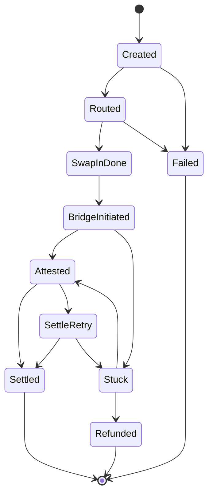

# sw4p USDT / Tron Stablecoin Parity CRD

**Status:** Corridor requirements - review gate.
**Date:** 2026-05-18.
**Owner:** sw4p Frontier Engine corpus.
**Scope:** Corridor, rail, provider, signing, proof, and observability requirements for USDT movement across EVM, Solana, and Tron.
**Companion docs:** `2026-05-18-sw4p-usdt-tron-parity-prd.md`, `2026-05-18-sw4p-usdt-tron-parity-sow.md`.

---

## 1. CRD Definition

CRD means Corridor Requirements Document. It defines what each source-chain, destination-chain, asset, rail, wallet, and proof combination must satisfy before sw4p can label a route supported.

This CRD exists because USDT/Tron cannot be validated with the same clean devnet/testnet shape as USDC/CCTP. The system must still be rigorous. That means the corridor requirements must distinguish:

- route eligibility,
- provider support,
- token availability,
- source signing model,
- destination settlement asset,
- transaction proof model,
- operational evidence state.

## 2. Corridor Architecture

```mermaid
flowchart LR
    User["User or Agent"] --> Route["sw4p Route Resolver"]
    Route --> Asset{ "Asset" }
    Asset -->|USDC| CCTP["CCTP V2 Rail"]
    Asset -->|USDT| AB["Allbridge Core Rail"]
    CCTP --> EVM["EVM CCTP Chains"]
    CCTP --> SOL["Solana"]
    AB --> AEVM["Allbridge EVM USDT Chains"]
    AB --> ASOL["Solana USDT"]
    AB --> TRON["Tron TRC20 USDT"]
    Route --> Gate["Proof and Availability Gate"]
    Gate --> Live["Live Route"]
    Gate --> Gated["Gated Unsupported Reason"]
```

The router must use the asset as the first discriminator. USDC uses CCTP V2 when both chains are CCTP-supported. USDT uses Allbridge Core only when live provider data and local execution support both say the route can be executed.

## 3. Current Provider Truth

### 3.1 Tether issuer truth

Tether's supported-protocol page lists current USDT support for ERC20, TRC20 on Tron, and Solana Token on Solana. The same page marks Omni Layer via Bitcoin, Bitcoin Cash SLP, Kusama, EOS, and Algorand as deprecated legacy support for issuance/redemption purposes. Therefore BTC/Omni is excluded from sw4p USDT parity.

### 3.2 Allbridge operational truth

The live Allbridge Core `/token-info` probe on 2026-05-18 returned these relevant entries:

| Chain | Allbridge symbol | Allbridge chain id | Token support relevant to sw4p |
|---|---:|---:|---|
| Ethereum | ETH | 1 | USDC, USDT, USDe |
| Arbitrum | ARB | 6 | USDC, USDT, USDe |
| Polygon | POL | 5 | USDT, USDC |
| Avalanche | AVA | 8 | USDC, USDT |
| Optimism | OPT | 10 | USDC, USDT |
| Base | BAS | 9 | USDC only |
| Unichain | UNI | 14 | USDC, USDT |
| Tron | TRX | 3 | USDT only |
| Solana | SOL | 4 | USDC, USDT |

Important consequences:

- Tron USDC must be treated as unsupported unless live token-info changes and the change is verified.
- Base USDT must be treated as unsupported in the direct Allbridge matrix unless live token-info changes.
- Solana USDT exists in live Allbridge token-info and must be included in the parity target.
- Unichain USDT exists in Allbridge token-info, but Unichain runtime exposure remains separate from the six-chain Frontier runtime registry rule.

### 3.3 Allbridge testnet truth

The existing W0 discovery found no documented or reachable public Allbridge testnet endpoint. That remains the controlling assumption until provider-confirmed evidence says otherwise.

## 4. Corridor States

Every route must be in exactly one state.

| State | Meaning | User visible? | Agent visible? |
|---|---|---:|---:|
| `live` | Fully executable, with proof and operational support. | Yes | Yes |
| `canary_authorized` | Explicitly authorized for a named small mainnet proof or controlled canary. | Yes, limited | Yes |
| `provider_supported_code_incomplete` | Provider supports the route, but sw4p execution is incomplete. | Gated | Yes |
| `code_supported_proof_missing` | sw4p code exists, but proof/corridor evidence is missing. | Gated | Yes |
| `provider_unsupported` | Provider data does not support the asset/chain tuple. | No live button | Yes |
| `out_of_scope` | Deliberately excluded by product decision. | No | Yes |

No route may default from any non-live state into a different rail without an explicit user-visible route change.

## 5. Corridor Matrix

| Corridor | Asset | Provider status | Local code status | Required state before live |
|---|---|---|---|---|
| ETH to Tron | USDT | Supported by Allbridge token-info | EVM to Tron code exists but must be revalidated against current API and contracts | `live` after signed tx proof or canary |
| ARB to Tron | USDT | Supported | EVM to Tron code exists | `live` after proof |
| POL to Tron | USDT | Supported | EVM to Tron code exists | Strong low-fee canary candidate |
| AVA to Tron | USDT | Supported | EVM to Tron code exists | `live` after proof |
| OP to Tron | USDT | Supported | EVM to Tron code exists | `live` after proof |
| UNI to Tron | USDT | Supported by Allbridge, not Frontier runtime registry | Script/registry policy required before exposure | `canary_authorized` or gated |
| BASE to Tron | USDT | Direct Base USDT unsupported in Allbridge token-info | Current code maps Base USDT to USDC, which is not acceptable as silent behavior | `provider_unsupported` unless explicit conversion route is designed |
| SOL to Tron | USDT | Supported by Allbridge token-info | Explicitly not implemented in local `allbridge.rs` | `provider_supported_code_incomplete` |
| Tron to EVM USDT chains | USDT | Supported | Tron source code exists but relies on relayer private key | Gated until signing/custody model approved |
| Tron to Solana | USDT | Supported by Allbridge token-info | Needs execution proof | Gated until signing/custody and proof |
| BTC/Omni to any | USDT | Deprecated legacy issuer path | No supported sw4p path | `out_of_scope` |

## 6. Signing and Custody Requirements

### CRD-SIGN-001: EVM source

EVM source execution must use the approved sw4p EVM operational path. For contract deployments this means Circle SCP only. For user transfer execution, the route must use either user wallet signatures or an explicitly approved Circle WaaS/SCP account model. Private-key direct broadcast is not allowed as a production pattern.

### CRD-SIGN-002: Solana source

Solana source execution must use the canonical Solana signing flow already accepted for sw4p. USDT ATA handling must be explicit and must not reuse USDC mint assumptions.

### CRD-SIGN-003: Tron source

Tron source execution must not silently use a backend relayer key as if it were a user wallet. The product must choose one of these models:

| Model | Description | Default decision |
|---|---|---|
| TronLink user-signed | User signs approve and bridge transaction through TronLink/TronWeb. | Preferred for non-custodial parity. |
| Controlled relayer | sw4p-controlled relayer executes from its own funded Tron address. | Allowed only for canary/proof or consciously custodial product mode. |
| Provider raw transaction | Allbridge REST/API returns unsigned raw tx for the user wallet to sign. | Preferred if reliable across browsers and wallets. |

The current `TRON_RELAYER_PRIVATE_KEY` path is not enough for production parity unless the product explicitly accepts a relayer-custody model.

## 7. Fee and Gas Requirements

| ID | Requirement |
|---|---|
| CRD-FEE-001 | EVM fees must show the selected rail and whether gas is sponsored, paid in stablecoin, or paid by wallet-native gas. |
| CRD-FEE-002 | Solana fees must distinguish transaction fee, priority fee, and any sponsor path. |
| CRD-FEE-003 | Tron fees must explain TRX, Energy, and Bandwidth. |
| CRD-FEE-004 | Allbridge bridge fees and pool impact must be sourced from live Allbridge quote/calculation endpoints where possible. |
| CRD-FEE-005 | Destination gas top-up must be an explicit route option, not a hidden promise. |

## 8. Proof Requirements

| ID | Requirement |
|---|---|
| CRD-PROOF-001 | Live Allbridge route inventory must be refreshed from `/token-info` before any route is marked live. |
| CRD-PROOF-002 | A route marked live must have at least one real transaction hash, provider transfer ID, or explicitly authorized canary result. |
| CRD-PROOF-003 | If no public non-production Allbridge corridor exists, documentation must say so and route acceptance must use either gated deferral or user-authorized mainnet micro-transfer. |
| CRD-PROOF-004 | No mock Allbridge transaction, localnet-only result, or guessed testnet contract address counts as acceptance. |
| CRD-PROOF-005 | Every proof must capture source tx, destination tx if available, provider status response, amount, asset, source chain, destination chain, and timestamp. |

## 9. State Machine Requirements

The Allbridge lifecycle must map into the Frontier 3-phase discipline.



Each transition must be durable-store-first. In-memory tracking is allowed only after the DB transition commits. No async lock may be held across provider polling.

## 10. Registry Requirements

| ID | Requirement |
|---|---|
| CRD-REG-001 | USDC/CCTP registry remains separate from Allbridge token/corridor registry. |
| CRD-REG-002 | Allbridge registry must be generated or refreshed from live token-info snapshots, with pinned evidence for releases. |
| CRD-REG-003 | Base USDT must not be represented as direct support while Allbridge token-info lists only Base USDC. |
| CRD-REG-004 | Tron USDT contract must remain `TR7NHqjeKQxGTCi8q8ZY4pL8otSzgjLj6t` unless Tether changes its official guidance. |
| CRD-REG-005 | Solana USDT mint must remain `Es9vMFrzaCERmJfrF4H2FYD4KCoNkY11McCe8BenwNYB` unless Tether changes its official guidance. |
| CRD-REG-006 | BTC/Omni identifiers must not be placed in the active route registry. |

## 11. API Requirements

The backend route API and kit API must return a structured route result:

```json
{
  "source_chain": "SOL",
  "destination_chain": "TRON",
  "asset": "USDT",
  "rail": "AllbridgeCore",
  "state": "provider_supported_code_incomplete",
  "reason": "Allbridge token-info supports SOL USDT and TRX USDT, but sw4p Solana-to-Tron execution is not implemented yet.",
  "evidence": {
    "provider": "Allbridge Core",
    "provider_snapshot": "2026-05-18 live token-info probe"
  }
}
```

The exact JSON shape can evolve during implementation, but these fields are mandatory: `source_chain`, `destination_chain`, `asset`, `rail`, `state`, `reason`, and `evidence`.

## 12. Security Requirements

| ID | Requirement |
|---|---|
| CRD-SEC-001 | No production Tron private key may be checked into repo, committed to docs, pasted into evidence, or embedded in scripts. |
| CRD-SEC-002 | Any relayer model must include spend caps, address allowlists where feasible, and transfer-size limits. |
| CRD-SEC-003 | TronLink origin/message handling must be reviewed before Tron source routes are enabled. |
| CRD-SEC-004 | Allbridge contract addresses and pool addresses must be verified against provider data before use. |
| CRD-SEC-005 | The system must detect and fail closed when provider token-info changes remove a route that was previously live. |

## 13. Open Decisions With Defaults

| ID | Decision | Default |
|---|---|---|
| OD-001 | Should Tron source use user-signed TronLink or relayer custody? | User-signed TronLink for production; relayer only for explicitly authorized canary/proof. |
| OD-002 | Should a mainnet micro-transfer be used as acceptance if no non-production corridor exists? | Yes only after explicit user authorization for a named route and amount. |
| OD-003 | Should Base to Tron USDT be synthesized through Base USDC or a two-leg conversion? | No for V1 parity. Mark unsupported unless explicitly designed as a conversion route. |
| OD-004 | Should Unichain USDT be exposed in runtime route selection? | Keep off runtime default until Frontier runtime registry policy admits Unichain. |

## 14. Acceptance Gate

The CRD is satisfied when:

1. Live route registry reflects Allbridge token-info for EVM, Solana, and Tron.
2. Tron, Solana, and EVM signing models are explicitly selected and implemented for every live route.
3. No unsupported route is visible as live in frontend, backend, or kit.
4. At least one Allbridge route has provider-backed proof, or the product is explicitly marked gated with no live Tron/USDT claim.
5. All Allbridge lifecycle transitions are durable and restart-safe.
6. BTC/Omni USDT is excluded from active code, docs, route registry, and agent outputs.
