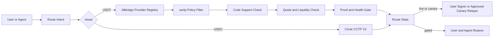
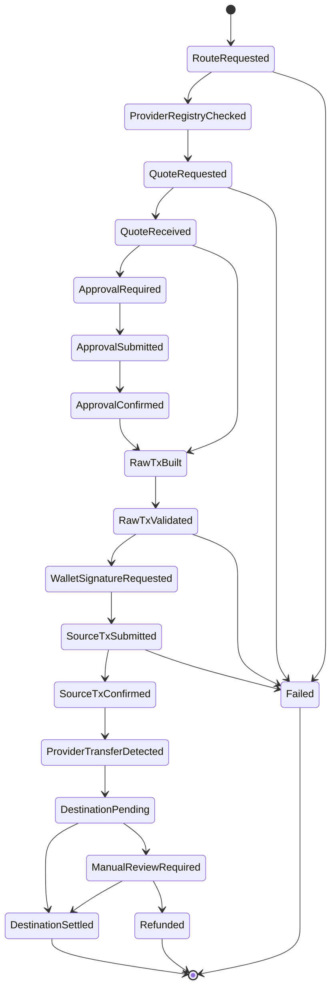

# sw4p USDT / Tron Stablecoin Parity CRD

**Status:** Corridor requirements - external-team handoff ready.
**Date:** 2026-05-18.
**Owner:** sw4p Frontier Engine corpus.
**Audience:** External implementation team with no prior sw4p context.
**Scope:** Corridor, route-state, provider, proof, policy, and launch requirements for USDT movement across EVM, Solana, and Tron.
**Companion docs:** `2026-05-18-sw4p-usdt-tron-parity-prd.md`, `2026-05-18-sw4p-usdt-tron-parity-trd.md`, `2026-05-18-sw4p-usdt-tron-parity-sow.md`.

---

## 1. CRD Definition

CRD means Corridor Requirements Document. It defines what each source-chain, destination-chain, asset, rail, provider, signer, quote, proof, and operations combination must satisfy before sw4p can label a route supported.

This CRD is separate from the TRD. The CRD decides what a corridor means and when it can be exposed. The TRD decides how to implement those requirements.

## 2. Corridor Principles

1. Asset is the first discriminator. USDC and USDT are not aliases.
2. USDC uses Circle CCTP V2 where CCTP supports the route.
3. USDT uses Allbridge Core only where provider and sw4p state both pass.
4. Provider token support is necessary but not sufficient.
5. Routes fail closed when provider data, code support, proof, or policy is stale or missing.
6. No route may silently change asset, rail, chain, recipient, or token standard.
7. Tron source routes are user-signed by default.
8. BTC/Omni USDT is `out_of_scope`.

## 3. Corridor Architecture



## 4. Provider Truth As Of 2026-05-18

### 4.1 Tether issuer truth

Tether lists current supported protocols including ERC20, TRC20 on Tron, and Solana Token. Tether marks Omni Layer via Bitcoin, Bitcoin Cash SLP, Kusama, EOS, and Algorand as legacy/deprecated for issuance and redemption obligations.

Requirement: BTC/Omni must be represented only as `out_of_scope`.

### 4.2 Allbridge provider truth

The 2026-05-18 live Allbridge token-info probe showed these relevant rows:

| Chain | Allbridge symbol | Allbridge chain id | Relevant support |
|---|---:|---:|---|
| Ethereum | ETH | 1 | USDC, USDT, USDe |
| Arbitrum | ARB | 6 | USDC, USDT, USDe |
| Polygon | POL | 5 | USDT, USDC |
| Avalanche | AVA | 8 | USDC, USDT |
| Optimism | OPT | 10 | USDC, USDT |
| Base | BAS | 9 | USDC only |
| Unichain | UNI | 14 | USDC, USDT |
| Tron | TRX | 3 | USDT only |
| Solana | SOL | 4 | USDC, USDT |

Requirements:

- Regenerate this matrix from current provider data before implementation and before release.
- Treat this table as a dated snapshot, not permanent truth.
- Include newly supported chains only after sw4p policy admits them.
- Keep Base direct USDT unsupported unless provider metadata changes and sw4p policy approves exposure.
- Keep Tron USDC unsupported unless provider metadata changes and sw4p policy approves exposure.

### 4.3 Allbridge non-production truth

No public Allbridge testnet corridor is assumed. If provider confirms a non-production corridor, record the provider confirmation and update this CRD. Until then, acceptance options are:

1. gated deferral,
2. provider metadata plus code readiness with no live claim,
3. explicitly authorized mainnet micro-transfer canary.

## 5. Required Route State Model

Every route has one primary state and multiple support dimensions.

### 5.1 Primary states

| State | Meaning | User visible? | Agent visible? | Execution allowed? |
|---|---|---:|---:|---:|
| `live` | Fully executable, proof-backed, operationally supported. | Yes | Yes | Yes |
| `canary_authorized` | Explicitly approved for one named proof transfer. | Yes, limited | Yes | Limited |
| `code_supported_proof_missing` | Code exists, but settlement proof is missing. | Gated | Yes | No public execution |
| `provider_supported_code_incomplete` | Provider supports tuple, sw4p cannot execute safely yet. | Gated | Yes | No |
| `provider_unsupported` | Provider does not expose the asset/chain tuple. | No live button | Yes | No |
| `suspended` | Route disabled due to provider, liquidity, stale registry, incident, or policy hold. | Gated | Yes | No |
| `policy_blocked` | Provider may support it, but sw4p policy blocks exposure. | No live button | Yes | No |
| `out_of_scope` | Product deliberately excludes it. | No | Yes | No |

### 5.2 Required dimensions

Each route must carry these fields or equivalents:

```ts
type Sw4pRouteState = {
  routeId: string;
  routeState:
    | "live"
    | "canary_authorized"
    | "code_supported_proof_missing"
    | "provider_supported_code_incomplete"
    | "provider_unsupported"
    | "suspended"
    | "policy_blocked"
    | "out_of_scope";

  asset: "USDC" | "USDT";
  sourceChain: string;
  destinationChain: string;
  sourceTokenStandard: "ERC20" | "SPL" | "TRC20" | "other";
  destinationTokenStandard: "ERC20" | "SPL" | "TRC20" | "other";

  provider: "circle_cctp_v2" | "allbridge_core";
  providerMechanism?: "pool" | "cctp" | "cctp_v2" | "oft" | "unknown";

  providerSupport: "supported" | "unsupported" | "unknown";
  quoteSupport: "available" | "unavailable" | "unknown";
  codeSupport: "implemented" | "partial" | "not_implemented";
  proofState:
    | "none"
    | "provider_metadata_only"
    | "provider_quote_only"
    | "raw_tx_built"
    | "signed_source_tx"
    | "source_tx_confirmed"
    | "destination_settled"
    | "provider_confirmed_nonprod";

  liquidityState: "unknown" | "available" | "insufficient" | "imbalanced";
  providerHealth: "unknown" | "ok" | "degraded" | "paused";
  policyState: "allowed" | "blocked" | "review_required";
  runtimeExposure: "hidden" | "operator_only" | "agent_visible" | "user_visible";
  registrySnapshotAt: string;
  registryExpiresAt: string;

  userVisibleReason: string;
  agentReasonCode: string;
  remediation?: string;
};
```

## 6. Corridor Matrix Requirements

| Corridor | Asset | Provider status | Local code status | Required primary state before live |
|---|---|---|---|---|
| ETH to Tron | USDT | Supported by provider snapshot | EVM to Tron code exists, must be revalidated | `live` only after quote, raw tx validation, source tx, destination proof |
| ARB to Tron | USDT | Supported | EVM to Tron code exists | Same as ETH |
| POL to Tron | USDT | Supported | EVM to Tron code exists | Best first canary candidate |
| AVA to Tron | USDT | Supported | EVM to Tron code exists | Same as ETH |
| OP to Tron | USDT | Supported | EVM to Tron code exists | Same as ETH |
| UNI to Tron | USDT | Supported by Allbridge | Runtime policy separate | `policy_blocked` unless runtime policy admits Unichain |
| BASE to Tron | USDT | Direct Base USDT unsupported in provider snapshot | Existing code maps Base USDT to USDC | `provider_unsupported` unless explicit composed route is designed |
| SOL to Tron | USDT | Supported by provider snapshot | Explicitly not implemented locally | `provider_supported_code_incomplete` |
| Tron to EVM USDT chains | USDT | Supported | Tron source code exists but relayer-based | Gated until TronLink/user-signing or canary custody approval |
| Tron to Solana | USDT | Supported | Needs execution proof | Gated until signing and proof pass |
| BTC/Omni to any | USDT | Issuer-deprecated legacy | No supported path | `out_of_scope` |

## 7. Signing And Custody Requirements

### CRD-SIGN-001: EVM source

EVM source transfer execution must use user wallet signatures or an explicitly approved Circle WaaS/SCP account model. Contract deployments remain Circle SCP only. Private-key direct broadcast is not allowed as a production pattern.

### CRD-SIGN-002: Solana source

Solana source execution must use the canonical sw4p Solana signing flow. USDT ATA handling must be explicit and must not reuse USDC mint assumptions.

### CRD-SIGN-003: Tron source

Production Tron source execution must use user-signed TronLink or an equivalent user-controlled Tron wallet. Backend relayer custody is not production parity.

Allowed Tron source models:

| Model | Allowed for production users? | Allowed for canary/proof? | Notes |
|---|---:|---:|---|
| TronLink user-signed | Yes | Yes | Default. |
| Provider raw transaction signed by user wallet | Yes | Yes | Preferred if provider tx shape is stable. |
| Controlled relayer | No by default | Yes, with explicit authorization | Requires caps, expiry, named route, and cleanup. |
| Backend private-key direct user substitute | No | No unless explicitly authorized for one proof action | Must never look like user custody. |

## 8. Fee And Gas Requirements

| ID | Requirement |
|---|---|
| CRD-FEE-001 | EVM fees must distinguish wallet-native gas, Circle/Gas Station sponsorship, and provider fees. |
| CRD-FEE-002 | Solana fees must distinguish transaction fee, priority fee, ATA/rent effects, and sponsorship. |
| CRD-FEE-003 | Tron fees must explain TRX, Bandwidth, Energy, fee limit, and resource burn risk. |
| CRD-FEE-004 | Allbridge fees must separate relayer/service fee, LP fee, pool impact, optional destination gas purchase, and receive estimate. |
| CRD-FEE-005 | Destination gas top-up must be explicit and route-supported. It must not be represented as universal gas abstraction unless the user is actually insulated from native gas. |
| CRD-FEE-006 | Quotes must carry expiry. Expired quotes cannot be signed. |
| CRD-FEE-007 | User must approve max slippage or max pool impact before signing. |

## 9. Provider Transaction Validation Requirements

Before any Allbridge raw transaction reaches wallet signing, sw4p must validate:

1. Target contract is a current allowlisted Allbridge contract or pool for the source chain.
2. Source token contract equals the selected route token.
3. Destination chain equals the selected destination.
4. Recipient equals the user-reviewed recipient.
5. Amount equals the reviewed amount within allowed tolerance.
6. Fees and destination gas fields match the reviewed quote.
7. Quote has not expired.
8. Approval spender is correct.
9. Approval amount is exact or bounded.
10. Provider route is not suspended, stale, degraded, or policy-blocked.

Any mismatch must stop the flow before signature.

## 10. Approval Requirements

| ID | Requirement |
|---|---|
| CRD-APPROVAL-001 | Approval spender must match the validated provider contract for the exact route. |
| CRD-APPROVAL-002 | Default approval must be exact amount or bounded cap, not unlimited. |
| CRD-APPROVAL-003 | Approval cap must be shown before signing. |
| CRD-APPROVAL-004 | Ethereum USDT allowance reset behavior must be supported where required. |
| CRD-APPROVAL-005 | Tron USDT approval must show spender and amount in the TronLink flow and sw4p confirmation surface. |

## 11. Proof Requirements

| ID | Requirement |
|---|---|
| CRD-PROOF-001 | Provider route inventory must be refreshed before any route is marked live. |
| CRD-PROOF-002 | A route marked live must have a real transaction hash, provider transfer ID, destination settlement proof, or provider-confirmed non-production proof. |
| CRD-PROOF-003 | Metadata alone can make a route candidate/gated, not live. |
| CRD-PROOF-004 | No mock Allbridge transaction, localnet-only result, or guessed testnet address counts as acceptance. |
| CRD-PROOF-005 | Every proof captures source tx, destination tx if available, provider status response, quote hash, registry snapshot hash, amount, asset, source, destination, timestamp, and operator. |
| CRD-PROOF-006 | Proof records must be immutable append-only from the product perspective. Corrections use superseding records, not silent edits. |

## 12. Lifecycle Requirements

The Allbridge lifecycle must map into Frontier's 3-phase discipline: durable intent, prepared external action, committed settlement or recoverable failure.



Each transition must be written to durable storage before external side effects are treated as accepted by the application. No async lock may be held across provider polling.

## 13. API Requirements

The route API must return structured state, not only quotes.

Minimum route response:

```json
{
  "route_id": "SOL:USDT->TRX:USDT:allbridge_core",
  "source_chain": "SOL",
  "destination_chain": "TRX",
  "asset": "USDT",
  "source_token_standard": "SPL",
  "destination_token_standard": "TRC20",
  "rail": "allbridge_core",
  "provider_mechanism": "pool",
  "route_state": "provider_supported_code_incomplete",
  "provider_support": "supported",
  "quote_support": "unknown",
  "code_support": "not_implemented",
  "proof_state": "provider_metadata_only",
  "liquidity_state": "unknown",
  "policy_state": "review_required",
  "reason_code": "SOL_TO_TRON_NOT_IMPLEMENTED",
  "reason": "Allbridge provider metadata supports SOL USDT and TRX USDT, but sw4p Solana-to-Tron execution is not implemented yet.",
  "remediation": "Complete WS2.4 before exposing this route as live.",
  "evidence": {
    "provider": "Allbridge Core",
    "provider_snapshot": "2026-05-18 live token-info probe"
  }
}
```

## 14. Security Requirements

| ID | Requirement |
|---|---|
| CRD-SEC-001 | No production Tron private key may be committed, pasted into evidence, or embedded in scripts. |
| CRD-SEC-002 | Any relayer/canary model must include route, amount, fee cap, approval cap, wallet, expiry, and approver. |
| CRD-SEC-003 | TronLink origin and message handling must be reviewed before Tron source routes are enabled. |
| CRD-SEC-004 | Allbridge contract and pool addresses must be verified against provider data before use. |
| CRD-SEC-005 | Provider token-info removal must automatically suspend affected routes. |
| CRD-SEC-006 | Raw transaction validation must happen before signature. |
| CRD-SEC-007 | Approval caps must be bounded unless the user explicitly opts into a higher cap after warning. |
| CRD-SEC-008 | Route suspension must be operator-accessible without code deployment. |
| CRD-SEC-009 | User-facing Tron copy must warn that failed smart contract execution may still consume resources. |

## 15. Open Decisions With Defaults

| ID | Decision | Default |
|---|---|---|
| OD-001 | Should Tron source use user-signed TronLink or relayer custody? | User-signed TronLink for production; relayer only for named canary/proof. |
| OD-002 | Should a mainnet micro-transfer be used as acceptance if no non-production corridor exists? | Yes only after explicit authorization for route, amount, wallets, fee cap, and expiry. |
| OD-003 | Should Base to Tron USDT be synthesized through Base USDC or a two-leg conversion? | No for V1 parity. Mark unsupported unless explicitly designed later. |
| OD-004 | Should Unichain USDT be exposed in runtime route selection? | Keep policy-blocked until Frontier runtime policy admits Unichain. |
| OD-005 | Should provider raw transactions be used? | Prefer provider-generated raw tx or SDK builder if sw4p validates the result before signing. |
| OD-006 | What is the minimum proof threshold for live? | Destination settlement proof or provider-confirmed non-production proof. |

## 16. Corridor Acceptance Gate

The CRD is satisfied only when:

1. Live route registry reflects current Allbridge and CCTP truth.
2. Route state dimensions are produced from one backend source of truth.
3. Tron, Solana, and EVM signing models are explicitly selected and implemented for every live route.
4. No unsupported route is visible as live in frontend, backend, or kit.
5. At least one Allbridge route has provider-backed proof, or the product remains explicitly gated with no live Tron/USDT claim.
6. All Allbridge lifecycle transitions are durable and restart-safe.
7. BTC/Omni USDT is excluded from active code, docs, route registry, and agent outputs.
