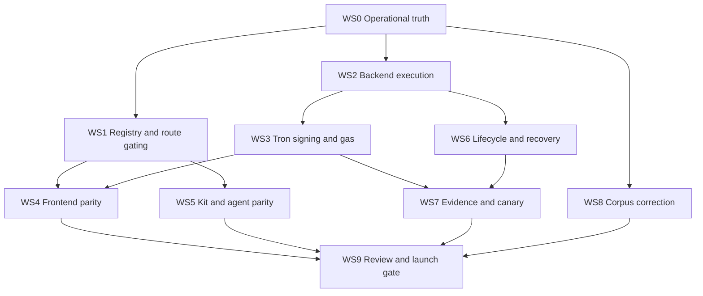

# sw4p USDT / Tron Stablecoin Parity SOW

**Status:** Statement of work - review gate.
**Date:** 2026-05-18.
**Owner:** sw4p Frontier Engine corpus.
**Scope:** Workstreams required to bring USDT parity across EVM, Solana, and Tron to an honest product and operator standard.
**Companion docs:** `2026-05-18-sw4p-usdt-tron-parity-prd.md`, `2026-05-18-sw4p-usdt-tron-parity-crd.md`.

---

## 1. Executive Summary

This SOW turns the USDT / Tron parity requirement into executable workstreams. It assumes the PRD and CRD decisions are accepted:

- USDC remains CCTP V2.
- USDT/Tron uses Allbridge Core.
- Tron is a first-class USDT chain, but not live until proof and signing gates close.
- Solana USDT is in scope.
- BTC/Omni USDT is out of scope.
- No public Allbridge testnet is assumed.
- Mainnet transfers require explicit per-action authorization.

This SOW is not a deploy instruction. It is the work contract for planning and implementation.

## 2. Workstream Overview

| Workstream | Title | Goal | Size |
|---|---|---|---|
| WS0 | Operational truth and route inventory | Build current route matrix from live provider data and local branch/code inventory. | M |
| WS1 | Allbridge registry and route gating | Replace optimistic route assumptions with provider-backed route states. | L |
| WS2 | Backend execution parity | Complete and harden Allbridge execution for EVM, Solana, and Tron. | XL |
| WS3 | Tron signing and gas model | Select and implement the production Tron signing model and fee explanation. | L |
| WS4 | Frontend parity | Make Tron/USDT UI honest, executable where live, and visibly gated where not. | M |
| WS5 | Kit and agent parity | Extend `@sw4p/kit` and MCP tools beyond USDC/base/solana assumptions. | M |
| WS6 | Lifecycle, observability, and recovery | Bring Allbridge lifecycle under the 3-phase discipline with durable tracking. | L |
| WS7 | Evidence and canary | Produce acceptance evidence without mocks or fake testnets. | M |
| WS8 | Corpus and product copy correction | Align canonical truth, Frontier docs, ops docs, and public claims. | S |
| WS9 | Review, audit, and launch gate | Final review gates before any live route is enabled. | M |

## 3. Dependency Graph

## 4. Work Packages

### WS0: Operational truth and route inventory

| WP | Deliverable | Dependencies | Acceptance |
|---|---|---|---|
| WP0.1 | Live Allbridge token-info snapshot parser and route matrix document. | None | Matrix lists ETH, ARB, POL, AVA, OP, BAS, UNI, SOL, TRX and their USDT/USDC support from live data. |
| WP0.2 | Local code inventory of Tron/USDT surfaces. | None | Inventory covers backend, frontend, kit, ops docs, stale branches, and merged status. |
| WP0.3 | Stale branch decision table for `fix/sw4p-tron-backend-adapter`, `ops/sw4p-tron-proof-corridor-provisioning`, and related branches. | WP0.2 | Each branch is classified as promote, cherry-pick, supersede, or close. |
| WP0.4 | BTC exclusion memo. | None | Memo cites Tether legacy protocol status and blocks BTC/Omni from active USDT routes. |

### WS1: Allbridge registry and route gating

| WP | Deliverable | Dependencies | Acceptance |
|---|---|---|---|
| WP1.1 | Separate Allbridge corridor registry. | WP0.1 | USDC/CCTP registry remains untouched; Allbridge registry stores provider-backed route state. |
| WP1.2 | Route state enum and reason schema. | WP1.1 | API can return `live`, `canary_authorized`, `provider_supported_code_incomplete`, `code_supported_proof_missing`, `provider_unsupported`, `out_of_scope`. |
| WP1.3 | Route selector fail-closed behavior. | WP1.2 | No unsupported Tron/USDT route is selected as live. |
| WP1.4 | Base USDT guard. | WP1.1 | Base to Tron USDT direct route is gated while Allbridge lists Base as USDC only. |
| WP1.5 | Solana USDT registry support. | WP1.1 | Solana USDT mint and Allbridge pool are represented separately from Solana USDC. |

### WS2: Backend execution parity

| WP | Deliverable | Dependencies | Acceptance |
|---|---|---|---|
| WP2.1 | Allbridge API contract reconciliation. | WP0.1 | Local `allbridge.rs` call shapes are checked against current Allbridge REST/SDK docs and live token-info. |
| WP2.2 | EVM to Tron execution hardening. | WP2.1 | Uses provider-backed contract/pool data, Circle-approved execution path where applicable, and real status tracking. |
| WP2.3 | Tron to EVM execution design and implementation. | WP2.1, WS3 | Does not depend on hidden backend private-key custody unless explicitly approved. |
| WP2.4 | Solana to Tron implementation. | WP1.5, WP2.1 | Removes the not-implemented error for any route marked live. |
| WP2.5 | Tron to Solana implementation or explicit gated state. | WP2.1, WS3 | Route is either executable with proof or gated with machine-readable reason. |
| WP2.6 | Provider raw transaction path evaluation. | WP2.1 | Decide whether to use Allbridge raw tx endpoints or SDK-generated transactions instead of manual ABI encoding. |

### WS3: Tron signing and gas model

| WP | Deliverable | Dependencies | Acceptance |
|---|---|---|---|
| WP3.1 | Tron signing decision record. | WP0.2 | Production default selected: user-signed TronLink unless user approves relayer custody. |
| WP3.2 | TronLink transaction signing path. | WP3.1 | Approve and bridge transaction can be user-reviewed and signed. |
| WP3.3 | Tron Energy/Bandwidth fee estimator. | WP3.1 | UI/API exposes fee limit, estimated Energy, estimated Bandwidth, and TRX exposure. |
| WP3.4 | Relayer/canary policy if needed. | WP3.1 | Spend caps, address scope, and evidence-only constraints documented and enforced. |

### WS4: Frontend parity

| WP | Deliverable | Dependencies | Acceptance |
|---|---|---|---|
| WP4.1 | Route UI state model. | WS1 | Live, gated, unsupported, and canary states render distinctly. |
| WP4.2 | Tron source execution UI. | WS3 | TronLink connection can progress to real transaction build/sign flow when live. |
| WP4.3 | USDT asset display. | WS1 | UI does not treat USDT as a USDC alias. |
| WP4.4 | Destination address validation. | Existing validation | Tron, Solana, EVM, and BTC preview validation remain separate; BTC not a USDT route. |
| WP4.5 | Fee disclosure. | WS3 | Tron fee model and Allbridge fees are visible before signing. |

### WS5: Kit and agent parity

| WP | Deliverable | Dependencies | Acceptance |
|---|---|---|---|
| WP5.1 | Extend chain schema. | WS1 | Kit supports Tron and Allbridge-supported EVM/Solana routes in types without overclaiming live execution. |
| WP5.2 | Extend asset schema. | Existing USDT type | USDT appears in balance, estimate, and send surfaces. |
| WP5.3 | Machine-readable gated route output. | WS1 | Agents get exact reason and evidence state for unsupported Tron/USDT routes. |
| WP5.4 | Real-protocol acceptance tests. | WS7 | No mocked SDK test counts as acceptance. |

### WS6: Lifecycle, observability, and recovery

| WP | Deliverable | Dependencies | Acceptance |
|---|---|---|---|
| WP6.1 | Allbridge lifecycle state table. | WS2 | Created, Routed, SwapInDone, BridgeInitiated, Attested, Settled, Failed, Stuck, SettleRetry, Refunded are durable states. |
| WP6.2 | 3-phase transition implementation. | WP6.1 | DB-write-first and no-lock-across-await are enforced. |
| WP6.3 | Provider status poller. | WP6.1 | Polls Allbridge status and can resume after process restart. |
| WP6.4 | Metrics and logs. | WP6.2 | Rail, route state, source/destination, proof state, and failure reason are logged. |
| WP6.5 | Recovery runbook. | WP6.3 | Operator can recover stuck or failed Allbridge route without guessing. |

### WS7: Evidence and canary

| WP | Deliverable | Dependencies | Acceptance |
|---|---|---|---|
| WP7.1 | Evidence folder and acceptance template. | WS0 | Template captures provider snapshot, source tx, destination tx, route, amount, fee, and status. |
| WP7.2 | Provider-confirmed non-production corridor attempt. | WS0 | If provider confirms one, document and use it; if not, document absence. |
| WP7.3 | Mainnet micro-transfer plan. | WP7.2 | Plan names route, amount, wallet, rollback, and authorization text. No tx without explicit go. |
| WP7.4 | Canary execution. | WP7.3 | Only runs if user authorizes. Produces real tx and status evidence. |
| WP7.5 | Gated deferral closeout. | WP7.2 | If no canary is authorized, routes remain gated and docs say exactly why. |

### WS8: Corpus and product copy correction

| WP | Deliverable | Dependencies | Acceptance |
|---|---|---|---|
| WP8.1 | Canonical truth correction. | PRD/CRD approval | RNDRNTWRK canonical truth distinguishes live CCTP/USDC from gated USDT/Tron parity. |
| WP8.2 | Frontier suite amendment. | PRD/CRD approval | Existing Frontier SOW/TRD no longer imply a public Tron testnet acceptance lane. |
| WP8.3 | Ops doc supersession map. | WS0 | Old PR #113/#123 and April docs are mapped to current work packages. |
| WP8.4 | Public copy guard. | WS4 | Public product text cannot claim Tron live until launch gate passes. |

### WS9: Review, audit, and launch gate

| WP | Deliverable | Dependencies | Acceptance |
|---|---|---|---|
| WP9.1 | Security review. | WS2, WS3, WS6 | Covers Tron signing, relayer risk, Allbridge provider dependence, and state-machine recovery. |
| WP9.2 | Product review. | WS4, WS5 | UI and agent outputs are accurate and non-misleading. |
| WP9.3 | Ops review. | WS6, WS7 | Secrets, runbooks, evidence, and rollback are complete. |
| WP9.4 | Launch decision. | All prior | Each route is individually authorized for live, canary-only, or gated. |

## 5. Milestones

| Milestone | Name | Exit criteria |
|---|---|---|
| M0 | Truth baseline | WS0 complete. Live provider matrix and code inventory accepted. |
| M1 | Route gating | WS1 complete. No false live routes. |
| M2 | Backend parity | WS2 and WS3 complete for the first target corridor. |
| M3 | Product parity | WS4 and WS5 complete for live/gated states. |
| M4 | Lifecycle safety | WS6 complete. Restart-safe Allbridge lifecycle proven. |
| M5 | Evidence | WS7 complete by provider proof, authorized mainnet canary, or honest gated deferral. |
| M6 | Launch gate | WS8 and WS9 complete. Per-route launch decisions recorded. |

## 6. Recommended First Target Corridor

Use Polygon USDT to Tron USDT as the first mainnet canary candidate if user authorization is granted later.

Reasoning:

- Live Allbridge token-info supports USDT on Polygon and Tron.
- Polygon gas cost is lower than Ethereum mainnet.
- It avoids Base's direct USDT unsupported gap.
- It exercises EVM to Tron without Solana's current not-implemented gap.

If the user does not authorize a mainnet micro-transfer, the first implementation target should still be Polygon to Tron, but its acceptance state remains `code_supported_proof_missing` until proof is authorized.

## 7. Review Gates

No implementation task may claim complete unless these gates are true:

1. The route state is generated from live provider data or pinned snapshot evidence.
2. The route has an explicit asset, source token, destination token, and rail.
3. The signing path is non-custodial or explicitly approved as relayer/canary custody.
4. The route has restart-safe lifecycle tracking.
5. The UI and kit surface the same state as the backend.
6. The proof is real, or the route remains gated.
7. BTC/Omni is absent.

## 8. Immediate Next Step After Approval

Invoke `writing-plans` for this SOW and create an implementation plan scoped to M0 through M2 first. Do not start WS4/WS5 product surfaces until WS1 route gating is complete, because product code must not encode false route availability.
