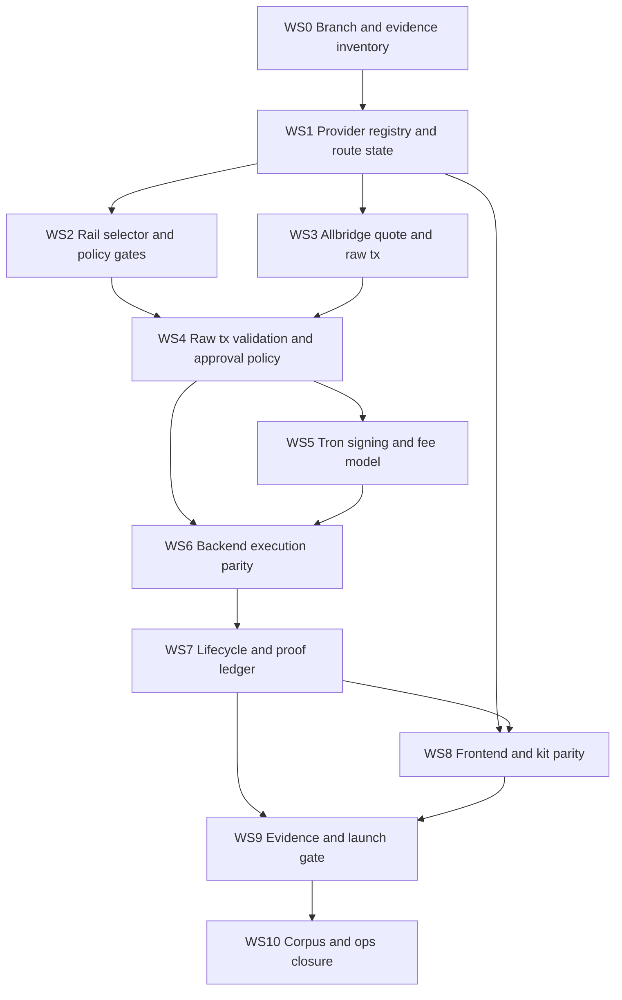

# sw4p USDT / Tron Stablecoin Parity SOW

**Status:** Statement of work - external-team handoff ready.
**Date:** 2026-05-18.
**Owner:** sw4p Frontier Engine corpus.
**Audience:** External implementation team with no prior sw4p context.
**Scope:** Workstreams required to deliver honest USDT parity across EVM, Solana, and Tron using Allbridge Core, with USDC preserved on CCTP V2 and BTC/Omni excluded.
**Companion docs:** `2026-05-18-sw4p-usdt-tron-parity-prd.md`, `2026-05-18-sw4p-usdt-tron-parity-crd.md`, `2026-05-18-sw4p-usdt-tron-parity-trd.md`.

---

## 1. Execution Standard

This SOW is written for an external team. Assume no prior sw4p context. The team must treat the PRD, CRD, and TRD as binding.

The governing rule is:

> Do not make a route appear live until provider support, sw4p code support, quote support, liquidity, signing, proof, runtime policy, frontend state, kit state, and operations state all agree.

This SOW is not a deploy authorization. It does not authorize mainnet transfers. It does not authorize non-Circle sw4p contract deployments. It does not authorize Tron relayer custody for production users.

## 2. Workstream Overview

| Workstream | Title | Goal | Size |
|---|---|---|---|
| WS0 | Branch and evidence inventory | Find existing Tron/USDT work and classify it before rebuilding. | M |
| WS1 | Provider registry and route state | Build the provider-backed route truth layer. | XL |
| WS2 | Rail selector and policy gates | Prevent silent rail, asset, and chain substitution. | L |
| WS3 | Allbridge quote and raw transaction integration | Build provider-backed quote, approval, and unsigned tx flows. | XL |
| WS4 | Raw tx validation and approval policy | Validate all provider tx material before signing. | L |
| WS5 | Tron signing and fee model | Implement TronLink/user-signed production route support. | XL |
| WS6 | Backend execution parity | Complete EVM, Solana, and Tron Allbridge execution paths. | XL |
| WS7 | Lifecycle, proof ledger, and observability | Make transfers restart-safe, auditable, and recoverable. | XL |
| WS8 | Frontend and kit parity | Expose honest route states to users and agents. | L |
| WS9 | Evidence, canary, and launch gate | Produce proof or keep routes gated. | M |
| WS10 | Corpus, ops, and public copy closure | Align docs, runbooks, and product claims. | M |

## 3. Dependency Graph

## 4. Work Packages

### WS0: Branch and evidence inventory

| WP | Deliverable | Acceptance |
|---|---|---|
| WP0.1 | Inventory branches `feat/sw4p-tron-sdk-contract`, `fix/sw4p-tron-backend-adapter`, `ops/sw4p-tron-proof-corridor-provisioning`, `docs/sw4p-tron-proof-corridor-research`. None of these were present on local or origin as of 2026-05-18. | Record presence/absence in `docs/superpowers/specs/2026-05-18-sw4p-usdt-tron-parity-inventory.md`. Where present, classify each file as promote, cherry-pick, supersede, or close. Where absent, mark recovered-from-archive or treat as never-existed and proceed. |
| WP0.2 | Inventory current backend, frontend, kit, and ops docs surfaces. | Covers Tron client, Allbridge adapter, route selector, native bridge, frontend wallet/config/hooks, kit intent schema, and ops proof docs. |
| WP0.3 | Current provider source review. | Captures Circle CCTP, Circle Contracts, Tether, Allbridge, and TRON sources with URLs and date. |
| WP0.4 | Existing evidence review. | Existing Allbridge discovery and Tron proof corridor docs are mapped to current requirements. |
| WP0.5 | Gap report. | P0 gaps are listed before implementation starts. |

Exit gate: no implementation starts until WP0.1 through WP0.5 are complete.

### WS1: Provider registry and route state

| WP | Deliverable | Acceptance |
|---|---|---|
| WP1.1 | Allbridge provider snapshot fetcher. | Fetches live or pinned provider chain/token metadata and stores raw/normalized hashes. |
| WP1.2 | Route matrix normalizer. | Produces route tuples with asset, source token, destination token, token standards, provider support, and provider mechanism. |
| WP1.3 | Registry TTL and stale rejection. | Expired snapshots cannot create live routes. |
| WP1.4 | Route-state derivation. | Supports `live`, `canary_authorized`, `code_supported_proof_missing`, `provider_supported_code_incomplete`, `provider_unsupported`, `suspended`, `policy_blocked`, `out_of_scope`. |
| WP1.5 | Policy filter. | Excludes BTC/Omni, gates Unichain runtime exposure, gates Base direct USDT, gates Tron USDC. |
| WP1.6 | Shared schema. | Backend, frontend, and kit consume the same route state shape or generated type definitions. |

Exit gate: given current provider metadata, every USDC/USDT route can be explained as live, gated, unsupported, suspended, policy-blocked, or out-of-scope.

### WS2: Rail selector and policy gates

| WP | Deliverable | Acceptance |
|---|---|---|
| WP2.1 | Asset-first rail selector. | USDC uses CCTP V2 where supported; USDT uses Allbridge Core where supported. |
| WP2.2 | No silent substitution guards. | Tests prove no USDT to USDC, Base USDT to Base USDC, CCTP-for-USDT, or wrong-token-standard fallback. |
| WP2.3 | Structured route-state errors. | Unsupported route returns reason code, user reason, remediation, and evidence summary. |
| WP2.4 | BTC/Omni exclusion guard. | BTC/Omni cannot appear in active route registry, UI, kit, or agent output. |

Exit gate: no unsupported route is selected as live.

### WS3: Allbridge quote and raw transaction integration

| WP | Deliverable | Acceptance |
|---|---|---|
| WP3.1 | Allbridge SDK/API integration decision. | Chosen path documented: SDK, REST, or hybrid. |
| WP3.2 | Quote request/response implementation. | Captures source amount, expected receive, minimum receive, relayer/service fees, LP fees, pool impact, optional destination gas, expiry. |
| WP3.3 | Raw approval transaction builder. | Produces provider-backed approval tx where required. |
| WP3.4 | Raw send transaction builder. | Produces provider-backed unsigned send tx. |
| WP3.5 | Quote and tx hashing. | Stores quote hash and raw tx hash before signing. |
| WP3.6 | Provider mechanism capture. | Records pool, CCTP, CCTP V2, OFT, or unknown. |

Exit gate: no wallet signing step can be reached without provider-backed quote and raw tx material.

### WS4: Raw tx validation and approval policy

| WP | Deliverable | Acceptance |
|---|---|---|
| WP4.1 | Contract/pool allowlist. | Generated or validated against provider contract inventory. |
| WP4.2 | Raw tx validator. | Validates target, method, token, amount, chain, recipient, fee fields, quote expiry, and route state. |
| WP4.3 | Approval policy. | Exact or bounded approvals by default; spender and amount shown. |
| WP4.4 | Ethereum USDT allowance reset support. | Handles nonzero allowance reset where required. |
| WP4.5 | Tron approval display requirements. | TronLink review surface shows spender, token, and amount. |
| WP4.6 | Failure reasons. | Validation failures return deterministic reason codes. |

Exit gate: provider raw transaction cannot reach signature unless it validates against original user intent.

### WS5: Tron signing and fee model

| WP | Deliverable | Acceptance |
|---|---|---|
| WP5.1 | Tron signing decision record. | Production default is TronLink/user-signed; relayer is canary-only unless explicitly approved. |
| WP5.2 | TronLink adapter. | Connect, account change, network check, sign, broadcast, and rejection handling implemented. |
| WP5.3 | Tron address validation. | Rejects malformed or wrong-chain addresses. |
| WP5.4 | Tron fee/resource preview. | Shows TRX, Bandwidth, Energy, fee limit, and resource burn risk. |
| WP5.5 | Tron confirmation watcher. | Source tx confirmation uses TRON-specific policy. |
| WP5.6 | Canary relayer policy. | If used, requires route, wallet, amount, fee cap, approval cap, expiry, approver, and cleanup. |

Exit gate: Tron source execution can progress through quote, review, signing request, broadcast, and source confirmation without backend private-key custody for production users.

### WS6: Backend execution parity

| WP | Deliverable | Acceptance |
|---|---|---|
| WP6.1 | EVM to Tron implementation. | First target corridor can build quote, approval, send tx, and watcher state. |
| WP6.2 | Tron to EVM implementation or gated state. | Route is executable or returns structured gated reason. |
| WP6.3 | Solana to Tron gap closure. | Removes not-implemented path for any route marked live, or route remains gated with reason. |
| WP6.4 | Tron to Solana implementation or gated state. | Same standard as Tron to EVM. |
| WP6.5 | Provider status polling. | Transfer status resumes after restart. |
| WP6.6 | Backend route API. | Returns full route-state response and quote response. |

Exit gate: no route marked live has an unimplemented backend path.

### WS7: Lifecycle, proof ledger, and observability

| WP | Deliverable | Acceptance |
|---|---|---|
| WP7.1 | DB schema for route snapshots, route states, quotes, raw tx validations, lifecycle events, evidence, suspensions, canary authorizations. | Migrations reviewed and tested. |
| WP7.2 | Durable lifecycle state machine. | Route, quote, approval, raw tx, source tx, provider status, destination settlement, failure, refund, and manual review events are durable. |
| WP7.3 | Proof ledger. | Captures registry hash, quote hash, raw tx hash, tx hashes, provider status hash, proof level, and supersession. |
| WP7.4 | Restart recovery. | Process can resume from DB state only. |
| WP7.5 | Metrics and logs. | Emits route state counts, stale registry, quote failures, raw tx validation failures, approval failures, tx failures, settlement latency, stuck count, suspensions. |
| WP7.6 | Operator runbooks. | Stuck transfer, route suspension, provider degradation, canary execution, and rollback runbooks exist. |

Exit gate: a stuck transfer can be traced from quote to approval to source transaction to provider status to destination settlement or escalation.

### WS8: Frontend and kit parity

| WP | Deliverable | Acceptance |
|---|---|---|
| WP8.1 | Route state UI. | Live, gated, unsupported, suspended, policy-blocked, and canary states render distinctly. |
| WP8.2 | Route detail screen. | Shows source asset, destination asset, token standards, provider rail, quote, fees, approval, proof state, and expected status. |
| WP8.3 | Tron execution UI. | TronLink source route can reach transaction review/sign flow when live. |
| WP8.4 | Kit chain/asset schema. | Supports Tron and USDT without overclaiming liveness. |
| WP8.5 | Agent-safe route output. | Returns reason code, remediation, and evidence summary. |
| WP8.6 | Consistency tests. | Frontend, backend, and kit agree for route fixtures and provider snapshots. |

Exit gate: user and agent surfaces cannot show a route live unless backend route truth says live.

### WS9: Evidence, canary, and launch gate

| WP | Deliverable | Acceptance |
|---|---|---|
| WP9.1 | Evidence template. | Captures provider snapshot, quote, route, amount, fee, source tx, destination tx, provider status, proof level. |
| WP9.2 | Provider-confirmed non-production corridor attempt. | Provider response is documented. If absent, no fake testnet is invented. |
| WP9.3 | Mainnet canary authorization packet. | Structured authorization exists before any mainnet proof. |
| WP9.4 | First canary candidate: Polygon USDT to Tron USDT. | Plan ready, no tx unless explicitly approved. |
| WP9.5 | Canary execution if approved. | Produces real evidence or failure report. |
| WP9.6 | Gated deferral if not approved. | Routes remain gated and public copy says why. |
| WP9.7 | Launch decision record. | Each route marked live, canary-only, gated, suspended, policy-blocked, or out-of-scope. |

Exit gate: a route cannot move to live from metadata alone.

### WS10: Corpus, ops, and public copy closure

| WP | Deliverable | Acceptance |
|---|---|---|
| WP10.1 | Canonical truth alignment. | sw4p text distinguishes USDC/CCTP live path from gated USDT/Tron track. |
| WP10.2 | Frontier suite amendment. | Existing Frontier SOW/TRD no longer implies public Tron testnet acceptance. |
| WP10.3 | Ops doc supersession map. | April Tron corridor docs and stale PRs mapped to new work packages. |
| WP10.4 | Public copy guard. | No public claim of Tron live until launch gate passes. |
| WP10.5 | External handoff closeout. | PRD, CRD, TRD, SOW, evidence, and runbooks are linked in one handoff index. |

Exit gate: product, ops, and corpus all tell the same truth.

## 5. Milestones

| Milestone | Name | Exit criteria |
|---|---|---|
| M0 | Truth baseline | WS0 complete. Existing code, branches, evidence, and provider docs inventoried. |
| M1 | Route truth | WS1 and WS2 complete. No false live routes possible. |
| M2 | Provider transaction safety | WS3 and WS4 complete. Quote/raw tx/approval validation gates exist. |
| M3 | Tron signing | WS5 complete. Production Tron source flow is user-signed. |
| M4 | Backend parity | WS6 complete for first target corridor and all non-live routes gated. |
| M5 | Lifecycle safety | WS7 complete. Restart-safe lifecycle and proof ledger exist. |
| M6 | Product parity | WS8 complete. Frontend, backend, kit, and agents agree. |
| M7 | Evidence | WS9 complete by provider proof, authorized canary, or gated deferral. |
| M8 | Launch closure | WS10 complete. Route launch decisions recorded. |

## 6. Recommended First Development Scope

The external team should start with M0 through M2 only.

Why:

- Route truth must exist before product surfaces.
- Raw transaction validation must exist before any signing work.
- Provider metadata needs to be separated from liveness before any public copy changes.

First implementation branch should deliver:

1. provider snapshot fetcher,
2. route matrix normalizer,
3. route-state schema,
4. policy filters,
5. rail selector guards,
6. structured route API response,
7. tests proving Base USDT, Tron USDC, BTC/Omni, stale registry, and Solana-to-Tron gap fail closed.

## 7. Recommended First Canary

If mainnet proof is later authorized, use Polygon USDT to Tron USDT.

Reasoning:

- Provider snapshot supports Polygon USDT and Tron USDT.
- Polygon gas is lower than Ethereum mainnet.
- It avoids Base direct USDT unsupported gap.
- It tests EVM to Tron without depending on Solana-to-Tron implementation.

No canary may run until the structured authorization object is approved.

## 8. Review Requirements

Each PR must include:

- scope statement,
- route states affected,
- evidence source,
- tests run,
- no-fake-live assertion,
- rollback/suspension impact,
- security notes for signing/approval/provider interaction.

Required review gates:

1. Security review for raw tx validation and approval policy.
2. Product review for route copy and unsupported state clarity.
3. Ops review for proof ledger, lifecycle, and runbooks.
4. Agent review for machine-readable error safety.
5. Final launch review per route.

## 9. Must-Not-Ship Checklist

No route ships live if any are true:

- Route state is hardcoded.
- Provider snapshot is stale.
- Raw transaction validation is missing.
- Approval is unlimited by default.
- Base USDT silently maps to Base USDC.
- CCTP is used for USDT without explicit designed conversion route.
- Tron source uses backend relayer custody by default.
- Solana to Tron is marked live while backend returns not implemented.
- Frontend, backend, and kit disagree.
- Proof ledger is missing.
- Stuck transfer runbook is missing.
- BTC/Omni appears active.
- Public copy claims Tron live before launch gate.

## 10. Definition Of Done For The Pack

This SOW is complete when:

1. PRD, CRD, TRD, and SOW agree on route states.
2. External sources are linked.
3. Local code surfaces are named.
4. Development work packages are independently actionable.
5. Mainnet canary remains gated.
6. BTC/Omni is excluded.
7. USDC/CCTP and USDT/Allbridge split is preserved.
8. No implementation is required to understand the work sequence.
