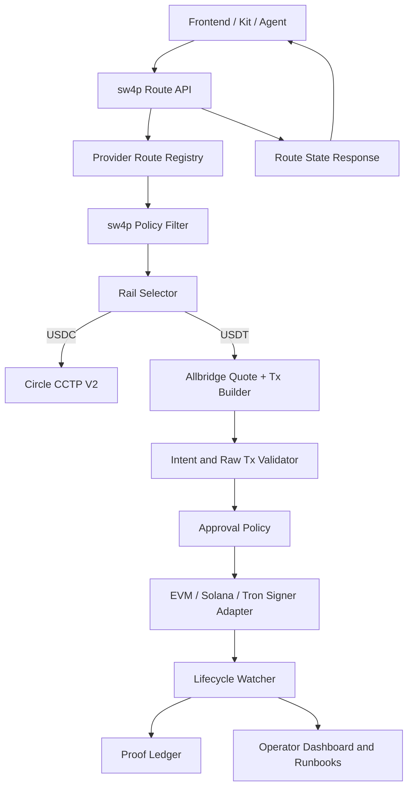
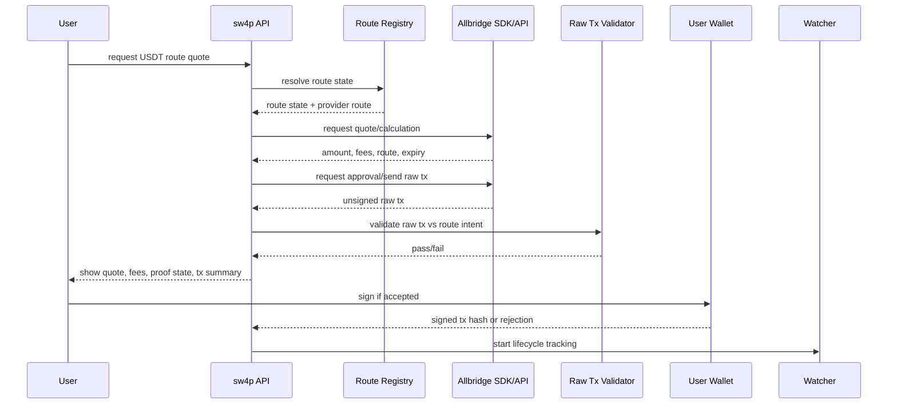

# sw4p USDT / Tron Stablecoin Parity TRD

**Status:** Technical requirements - external-team handoff ready.
**Date:** 2026-05-18.
**Owner:** sw4p Frontier Engine corpus.
**Audience:** External implementation team with no prior sw4p context.
**Scope:** Technical design requirements for USDT movement across EVM, Solana, and Tron using Allbridge Core, while preserving USDC/CCTP V2 and excluding BTC/Omni.
**Companion docs:** `2026-05-18-sw4p-usdt-tron-parity-prd.md`, `2026-05-18-sw4p-usdt-tron-parity-crd.md`, `2026-05-18-sw4p-usdt-tron-parity-sow.md`.

---

## 1. Technical Thesis

USDT/Tron parity is not one feature flag. It is a route truth, transaction construction, signing, proof, and operations system.

The technical system must implement this invariant:

> A sw4p route is live only when provider state, sw4p policy, code support, quote support, liquidity, raw transaction validation, signer model, proof state, frontend state, kit state, and operations state all agree.

The required architecture has seven modules:

1. Provider Route Registry
2. Rail Selector
3. Allbridge Quote and Raw Transaction Builder
4. Approval Policy
5. Tron Wallet Adapter
6. Lifecycle Watcher and Proof Ledger
7. Kit and Agent API

## 2. System Architecture



## 3. Module 1: Provider Route Registry

### 3.1 Purpose

Maintain current provider-backed route truth for Allbridge Core and CCTP without hardcoded optimism.

### 3.2 Inputs

- Allbridge chain/token metadata.
- Allbridge contract/pool inventory.
- Allbridge quote/calculation endpoints.
- Circle CCTP supported domain/chain registry.
- sw4p policy file.
- sw4p code-support manifest.
- proof ledger state.
- operations health and suspension controls.

### 3.3 Outputs

- `RouteMatrixSnapshot`
- `ProviderRoute`
- `RouteState`
- `RegistrySnapshotHash`
- `RegistryExpiry`

### 3.4 Requirements

| ID | Requirement |
|---|---|
| TRD-REG-001 | Implement an Allbridge provider fetcher that loads chain/token metadata from provider endpoints or SDK. |
| TRD-REG-002 | Persist every registry snapshot with timestamp, source endpoint, raw response hash, normalized route hash, and expiry. |
| TRD-REG-003 | Use a TTL. Expired snapshots cannot create live routes. |
| TRD-REG-004 | Apply policy after provider discovery, not before. Provider truth and sw4p exposure are separate. |
| TRD-REG-005 | Exclude BTC/Omni from active route registry. |
| TRD-REG-006 | Represent Base direct USDT as unsupported unless live provider data changes. |
| TRD-REG-007 | Represent Tron USDC as unsupported unless live provider data changes. |
| TRD-REG-008 | Represent Unichain USDT as provider-supported but policy-blocked until runtime policy admits it. |
| TRD-REG-009 | Emit route-state reasons suitable for users and agents. |
| TRD-REG-010 | Fail closed if provider fetch fails and no non-expired snapshot exists. |

### 3.5 Suggested data model

```ts
type ProviderRoute = {
  provider: "allbridge_core" | "circle_cctp_v2";
  sourceChain: string;
  destinationChain: string;
  sourceToken: {
    symbol: "USDC" | "USDT";
    standard: "ERC20" | "SPL" | "TRC20";
    address: string;
    decimals: number;
  };
  destinationToken: {
    symbol: "USDC" | "USDT";
    standard: "ERC20" | "SPL" | "TRC20";
    address: string;
    decimals: number;
  };
  providerMechanism: "pool" | "cctp" | "cctp_v2" | "oft" | "unknown";
  providerSupport: "supported" | "unsupported" | "unknown";
  rawProviderEvidenceHash: string;
};

type RouteMatrixSnapshot = {
  snapshotId: string;
  provider: string;
  fetchedAt: string;
  expiresAt: string;
  sourceUrlOrSdk: string;
  rawResponseHash: string;
  normalizedHash: string;
  routes: ProviderRoute[];
};
```

## 4. Module 2: Rail Selector

### 4.1 Purpose

Select the correct rail without silent substitution.

### 4.2 Rules

```txt
IF asset == USDC AND source/destination are CCTP-supported:
  rail = circle_cctp_v2

ELSE IF asset == USDT AND Allbridge supports source/destination token tuple:
  rail = allbridge_core

ELSE:
  route_state = provider_unsupported OR provider_supported_code_incomplete

NEVER:
  silently map USDT to USDC
  silently map Base USDT to Base USDC
  silently use CCTP for USDT
  silently compose two routes without explicit user consent
  silently substitute a different destination token standard
```

### 4.3 Requirements

| ID | Requirement |
|---|---|
| TRD-SEL-001 | Add asset-first rail selection. |
| TRD-SEL-002 | Keep CCTP registry separate from Allbridge registry. |
| TRD-SEL-003 | Add a fail-closed Base USDT guard. |
| TRD-SEL-004 | Add a fail-closed Tron USDC guard. |
| TRD-SEL-005 | Add a hard BTC/Omni out-of-scope guard. |
| TRD-SEL-006 | Return structured route-state response instead of generic unsupported errors. |
| TRD-SEL-007 | Add regression tests proving unsupported routes cannot become live through fallback. |

## 5. Module 3: Allbridge Quote And Raw Transaction Builder

### 5.1 Purpose

Build provider-backed quotes and unsigned transaction payloads, then validate them before signing.

### 5.2 Flow



### 5.3 Requirements

| ID | Requirement |
|---|---|
| TRD-AB-001 | Use Allbridge SDK/API for quote/calculation where possible. |
| TRD-AB-002 | Use provider-generated raw tx builder where possible. |
| TRD-AB-003 | Store quote request hash and quote response hash. |
| TRD-AB-004 | Enforce quote expiry. |
| TRD-AB-005 | Normalize relayer fee, LP fee, pool impact, optional destination gas, source amount, expected receive amount, minimum receive amount. |
| TRD-AB-006 | Validate provider mechanism: pool, cctp, cctp_v2, oft, or unknown. |
| TRD-AB-007 | Reject quote if route state is not executable. |
| TRD-AB-008 | Reject quote if liquidity is insufficient or provider reports degraded/paused state. |
| TRD-AB-009 | Store raw transaction preimage hash before presenting it to the signer. |

## 6. Module 4: Raw Transaction Validator

### 6.1 Purpose

Prevent malicious, stale, mismatched, or provider-drifted transactions from reaching wallet signing.

### 6.2 Required validation checklist

| ID | Validation |
|---|---|
| TRD-RAW-001 | Target contract equals current allowlisted provider contract for the selected source chain. |
| TRD-RAW-002 | Approval spender equals expected provider spender. |
| TRD-RAW-003 | Source token equals selected source token. |
| TRD-RAW-004 | Destination chain equals selected destination chain. |
| TRD-RAW-005 | Destination token equals selected destination token. |
| TRD-RAW-006 | Recipient equals user-reviewed recipient. |
| TRD-RAW-007 | Amount equals quoted amount within configured tolerance. |
| TRD-RAW-008 | Fee fields match reviewed quote. |
| TRD-RAW-009 | Optional destination gas purchase matches reviewed setting. |
| TRD-RAW-010 | Quote has not expired. |
| TRD-RAW-011 | Route is not stale, suspended, provider-unsupported, policy-blocked, or proof-blocked. |
| TRD-RAW-012 | Chain id or network id matches the connected wallet network. |
| TRD-RAW-013 | Encoded method selector is allowlisted for approval or bridge send. |
| TRD-RAW-014 | Any unknown field or unrecognized provider payload causes fail-closed behavior. |

### 6.3 Required validator output

```ts
type RawTxValidationResult =
  | {
      ok: true;
      validationId: string;
      rawTxHash: string;
      quoteHash: string;
      registrySnapshotHash: string;
      checksPassed: string[];
    }
  | {
      ok: false;
      reasonCode: string;
      reason: string;
      failedCheck: string;
      remediation?: string;
    };
```

## 7. Module 5: Approval Policy

### 7.1 Purpose

Prevent approval abuse on ERC20, SPL delegated flows where relevant, and TRC20.

### 7.2 Requirements

| ID | Requirement |
|---|---|
| TRD-APP-001 | Approval spender must match the validated provider contract. |
| TRD-APP-002 | Default approval amount must be exact route amount or bounded cap. |
| TRD-APP-003 | Unlimited approval is disabled by default. |
| TRD-APP-004 | User-visible approval surface shows spender, token, amount, chain, and expiry where applicable. |
| TRD-APP-005 | Ethereum USDT allowance reset behavior must be supported. |
| TRD-APP-006 | Tron USDT approval must show spender and amount before TronLink confirmation. |
| TRD-APP-007 | Approval tx and bridge tx are separate lifecycle events. |
| TRD-APP-008 | Approval failures must not leave route state ambiguous. |

## 8. Module 6: Tron Wallet Adapter

### 8.1 Purpose

Complete Tron source execution through user-controlled signing.

### 8.2 Requirements

| ID | Requirement |
|---|---|
| TRD-TRON-001 | Implement TronLink connection, network check, address check, and account-change handling. |
| TRD-TRON-002 | Build or receive provider raw transaction and present review data before signature. |
| TRD-TRON-003 | Use TronLink signing for production source routes. |
| TRD-TRON-004 | Broadcast signed transaction and record tx hash. |
| TRD-TRON-005 | Track confirmation using Tron-specific finality policy. |
| TRD-TRON-006 | Display TRX, Bandwidth, Energy, fee limit, and resource burn risk. |
| TRD-TRON-007 | Reject malformed or wrong-chain Tron destination addresses. |
| TRD-TRON-008 | Do not use backend `TRON_RELAYER_PRIVATE_KEY` for production user routes. |
| TRD-TRON-009 | If a canary relayer is approved, enforce route, wallet, amount, approval cap, fee cap, expiry, and cleanup. |
| TRD-TRON-010 | Add tests for account switch, wallet rejection, insufficient resources, invalid recipient, stale quote, and provider tx mismatch. |

## 9. Module 7: Lifecycle Watcher And Proof Ledger

### 9.1 Purpose

Make every Allbridge transfer auditable, restart-safe, and recoverable.

### 9.2 Lifecycle events

Required lifecycle events:

```txt
route_requested
provider_registry_checked
quote_requested
quote_received
approval_required
approval_submitted
approval_confirmed
raw_tx_built
raw_tx_validated
wallet_signature_requested
source_tx_submitted
source_tx_confirmed
provider_transfer_detected
destination_pending
destination_settled
settlement_proof_recorded
failed
refunded
manual_review_required
suspended
```

### 9.3 Proof ledger object

```ts
type SettlementEvidence = {
  evidenceId: string;
  routeId: string;
  provider: "circle_cctp_v2" | "allbridge_core";
  providerMechanism?: "pool" | "cctp" | "cctp_v2" | "oft" | "unknown";
  sourceTxHash?: string;
  destinationTxHash?: string;
  providerTransferId?: string;
  providerStatusResponseHash?: string;
  registrySnapshotHash: string;
  quoteHash: string;
  rawTxHash?: string;
  approvalTxHash?: string;
  sourceChainFinality: string;
  destinationChainFinality?: string;
  amount: string;
  sourceToken: string;
  destinationToken: string;
  proofLevel:
    | "metadata_only"
    | "quote_only"
    | "raw_tx_only"
    | "source_tx_confirmed"
    | "destination_settled"
    | "provider_confirmed_nonprod";
  recordedAt: string;
  operator?: string;
  supersedesEvidenceId?: string;
};
```

### 9.4 Requirements

| ID | Requirement |
|---|---|
| TRD-PROOF-001 | Every route execution gets a durable lifecycle row before external calls. |
| TRD-PROOF-002 | Every quote gets a quote hash. |
| TRD-PROOF-003 | Every raw transaction gets a raw tx hash before signing. |
| TRD-PROOF-004 | Every source tx hash is recorded immediately after submission. |
| TRD-PROOF-005 | Provider status responses are hashed and linked to lifecycle state. |
| TRD-PROOF-006 | Destination settlement proof is required before live-route acceptance. |
| TRD-PROOF-007 | Proof corrections use superseding evidence records, not silent mutation. |
| TRD-PROOF-008 | Watcher can resume after process restart using DB state only. |
| TRD-PROOF-009 | Stuck transfers enter manual review with route, tx, provider state, and operator instructions. |

## 10. Kit And Agent API

### 10.1 Purpose

Make route state safe for agents. Agents must never infer liveness from partial metadata.

### 10.2 Response shape

```ts
type Sw4pRouteQuoteResponse =
  | {
      ok: true;
      routeState: "live" | "canary_authorized";
      quote: Quote;
      requiredSignatures: SignatureStep[];
      fees: FeeBreakdown;
      proofState: string;
      evidence: EvidenceSummary;
    }
  | {
      ok: false;
      routeState:
        | "provider_supported_code_incomplete"
        | "code_supported_proof_missing"
        | "provider_unsupported"
        | "suspended"
        | "policy_blocked"
        | "out_of_scope";
      reasonCode: string;
      reason: string;
      remediation?: string;
      evidence: EvidenceSummary;
    };
```

### 10.3 Requirements

| ID | Requirement |
|---|---|
| TRD-KIT-001 | Kit chain schema at `sw4p-kit/src/core/intent.ts` line 3 must include `"tron"` without marking all Tron routes live. |
| TRD-KIT-002 | Kit asset schema must include USDT as a first-class asset. |
| TRD-KIT-003 | Kit `estimate` must return route-state failures, not throw generic unsupported errors. |
| TRD-KIT-004 | Kit `send` must refuse non-live routes unless canary authorization object is present. |
| TRD-KIT-005 | Agent tool output (`sw4p-mcp-gateway/src/tools.ts`) must include reason code, remediation, and evidence summary. The gateway consumes the kit response shape directly and must not re-flatten it. |
| TRD-KIT-006 | Unit mocks do not count as acceptance. Acceptance must use real provider data or pinned release evidence. |

## 11. Database Requirements

Engine: PostgreSQL, accessed through `sqlx` with the existing `migrations/` directory in `sw4p-backend`. New tables ship as new `sqlx` migrations and follow the existing `YYYYMMDDHHMMSS_<name>.sql` naming convention.

Recommended tables or equivalents:

| Table | Purpose |
|---|---|
| `provider_route_snapshots` | Raw and normalized provider snapshot metadata. |
| `route_states` | Current route state by route id. |
| `route_state_history` | Append-only state transitions. |
| `allbridge_quotes` | Quote request/response hashes and expiry. |
| `raw_tx_validations` | Raw transaction validation results. |
| `settlement_lifecycle_events` | Durable transfer lifecycle events. |
| `settlement_evidence` | Append-only proof ledger. |
| `route_suspensions` | Operator route suspension state and reason. |
| `canary_authorizations` | Explicit canary approvals and limits. |

Every table containing provider or transaction material must avoid raw secrets. Store hashes or redacted payloads when full payload is not required for recovery.

## 12. Observability Requirements

Stack already in `sw4p-backend`: `tracing` and `tracing-subscriber` for structured JSON logs (`LOG_LEVEL` env), `opentelemetry` and `opentelemetry-otlp` for metrics and traces exported by gRPC, and `tower-http` request-id middleware for context propagation. New metrics and logs must be emitted through this stack, not added through a parallel logger.

Metrics:

- provider registry fetch success/failure,
- stale registry rejection count,
- route state counts by chain and asset,
- quote success/failure,
- raw tx validation failures by reason,
- approval failures,
- source tx failures,
- provider status polling latency,
- destination settlement latency,
- stuck transfer count,
- route suspension count,
- canary execution count.

Logs must include:

- route id,
- provider,
- source chain,
- destination chain,
- asset,
- route state,
- reason code,
- evidence id,
- lifecycle event,
- tx hash where available.

Logs must not include:

- private keys,
- mnemonic phrases,
- entity secrets,
- raw wallet secrets,
- unredacted authorization tokens.

## 13. Testing Requirements

Backend tests use `cargo test` against the existing `tokio-test`, `mockall`, and `wiremock` toolchain. Kit and gateway tests use `vitest run` (config at `sw4p-kit/vitest.config.ts` and the smoke config at `vitest.smoke.config.ts`). Frontend tests use `vitest run` plus `playwright test` for end to end.

### 13.1 Unit tests

- route-state derivation,
- policy filter application,
- Base USDT guard,
- Tron USDC guard,
- BTC/Omni out-of-scope guard,
- raw tx validator pass/fail cases,
- quote expiry,
- approval cap logic,
- Tron address validation,
- kit response shape.

### 13.2 Integration tests

- live or pinned Allbridge metadata to route matrix,
- registry TTL and stale snapshot behavior,
- quote path with provider SDK/API where possible,
- provider status polling,
- lifecycle recovery after process restart,
- frontend/backend/kit route-state consistency.

### 13.3 Acceptance tests

Acceptance must use one of:

- real provider-confirmed non-production corridor,
- explicitly authorized mainnet micro-transfer,
- gated deferral with provider metadata and no live claim.

Do not count:

- mocks,
- local-only bridge simulations,
- guessed testnet addresses,
- provider metadata alone as live proof.

## 14. Canary Authorization Object

A mainnet canary cannot run without a structured authorization object:

```json
{
  "authorization_id": "auth_2026_05_18_pol_trx_usdt_001",
  "route": {
    "source_chain": "POL",
    "destination_chain": "TRX",
    "source_asset": "USDT",
    "destination_asset": "USDT",
    "rail": "allbridge_core"
  },
  "amount": "5.00",
  "source_wallet": "named wallet or address",
  "destination_wallet": "named wallet or address",
  "max_fee": "explicit cap",
  "max_slippage_or_pool_impact": "explicit cap",
  "approval_cap": "exact or bounded cap",
  "expires_at": "ISO-8601 timestamp",
  "approver": "named human/operator",
  "proof_destination": "evidence folder or ledger id",
  "notes": "No reuse beyond this canary."
}
```

## 15. Must-Not-Ship Conditions

Do not ship a live route if any are true:

1. Route state is hardcoded instead of provider and policy derived.
2. Provider snapshot is expired.
3. Base USDT silently maps to Base USDC.
4. Tron USDC appears live without provider support.
5. BTC/Omni appears in an active route registry.
6. Solana to Tron appears live while backend still has a not-implemented path.
7. Tron source uses backend relayer custody without explicit canary authorization.
8. Raw transaction is not validated before signature.
9. Approval amount is unbounded by default.
10. Frontend, backend, and kit disagree on route state.
11. Lifecycle cannot recover after process restart.
12. Public copy claims Tron/USDT live before launch gate passes.

## 16. Implementation Handoff Notes

External team should start with the SOW M0-M2 scope only:

1. Branch/code inventory.
2. Provider registry and route state service.
3. Rail selector and fail-closed route gating.
4. Allbridge quote/raw transaction integration design.
5. Backend execution parity for the first target corridor.
6. Tron signing decision and canary policy.

Do not start UI enablement until route-state truth exists. UI work before route gating will recreate false parity.
