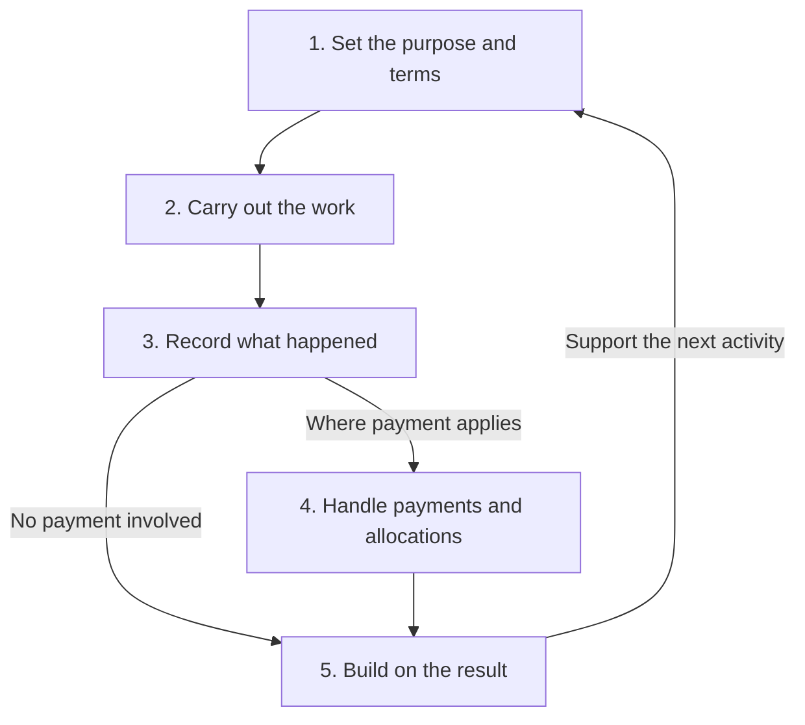

The model starts with an activity: running a programme, providing a service, building software, or creating an interactive experience. It connects that activity to the people and agents involved, the resources they can use, the work they produce, and any ownership or payment agreements.

RNDRNTWRK’s products are being developed to carry those connections through the activity and into what comes next.

## The Operating Loop

The operating model RNDRNTWRK is building. Work, resources, records, and relationships from one activity can support the next.

### 1. Set the purpose and terms

An activity starts with a purpose, the people or agents involved, and the resources available. Its terms establish what should be produced, who can do what, who owns the result, and how any payments will be handled.

### 2. Carry out the work

People and agents use the relevant products and services to carry out the activity. Agent Fixtures organise agent capabilities around a defined objective, including the tools, permissions, and expected outputs.

### 3. Record what happened

The model connects the work produced and the contributions made to the participants involved. It keeps track of resources used, ownership, costs, and any amounts owed.

### 4. Handle payments and allocations

When an activity involves payment, SW4P is the settlement component. It coordinates route selection, fees, execution, confirmation, recovery, and accounting for the result.

The activity’s funding source and agreements determine its costs, recipients, and allocations. SW4P Earn extends SW4P’s economic model into source-aware allocation, claims, rewards, payout schedules, reserves, and reconciliation.

Current status: SW4P Earn is not yet publicly available. No staking, liquidity, reward, or claim programme is currently open.

### 5. Build on the result

Work, software, records, remaining resources, and relationships can support later activities. Each completed activity can add to what people and agents are able to do next.

## Points and Credits

An experience can use points to record participation and credits to record a balance. Its published terms explain what each means and how it can be used.

### Points

Points can record things such as progress in a game, completed tasks, or participation in a programme. The experience defines which actions count, how points are calculated, and what they can be used for.

### Credits

Credits are a balance recorded within an experience. The terms explain what that balance represents, how it changes, and whether it can be spent, transferred, or paid out.

### Conversion and payment

The published terms for each experience define any conversion rate, expiry date, claim process, or payment schedule. The [SW4P Earn](/products/earn) documentation explains the allocation, claims, and payout model.

## Token-Based Access

A product can use a token holding as an access condition—for example, to enter an experience or take part in a particular role.

Where this is used, the product’s terms explain which token and network are supported, the amount required, how the holding is checked, and what access it provides.

The [$555 Token](/tokenomics/555-token) documentation explains $555’s role as RNDRNTWRK’s coordination asset. Any use of $555 for access is defined by the particular product or programme.

## Where to Go Next

<CardGroup cols={2}>
  <Card title="555stream" icon="video" href="/555stream">
    Explore live and recorded programming, publishing, and interaction between people and agents.
  </Card>
  <Card title="555 Arcade" icon="gamepad" href="/arcade/overview">
    Explore games, challenges, and interactive environments for people and agents.
  </Card>
  <Card title="Tokenomics" icon="coins" href="/tokenomics/overview">
    Understand $555’s role as RNDRNTWRK’s coordination asset.
  </Card>
  <Card title="API Reference" icon="code" href="/api-reference">
    Read the technical reference for RNDRNTWRK’s interfaces.
  </Card>
</CardGroup>

<Note>
  Deep dive: [Fee Distribution](/tokenomics/fee-distribution) · [$555 Token](/tokenomics/555-token) · [Creator Tokens](/tokenomics/creator-tokens)
</Note>
