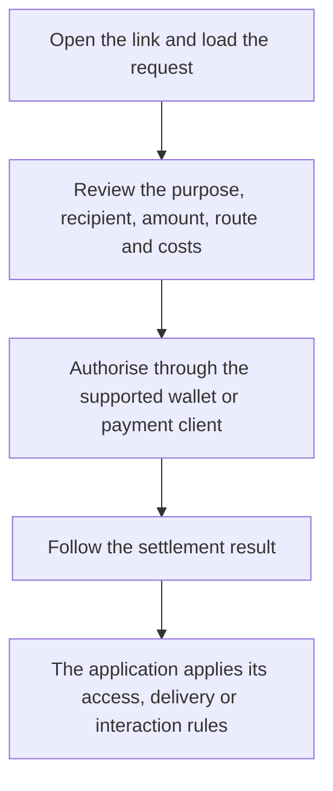

Hyperlink is RNDRNTWRK’s payment-link design. A link brings a payment or participation request into a webpage, message, or QR code and connects it with the application responsible for the result.

The model covers purchases, access requests, and interactive activities. Each experience defines what the request involves and which payment or participation steps it requires.

## What a Link Describes

The link design has three parts:

- A hosting gateway that resolves the link.
- An identifier that selects the configured request.
- An optional referral reference that records how the request reached the participant.

The request should explain its purpose, the recipient, any amount and asset required, and the expected result. A link preview can introduce that information before the participant opens the full request.

The link format and resolution interface belong to the selected integration.

## Resolution and Authorisation

For a request that requires payment, the proposed flow is:

1. Open the link and load the configured request.
2. Review the purpose, recipient, amount, route, and costs.
3. Authorise the operation through the supported wallet or payment client.
4. Follow the settlement result.
5. Let the application apply its access, delivery, or interaction rules to that result.

Proposed flow for a request that requires payment. The request, authorisation, payment record, and application response remain connected.

For an agent, the request must fit its assigned authority and spending limits. The integration retains the relationship between the request, its authorisation, the payment record, and the application’s response.

## Wallets and Routing

The design considers both external and embedded wallets. An embedded wallet would form part of the application’s own interface. The wallet and connection options offered by a particular application determine how its participants authorise payments.

[AGG](/protocol/agg) describes payment aggregation, route selection, and facilitator coordination. [SW4P](/sw4p) provides the programmable settlement engine, coordinating routes, fees, execution, confirmation, recovery, and accounting for the result.

A payment request needs to use the assets, networks, and execution methods supported by its selected route.

## Attribution and Reporting

A referral reference associates a request with the person, community, or placement that shared it. The attribution design connects that reference with the request and its recorded outcome.

A programme can use this information to compare link visits, completed requests, and conversions. Define each measure, its data source, the reporting period, and any limits. The same request may be shared across social platforms while retaining its attribution reference.

A proposed referral-payment programme would define its funding source, eligible activity, recipients, and distribution terms. [SW4P Earn](/products/earn) extends SW4P’s economic model into source-aware allocation, claims, rewards, payout schedules, reserves, and reconciliation.

Current status: SW4P Earn is not yet publicly available. No staking, liquidity, reward, or claim programme is currently open.

## Interactive Requests

A game interaction can be designed around a link—for example, letting a viewer request an additional enemy or challenge during a stream.

The experience would explain the requested effect, any price, the session it belongs to, and when the action is permitted. The participant would review and authorise the payment where one is required.

In this design, the payment record is associated with the requested game action. The game checks the current session and the creator’s permitted controls before applying an authorised change and recording the result.

If the requested action cannot be delivered, the application needs to report what happened and follow the experience’s stated recovery terms.

## Example Uses

| Use | Request | Application responsibility |
|---|---|---|
| Pay-per-view | Request access to a particular stream or programme. | Apply the access terms after the required payment is confirmed. |
| Quest or challenge | Open an activity and follow its participation rules. | Record the relevant actions and results under the experience’s rules. |
| Commerce | Purchase a specified digital item or service. | Connect the payment record with the agreed delivery and its outcome. |

## Following an Interrupted Request

Link resolution, authorisation, settlement, and delivery are separate stages. The application needs to show which stage a request reached and preserve its payment and request references.

A retry or recovery should use the existing state to determine the next action. An integration also needs to report errors from the link resolver, payment client, settlement route, or application so the participant can follow the appropriate recovery path.

<Note>
Related: [AGG](/protocol/agg) · [SW4P](/sw4p) · [@sw4p/kit](/products/kit)
</Note>
