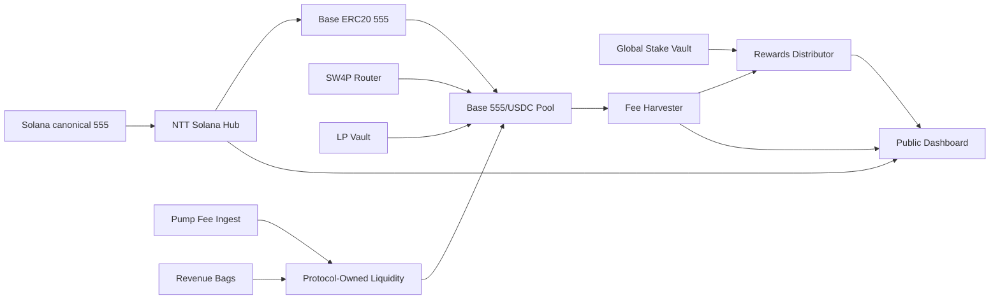

# SW4P Earn Execution Plan, TRD, and SOW

**Version:** v0.1  
**Prepared for:** RNDRNTWRK / $555 / SW4P  
**Date:** 2026-05-06  
**Primary objective:** build the structure that lets SW4P route real 555 volume through approved pools, bootstrap liquidity from fees and incentives, and turn $555 into a visibly revenue-linked, cross-chain, intelligently growing token.

---

## 1. Executive thesis

The opportunity is to ship **SW4P Earn**: a cross-chain staking and liquidity system where $555 holders and liquidity providers earn from **real trading activity**, while SW4P, Pump creator fees, product revenue bags, and future market-maker infrastructure compound into deeper liquidity and better execution.

The product should not promise artificial APY. It should be built around this principle:

> **If a user contributes liquidity, they can earn pool fees. If a user locks 555, they can earn protocol-defined staking rewards, fee rebates, boosts, and potentially a share of SW4P fees. Every reward must be traceable to real flow, explicit policy, or disclosed incentives.**

This plan assumes:

- Total $555 supply is treated as **1,000,000,000**.
- The initial cross-chain/liquidity program uses **100,000,000 $555**.
- Solana remains the canonical $555 hub.
- EVM $555 supply is minted through NTT against locked/backed Solana $555, not as unbacked inflation.
- The first EVM chain should be **Base**.
- There is currently no meaningful USDC/ETH paired-liquidity budget, so paired liquidity must be bootstrapped by external LPs, SW4P fees, Pump creator fees, and product revenue bags.

---

## 2. Non-negotiable rules

1. **No fake volume.** SW4P must route real user, sponsor, creator, product, or treasury-purposeful flow. Wash trading, self-crossing, and fake activity should be excluded from rewards and reported metrics.
2. **No unbacked cross-chain supply.** EVM $555 must be backed by locked/burned canonical supply via NTT accounting.
3. **No hidden fee stack.** Users must see SW4P fee, DEX fee, bridge fee, slippage, and route fallback behavior.
4. **No misleading staking APY.** Split APY into real-fee yield, 555 incentive yield, and utility boosts.
5. **No liquidity fragmentation before depth.** Base first; add Arbitrum and Polygon only after Base proves TVL, routed volume, and route quality.
6. **No market-maker opacity.** Future MM mandate must forbid wash trading and require quote-depth/inventory reporting.
7. **Public proof before marketing.** Dashboard must show route volume, TVL, fees, rewards, NTT supply, locked tokens, Pump fees, buybacks, reserves, and MM fund.

---

## 3. Current technical baseline from the architecture audit

The existing architecture already contains many needed components:

- SW4P settlement engine with a documented 50 bps fee model and route/fee architecture.
- 555stream sponsor billing and economic event dual-write paths.
- Revenue split policy using ARP, creator/platform split, and 20/5/5/70 platform allocation.
- Buyback/burn code using Jupiter swap-and-burn mechanics.
- Platform distribution executor that can enqueue buybacks and handle reserves/treasury execution states.
- VAP documentation/SDK concepts for verifiable attention.
- Arcade and Alice plugin surfaces.

However, the previous audit found several execution gaps that must be respected in this plan:

- Token metadata/decimal mismatch must be resolved before NTT or burn automation.
- Production rail status must be made truthful and visible.
- SW4P fee ingest needs durable outbox/replay rather than best-effort delivery.
- Reserve execution needs automation or public manual proof.
- Public dashboard is not optional.

---

## 4. Target product: SW4P Earn

SW4P Earn has five modules.

| Module | User deposit | What it does | Yield source | Launch priority |
|---|---:|---|---|---:|
| Global 555 Lock | 555 only | Reduces float, unlocks boosts, governance, fee rebates, selected protocol rewards | SW4P fee allocation, incentives, utility boosts | P0 |
| LP Vault | 555 + USDC/ETH | Provides real AMM liquidity | DEX LP fees + selected SW4P fee allocation | P0 |
| Matched 555 Vault | 555 only | Protocol/external USDC pairs against user 555 | DEX fees split between 555 staker and USDC matcher | P1 |
| Protocol-Owned Liquidity Vault | Treasury 555 + USDC/ETH | Builds permanent depth | Pump fees, SW4P fees, revenue bags | P0 |
| Market-Maker Reserve | 555 + USDC/ETH inventory | Future quote/depth support | Fee-funded mandate, callable inventory | P2 |

---

## 5. Token and liquidity allocation model

### 5.1 100M $555 program allocation

| Bucket | Allocation | Purpose |
|---|---:|---|
| Base liquidity capacity | 40,000,000 555 | Primary EVM pool and first routing target |
| Arbitrum liquidity capacity | 20,000,000 555 | Secondary DeFi-native expansion |
| Polygon liquidity/campaign capacity | 10,000,000 555 | Consumer, creator, and payment experiments |
| LP incentives reserve | 12,000,000 555 | Released only against real TVL and real routed volume |
| Market-maker inventory reserve | 10,000,000 555 | Future callable/contracted inventory, not gifted |
| Bridge/emergency reserve | 5,000,000 555 | NTT/rate-limit recovery, failed transfer recovery, ops buffer |
| Partner integrations | 3,000,000 555 | Strategic apps, wallets, marketplaces, creator campaigns |

### 5.2 Launch discipline

Do not deploy all 100M on day one. Use the 100M as capacity.

| Stage | Active deployed tokens | Held back |
|---|---:|---:|
| Base genesis | 10M-25M | 75M-90M |
| Base liquidity proof | 25M-40M | 60M-75M |
| Arbitrum expansion | 40M-60M | 40M-60M |
| Polygon/partner expansion | 50M-70M | 30M-50M |
| MM-ready expansion | 70M-100M | 0M-30M |

---

## 6. FDV and liquidity math

Assuming 1B total supply:

```text
FDV = price * 1,000,000,000
100M program value = price * 100,000,000
Balanced 50/50 LP requires USDC/ETH equal to token-side value.
```

| 555 price | FDV | 100M token-side value | USDC/ETH needed to pair 100M | Total 50/50 TVL |
|---:|---:|---:|---:|---:|
| $0.0001000 | $100.0K | $10.0K | $10.0K | $20.0K |
| $0.0010000 | $1.00M | $100.0K | $100.0K | $200.0K |
| $0.0050000 | $5.00M | $500.0K | $500.0K | $1.00M |
| $0.0100000 | $10.00M | $1.00M | $1.00M | $2.00M |
| $0.1000000 | $100.00M | $10.00M | $10.00M | $20.00M |
| $1.0000000 | $1.00B | $100.00M | $100.00M | $200.00M |
| $5.0000000 | $5.00B | $500.00M | $500.00M | $1.00B |


**Interpretation:** the same 100M tokens become more powerful as the token reprices. At low FDV, the bottleneck is not token count; it is paired USDC/ETH depth. At higher FDV, the same inventory becomes a serious cross-chain liquidity weapon.

---

## 7. Money-maker model

### 7.1 DEX LP fees

Initial pool assumption:

```text
DEX fee tier = 0.30%
DEX LP fee = routed volume * 0.003
```

DEX fees go primarily to LPs because LP capital supports the pool.

### 7.2 SW4P protocol fees

Working assumption based on the audited SW4P fee model:

```text
SW4P protocol fee = routed SW4P volume * 0.005
```

Proposed SW4P fee allocation:

| Bucket | Share of SW4P fee | Why |
|---|---:|---|
| ARP | 10% | Preserve network participation economics |
| Pool stakeholders / LP stakers | 45% | Make real routed volume reward liquidity providers |
| Platform allocation | 45% | Buybacks, reserves, treasury, operations |

The platform allocation then follows the existing 20/5/5/70 logic:

| Platform sub-bucket | Share of platform allocation | Share of gross SW4P fee |
|---|---:|---:|
| Buyback/burn | 20% | 9.00% |
| $555 reserve | 5% | 2.25% |
| SOL/USDC reserve | 5% | 2.25% |
| Treasury | 70% | 31.50% |

### 7.3 Pump creator fees

Pump creator fees should be treated as a Solana-side bootstrap accelerator. Conservative planning assumption:

```text
Pump creator fee = Solana/Pump 555 volume * 0.30%
```

Early liquidity-buildout allocation:

| Use | Share of Pump creator fees |
|---|---:|
| Protocol-owned liquidity / paired-side liquidity | 45% |
| Buyback/burn | 20% |
| LP incentives | 15% |
| Market-maker fund | 10% |
| Ops/risk/reserve | 10% |

| Pump daily volume | Creator fee/day | POL | Buyback/burn | LP incentives | MM fund | Ops/reserve |
|---:|---:|---:|---:|---:|---:|---:|
| $10.0K | $30.00 | $13.50 | $6.00 | $4.50 | $3.00 | $3.00 |
| $100.0K | $300.00 | $135.00 | $60.00 | $45.00 | $30.00 | $30.00 |
| $1.00M | $3.0K | $1.4K | $600.00 | $450.00 | $300.00 | $300.00 |
| $10.00M | $30.0K | $13.5K | $6.0K | $4.5K | $3.0K | $3.0K |


### 7.4 Product revenue bags

Revenue bags include 555stream sponsors, Arcade campaigns, Alice paid actions, x402 payments, creator tools, premium subscriptions, and partner campaigns. During the liquidity buildout epoch, treasury policy should prioritize paired liquidity and market-quality reserves.

Suggested temporary treasury policy until aggregate 555 liquidity reaches $250K-$500K:

| Use | Share |
|---|---:|
| Paired-side liquidity, mostly USDC/ETH | 40% |
| Buyback/burn | 20% |
| LP incentives | 15% |
| Market-maker fund | 10% |
| $555 reserve | 5% |
| SOL/USDC reserve | 5% |
| Ops/risk buffer | 5% |

---

## 8. Real yield model

Assumption:

```text
DEX fee = 0.30%
LP/staker share of DEX fee = 80% => 0.24% of routed volume
SW4P fee = 0.50%
LP/staker share of SW4P fee = 45% => 0.225% of routed volume
Total LP/staker capture = 0.465% of routed volume = 46.5 bps
```

| Pool TVL | Daily routed volume | LP/staker rewards/day | Rewards/year | Fee APR |
|---:|---:|---:|---:|---:|
| $50.0K | $10.0K | $46.50 | $17.0K | 33.9% |
| $50.0K | $25.0K | $116.25 | $42.4K | 84.9% |
| $50.0K | $100.0K | $465.00 | $169.7K | 339.4% |
| $250.0K | $10.0K | $46.50 | $17.0K | 6.8% |
| $250.0K | $25.0K | $116.25 | $42.4K | 17.0% |
| $250.0K | $100.0K | $465.00 | $169.7K | 67.9% |
| $250.0K | $250.0K | $1.2K | $424.3K | 169.7% |
| $250.0K | $1.00M | $4.7K | $1.70M | 678.9% |
| $1.00M | $10.0K | $46.50 | $17.0K | 1.7% |
| $1.00M | $25.0K | $116.25 | $42.4K | 4.2% |
| $1.00M | $100.0K | $465.00 | $169.7K | 17.0% |
| $1.00M | $250.0K | $1.2K | $424.3K | 42.4% |
| $1.00M | $1.00M | $4.7K | $1.70M | 169.7% |


**Interpretation:** high APRs early are not a problem if they are generated by real volume. High APR attracts more TVL; more TVL improves execution and lowers APR toward equilibrium.

---

## 9. Lock timelines

| Lock term | Reward multiplier | Intended user |
|---:|---:|---|
| Flexible, 7-day cooldown | 0.5x | Casual holders |
| 30 days | 1.0x | Base staking |
| 90 days | 1.75x | Serious holders |
| 180 days | 2.5x | Long-term liquidity supporters |
| 365 days | 4.0x | Strategic holders and governance participants |

Reward formula:

```text
weighted stake = raw stake * lock multiplier
user reward share = user weighted stake / total weighted stake
```

Unlock design:

- Avoid large cliff unlocks.
- Use cooldowns or linear unlocks.
- Public unlock calendar.
- Optional early-exit penalty routed to LP incentives or burn.

---

# Part A — Execution Plan

## 10. Workstream map

| Workstream | Objective | Priority |
|---|---|---:|
| Token truth and NTT readiness | Verify $555 metadata, decimals, authority, NTT supply invariant | P0 |
| Base EVM deployment | Deploy Base ERC-20 555, NTT manager, registry, initial pool | P0 |
| SW4P routing engine | Route real 555 volume through approved pools with best-execution guardrails | P0 |
| Earn vaults | Global Lock, LP Vault, Protocol-Owned Liquidity Vault | P0 |
| Rewards and fee accounting | Harvest fees, classify money makers, distribute rewards | P0 |
| Dashboard and proof | Public proof for supply, TVL, volume, fees, rewards, buybacks | P0 |
| Liquidity bootstrap | Incentive USDC/ETH LPs and match 555 inventory safely | P0/P1 |
| Matched staking | Single-sided 555 vault paired with protocol or external USDC | P1 |
| Arbitrum/Polygon expansion | Add additional EVM pools after Base proof | P1/P2 |
| Market-maker readiness | Future depth/spread support with transparent mandate | P2 |

## 11. Phase plan

### Phase 0 — Foundation and truth layer

**Goal:** eliminate ambiguity before moving supply cross-chain.

Deliverables:

- Chain-verified $555 decimals, mint/freeze/metadata state.
- Cross-chain supply policy.
- NTT topology decision: Solana hub, EVM spokes.
- 100M allocation registry.
- Pool registry schema.
- Fee allocation policy.
- Reward and anti-wash policy.
- Dashboard wireframe.

Acceptance gates:

- Decimal mismatch resolved and enforced in code.
- NTT supply invariant documented.
- No public APY shown without real-fee source labels.
- Production rail status visible as live/staging/manual/disabled.

### Phase 1 — Base genesis deployment

**Goal:** make Base the first EVM liquidity home.

Deliverables:

- Base ERC-20 $555 contract.
- Base NTT Manager and peer config.
- Base 555/USDC pool.
- PoolRegistry contract/API.
- Global 555 Lock MVP.
- LP Vault MVP.
- Protocol-Owned Liquidity Vault MVP.
- Dashboard alpha.

Acceptance gates:

- Solana lock -> Base mint -> Base burn -> Solana unlock tested.
- Pool supports small swaps within guardrail thresholds.
- Vault deposits/withdrawals tested.
- Dashboard shows Base supply, pool TVL, and vault balances.

### Phase 2 — SW4P route integration

**Goal:** route real volume, safely.

Deliverables:

- SW4P 555 route scoring.
- Best-execution threshold.
- Pool-level route caps.
- Slippage and price-impact limits.
- Route event ledger.
- Treasury flow labels to separate user volume from protocol operations.

Acceptance gates:

- No route selected if it exceeds max extra cost threshold.
- Route events classify `user`, `sponsor`, `creator`, `product`, `treasury`, and `rebalance` volume.
- Suspicious/self-referential volume excluded from rewards.

### Phase 3 — Fee/reward engine

**Goal:** make real fees claimable and provable.

Deliverables:

- DEX fee harvester.
- SW4P fee allocation engine.
- Pump fee ingest/accounting adapter.
- Reward epochs.
- RewardsDistributor contract/service.
- APY calculator that separates real-fee APY from incentive APY.

Acceptance gates:

- Rewards can be traced to fee events.
- Rewards cannot be claimed twice.
- Pump fees, SW4P fees, DEX fees, and product revenue bags are separately labeled.
- Dashboard reconciles fee source -> allocation -> reward/buyback/POL/MM fund.

### Phase 4 — Liquidity bootstrap

**Goal:** grow paired liquidity without fake volume.

Deliverables:

- USDC/ETH LP onboarding flow.
- Matched 555 Vault design and beta.
- Volume-qualified 555 incentives.
- Protocol-Owned Liquidity ramp.
- Liquidity level ladder.

Acceptance gates:

- Incentives are conditioned on TVL quality and real routed volume.
- Stakers see lock, risk, yield source, and impermanent loss disclosure.
- SW4P route caps increase only as TVL and slippage improve.

### Phase 5 — Chain expansion

**Goal:** expand only after Base proves the model.

Arbitrum launch triggers:

- Base TVL >= $100K.
- Base real routed volume >= $25K/day for a sustained period.
- Dashboard, rewards, and route metrics stable.
- No unresolved critical reconciliation gaps.

Polygon launch triggers:

- Base + Arbitrum aggregate TVL >= $250K.
- Demonstrated sponsor/Arcade/creator use case needing Polygon.

### Phase 6 — Market-maker readiness

**Goal:** prepare professional market structure.

Deliverables:

- Market-maker inventory vault.
- MM mandate terms.
- Quote-depth reporting schema.
- Callable inventory controls.
- No-wash-trading covenant.
- Weekly MM report template.

Acceptance gates:

- MM receives inventory as a mandate/loan, not hidden gifted supply.
- MM metrics show quote uptime, spread, depth, and inventory.
- MM volume is excluded from organic-user-volume metrics unless clearly labeled.

---

# Part B — Technical Requirements Document (TRD)

## 12. TRD objective

Build the technical system that lets SW4P route real $555 flow through approved pools, lets users stake or provide liquidity, distributes fees transparently, and uses Pump/SW4P/product revenue to compound liquidity, buybacks, reserves, and market-maker readiness.

## 13. TRD system architecture



## 14. Functional requirements

| ID | Requirement | Priority |
|---|---|---:|
| FR-001 | Verify live $555 token metadata and decimals at startup and deployment | P0 |
| FR-002 | Deploy Base ERC-20 $555 and NTT manager with 1:1 supply backing | P0 |
| FR-003 | Maintain cross-chain supply ledger: Solana locked, EVM minted, EVM burned, Solana unlocked | P0 |
| FR-004 | Create PoolRegistry for approved pools, caps, fee tiers, chain, status, route limits | P0 |
| FR-005 | Implement SW4P route scoring with best-execution and slippage guardrails | P0 |
| FR-006 | Implement Global 555 Lock with lock multipliers and cooldowns | P0 |
| FR-007 | Implement LP Vault for two-sided 555 + USDC/ETH liquidity | P0 |
| FR-008 | Implement Protocol-Owned Liquidity Vault | P0 |
| FR-009 | Implement fee harvester for DEX LP fees and SW4P fee events | P0 |
| FR-010 | Implement Pump creator fee ingest/accounting bucket | P0 |
| FR-011 | Implement RewardsDistributor with real-fee and incentive APY separation | P0 |
| FR-012 | Implement public proof dashboard | P0 |
| FR-013 | Implement Matched 555 Vault | P1 |
| FR-014 | Implement Arbitrum pool/vault after Base criteria | P1 |
| FR-015 | Implement Polygon pool/vault after Arbitrum criteria | P2 |
| FR-016 | Implement market-maker vault and reporting | P2 |

## 15. Non-functional requirements

| ID | Requirement | Target |
|---|---|---|
| NFR-001 | Supply invariant | EVM minted <= Solana locked + valid transferred supply |
| NFR-002 | Reward integrity | No double claims, no reward from flagged wash/self volume |
| NFR-003 | Route safety | Never route above max slippage/extra-cost threshold |
| NFR-004 | Observability | Metrics for volume, fees, TVL, rewards, NTT supply, stuck jobs |
| NFR-005 | Security | Multisig for treasury/reserve, pausable contracts, role separation |
| NFR-006 | Reliability | Durable fee outbox, DLQ, replay, reconciliation |
| NFR-007 | User clarity | Fee stack and APY source labels shown before action |

## 16. Smart contract components

| Contract | Chain | Purpose |
|---|---|---|
| `EVM555Token` | Base first | ERC-20 $555, mint/burn restricted to NTT Manager |
| `NttManager` | Solana/Base | Cross-chain token movement and rate limits |
| `PoolRegistry` | EVM + service mirror | Approved pool list, route caps, chain statuses |
| `GlobalStakeVault` | EVM | 555 lock positions, multipliers, cooldowns |
| `LPVault` | EVM | Two-sided LP deposits and vault share accounting |
| `ProtocolOwnedLiquidityVault` | EVM | Holds POL positions and reports balances |
| `MatchedLiquidityVault` | EVM | User 555 + protocol/external USDC paired liquidity |
| `RewardsDistributor` | EVM | Epoch rewards, merkle/claim distribution |
| `MarketMakerVault` | EVM | Future inventory mandate and accounting |

## 17. Backend/service components

| Service | Purpose |
|---|---|
| SW4P Quote Engine | Evaluates approved pools, external routes, cost, slippage, route split |
| Route Event Ledger | Stores every route decision and classification |
| Fee Event Ingest | Ingests SW4P protocol fees, DEX fee harvests, Pump fees, revenue bags |
| Durable Outbox | Prevents losing fee events during outages |
| Rewards Indexer | Builds reward epochs from fee events and staking weights |
| Supply Indexer | Tracks NTT locked/minted/burned/unlocked supply |
| Dashboard API | Public metrics for market proof |
| Risk/Antiwash Engine | Detects self-volume, loops, sybil wallets, abnormal farming |
| Treasury Router | Applies fee allocation policy to POL, buyback, reserves, MM fund |

## 18. Data model

| Entity | Key fields |
|---|---|
| `pool_registry` | pool_id, chain, pair, fee_tier, status, tvl, route_cap, max_price_impact |
| `route_event` | route_id, user_id, chain, pool_id, input, output, fees, slippage, classification |
| `stake_position` | position_id, wallet, chain, amount, lock_start, lock_end, multiplier, status |
| `lp_position` | position_id, vault, wallet, pool_id, token_amount, paired_amount, shares |
| `fee_event` | source, amount, asset, chain, tx_hash, policy_id, classification |
| `reward_epoch` | epoch_id, start, end, fees_total, incentives_total, merkle_root |
| `reward_claim` | wallet, epoch_id, amount, asset, tx_hash, claimed_at |
| `ntt_supply_state` | chain, locked, minted, burned, unlocked, outstanding |
| `pump_fee_receipt` | tx_hash, volume, creator_fee, allocation_bucket |
| `treasury_allocation` | source, bucket, amount, destination, tx_hash, status |
| `mm_mandate` | inventory, chain, limits, spread_target, depth_target, reports |

## 19. APIs

| Endpoint | Purpose |
|---|---|
| `GET /v1/earn/pools` | List approved pools, TVL, volume, fees, status |
| `GET /v1/earn/apy` | Real-fee APY, incentive APY, blended APY |
| `POST /v1/earn/stake` | Create stake lock |
| `POST /v1/earn/unstake` | Start cooldown/unlock |
| `POST /v1/earn/lp/deposit` | Deposit two-sided LP |
| `POST /v1/earn/lp/withdraw` | Withdraw LP position |
| `GET /v1/earn/rewards` | Claimable rewards by wallet |
| `POST /v1/earn/rewards/claim` | Claim rewards |
| `GET /v1/supply/ntt` | Cross-chain supply proof |
| `GET /v1/fees/sources` | SW4P/Pump/DEX/product fee source summary |
| `GET /v1/dashboard/555-proof` | Public combined proof layer |

## 20. Route guardrails

| Guardrail | Initial value |
|---|---:|
| Max extra cost vs best route | 25-50 bps |
| Max pool price impact | 1.0% early, tighten as TVL grows |
| Max trade size at Level 1 pool | $250 equivalent |
| Reward exclusion | Exclude treasury, self-volume, MM internal rebalance, suspicious loops |
| Pool health check | TVL, depth, stale price, fee harvest status, route success rate |

## 21. Pool level ladder

| Pool level | TVL | SW4P routing behavior |
|---|---:|---|
| Level 0 | <$10K | No default routing; small manual/bootstrap only |
| Level 1 | $10K-$50K | Route small trades only |
| Level 2 | $50K-$250K | Route 25%-50% of eligible flow |
| Level 3 | $250K-$1M | Route majority if best-execution passes |
| Level 4 | $1M+ | Primary route if execution quality is best or comparable |

## 22. Security requirements

- Confirm token decimals on-chain before deployment.
- NTT rate limits by chain and epoch.
- Multisig for treasury/reserves/market-maker vaults.
- Pausable vaults and router emergency stop.
- Role separation: deployer, operator, treasury, auditor, market maker.
- Anti-wash reward exclusions.
- Slippage and price-impact enforcement.
- Immutable reward epoch records.
- Public proof hashes for fee allocation.
- Third-party contract review before public launch.

## 23. Observability and dashboard metrics

| Metric | Why it matters |
|---|---|
| Real SW4P routed volume | Usage proof |
| DEX LP fees | Pool yield proof |
| SW4P protocol fees | Protocol revenue proof |
| Pump creator fees | Solana trading revenue proof |
| Product revenue bags | Broader ecosystem revenue proof |
| LP rewards paid | Staker confidence |
| 555 locked/staked | Float reduction proof |
| 555 in LP | Liquidity commitment |
| USDC/ETH paired liquidity | Real market depth |
| NTT locked/minted supply | No inflation proof |
| Protocol-owned liquidity | Stability proof |
| Buybacks/burns | Token value capture |
| MM reserve | Future depth support |
| Route slippage | Execution quality |
| Excluded volume | Anti-wash credibility |

---

# Part C — Statement of Work (SOW)

## 24. SOW purpose

This SOW defines the work required to deliver **SW4P Earn Phase 1**, covering Base NTT deployment, Base 555/USDC pool integration, staking/LP vaults, SW4P real-volume routing, fee/reward accounting, Pump fee integration, dashboard proof, and liquidity bootstrap mechanisms.

## 25. In scope

- Token metadata and decimals verification.
- NTT readiness and Base deployment.
- Base ERC-20 $555 and 555/USDC pool.
- Global 555 Lock.
- LP Vault.
- Protocol-Owned Liquidity Vault.
- SW4P route guardrails and route event ledger.
- Fee accounting for DEX, SW4P, Pump, and revenue bags.
- Reward epoch and claims system.
- Public dashboard alpha.
- Liquidity bootstrap incentive policy.
- Security, observability, and launch runbooks.

## 26. Out of scope for Phase 1

- CEX listings.
- Market-maker execution agreement.
- Arbitrum and Polygon production launch.
- Guaranteed APY or guaranteed token price outcomes.
- Fully autonomous treasury management without multisig review.
- Any fake volume, wash trading, or undisclosed promotional trading.

## 27. Milestones and deliverables

| Milestone | Deliverables | Acceptance criteria |
|---|---|---|
| M0: Design freeze | TRD, SOW, fee policy, route policy, reward policy | Stakeholder signoff; no unresolved P0 ambiguity |
| M1: Token/NTT readiness | Decimal verification, NTT config, cross-chain supply policy | Test transfer and supply invariant pass |
| M2: Base contracts | ERC-20, NTT Manager, PoolRegistry, vault contracts | Test suite + testnet deployment pass |
| M3: SW4P routing | Quote engine, route caps, ledger, best-execution guardrails | Small trades route only when guardrails pass |
| M4: Rewards engine | Fee ingest, reward epochs, claims, APY calculation | Rewards trace to fee events; no double claims |
| M5: Dashboard | Public supply, TVL, fees, rewards, Pump fees, POL | Dashboard reconciles with chain/indexer data |
| M6: Base beta launch | Base pool, LP onboarding, staking, limited SW4P routing | Low-value canaries pass; monitoring live |
| M7: Liquidity bootstrap | Incentive campaigns, matched-liquidity beta | TVL and route thresholds tracked publicly |

## 28. Work breakdown structure

### WBS 1 — Token truth and NTT

Tasks:

- Verify Solana mint decimals, authorities, metadata, supply.
- Fix hardcoded decimals in existing burn/treasury paths.
- Define NTT Solana hub and Base spoke topology.
- Configure NTT rate limits and supply accounting.
- Publish cross-chain supply policy.

### WBS 2 — Base contracts and pool

Tasks:

- Deploy Base ERC-20 $555.
- Configure Base NTT Manager.
- Deploy/register Base 555/USDC pool.
- Deploy PoolRegistry.
- Run Base testnet and mainnet canaries.

### WBS 3 — Earn vaults

Tasks:

- Build GlobalStakeVault.
- Build LPVault.
- Build ProtocolOwnedLiquidityVault.
- Implement lock multipliers and cooldowns.
- Implement vault share accounting.
- Add wallet UI flows.

### WBS 4 — SW4P routing

Tasks:

- Integrate PoolRegistry into SW4P quote engine.
- Add route-level best-execution guardrails.
- Add route event ledger and classifications.
- Exclude non-organic route classes from rewards.
- Implement route caps by pool level.

### WBS 5 — Fee/reward accounting

Tasks:

- Add DEX fee harvester.
- Add SW4P fee allocation policy.
- Add Pump creator fee ingest bucket.
- Add product revenue bag integration hooks.
- Build reward epochs and distributor.
- Add claim flow.

### WBS 6 — Dashboard and public proof

Tasks:

- Build dashboard API.
- Build front-end proof dashboard.
- Display NTT supply, TVL, volume, fees, rewards, Pump fees, POL, buybacks, reserves.
- Display real-fee APY and incentive APY separately.
- Add exportable weekly proof report.

### WBS 7 — Liquidity bootstrap

Tasks:

- Define LP incentive budgets and release rules.
- Launch Base genesis LP campaign.
- Enable external USDC/ETH LP deposits.
- Beta Matched 555 Vault.
- Increase route caps only as depth grows.

### WBS 8 — Operations and security

Tasks:

- Add monitoring, alerts, and stuck-job metrics.
- Add multisig policy for treasury and reserves.
- Add pause/recovery runbooks.
- Complete security review.
- Add anti-wash monitoring.

## 29. RACI

| Function | Responsible | Accountable | Consulted | Informed |
|---|---|---|---|---|
| Token/NTT architecture | Protocol engineering | CTO/Product lead | Security, treasury | Community |
| Vault contracts | Smart contract engineer | CTO | Security reviewer | Product |
| SW4P routing | SW4P backend engineer | CTO | Product, risk | Community |
| Dashboard | Full-stack engineer | Product lead | Treasury, growth | Community |
| Fee policy | Product + treasury | Founder/lead | Legal/compliance, engineering | Community |
| Market-maker readiness | Treasury/BD | Founder/lead | Legal, exchange/MM partners | Community |

## 30. Acceptance criteria

Phase 1 cannot be considered complete unless:

1. $555 decimals are chain-verified and all contracts/services use correct precision.
2. Base NTT transfer can complete both directions with supply invariant proof.
3. SW4P routes only within defined execution-quality guardrails.
4. LP/staker rewards are traceable to real fee events or disclosed incentives.
5. Pump creator fees are accounted as a separate accelerator source.
6. Dashboard displays real volume, TVL, fees, rewards, NTT supply, and excluded volume.
7. Treasury/POL allocations are labeled and auditable.
8. No APY is displayed without source separation.
9. Emergency pause and recovery runbooks exist.
10. Testnet and low-value mainnet canaries pass.

## 31. Key risks and mitigations

| Risk | Severity | Mitigation |
|---|---:|---|
| Decimal mismatch causes transfer/burn errors | Critical | Chain-verify decimals and fail closed |
| Low USDC liquidity limits routing | High | Use pool ladder, external LP incentives, fee-funded POL |
| Rewards attract farmed/wash volume | High | Anti-wash filters, volume classifications, reward exclusions |
| Liquidity fragmentation | High | Base first, route caps, add chains only after thresholds |
| Fee stack hurts users | Medium | Best-execution threshold and transparent quotes |
| Pump fees fluctuate | Medium | Treat Pump fees as accelerator, not core guaranteed yield |
| Market maker creates reputational risk | Medium | No-wash mandate, public reports, inventory limits |
| Treasury hot wallet risk | High | Multisig, caps, sweep rules, approval gates |
| Dashboard inconsistency | High | Reconciliation jobs and proof hashes |

## 32. Launch checklist

- [ ] Token decimals verified on Solana.
- [ ] All hardcoded decimals removed or checked against live mint.
- [ ] Base ERC-20 verified on explorer.
- [ ] NTT Base route tested both directions.
- [ ] PoolRegistry live.
- [ ] Base 555/USDC pool live.
- [ ] GlobalStakeVault live.
- [ ] LPVault live.
- [ ] POL vault live.
- [ ] SW4P route guardrails live.
- [ ] Fee event ledger live.
- [ ] Pump fee ingest/accounting live.
- [ ] Dashboard live.
- [ ] APY source separation live.
- [ ] Anti-wash filters live.
- [ ] Pause/runbook tested.
- [ ] Low-value canaries pass.
- [ ] Public launch note published.

---

## 33. Expert recommendation

Ship **Base-only SW4P Earn** first. Do not spread the 100M program across several EVM chains immediately.

The first public milestone should be:

> **Base 555 is live, backed by NTT, with a transparent 555/USDC pool, SW4P routing, staking, LP rewards, Pump fee accounting, and a public proof dashboard.**

Once Base proves real routed volume, grow the system in this order:

1. Increase Base route caps.
2. Add external USDC LP campaigns.
3. Enable Matched 555 Vault.
4. Expand to Arbitrum.
5. Expand to Polygon.
6. Add market-maker mandate once liquidity and volume justify it.

This puts the project’s best foot forward because it combines:

- Cross-chain access.
- Liquidity depth.
- Real fee yield.
- Token locking.
- Revenue-bag compounding.
- Pump fee acceleration.
- Public proof.
- Future market-maker readiness.

That is the support structure for an intelligently growing token.

---

## Appendix A — Reference facts used

- NTT is suitable for native cross-chain token movement and supports hub-and-spoke and burn-and-mint models.
- Liquidity providers earn fees from the pools they support; 0.30% is a common volatile-pair fee tier.
- Pump creator fees exist and vary by bonding curve / PumpSwap canonical pool conditions.
- Existing RNDRNTWRK economic model uses ARP, creator/platform split, and platform buyback/reserve/treasury allocation.
- Existing SW4P fee model is documented as 50 bps.
